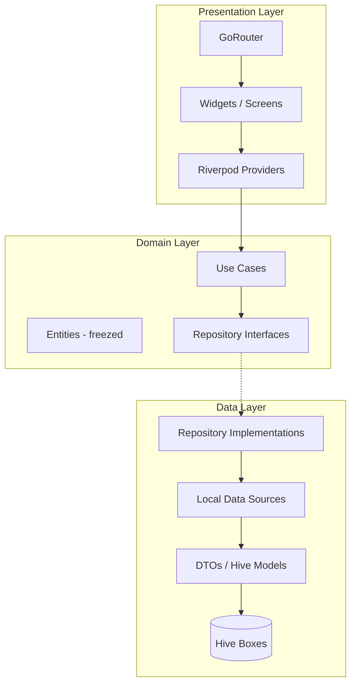
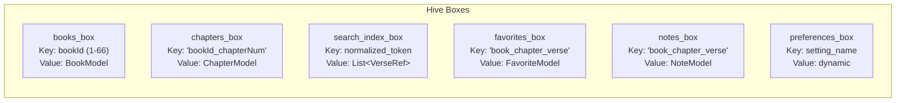
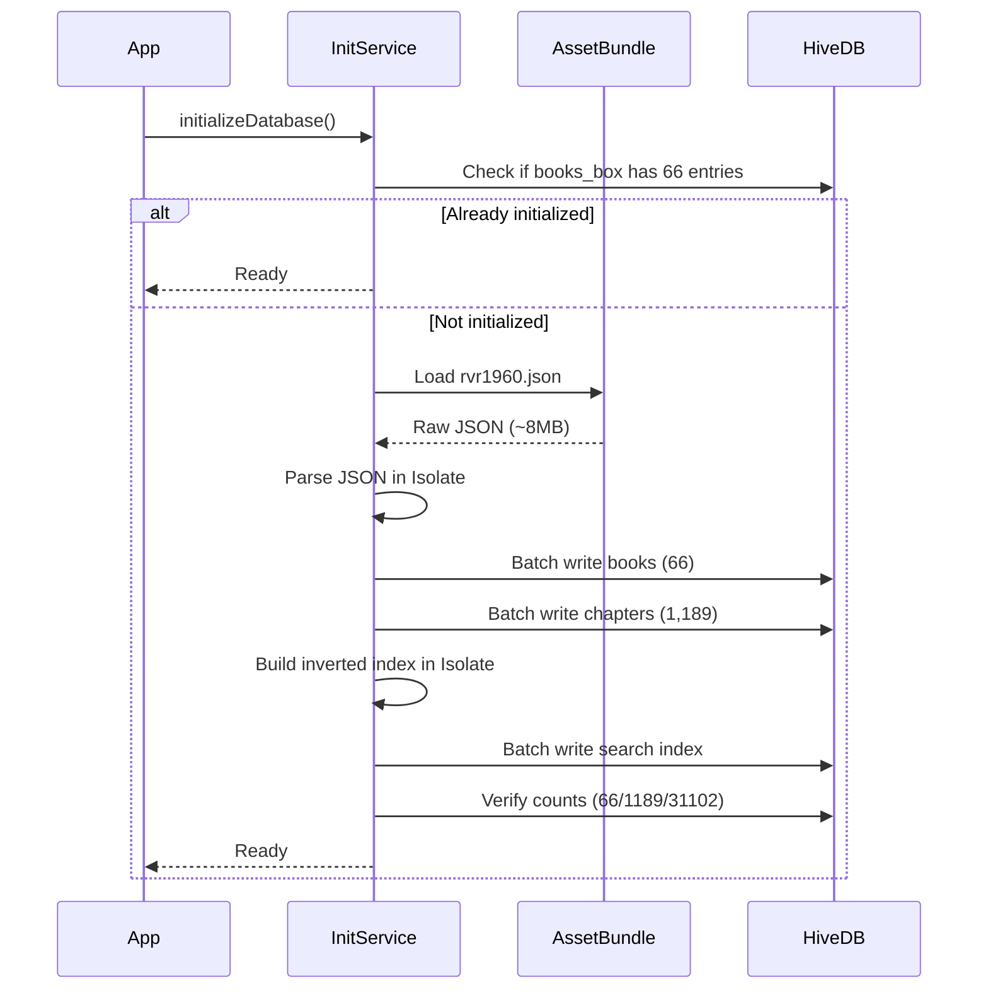
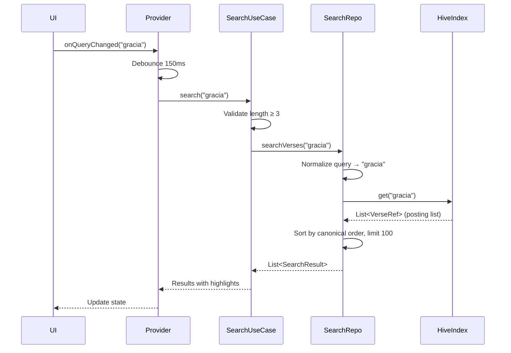
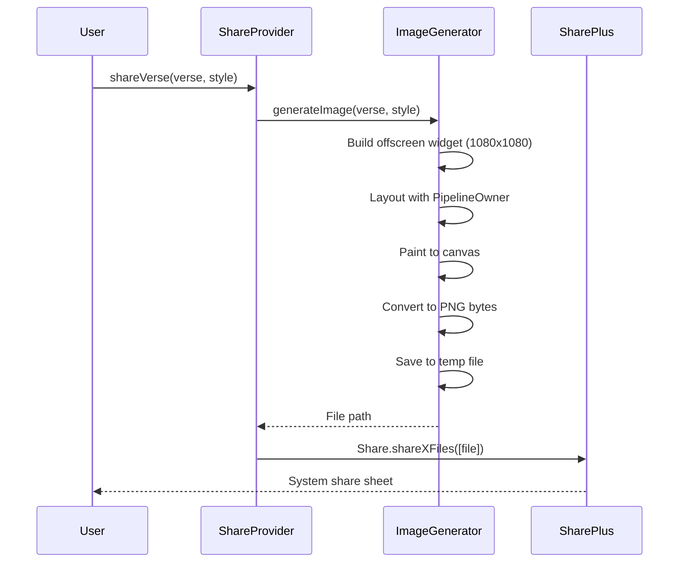
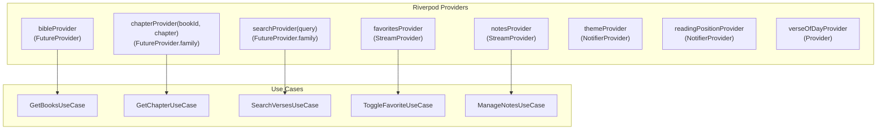
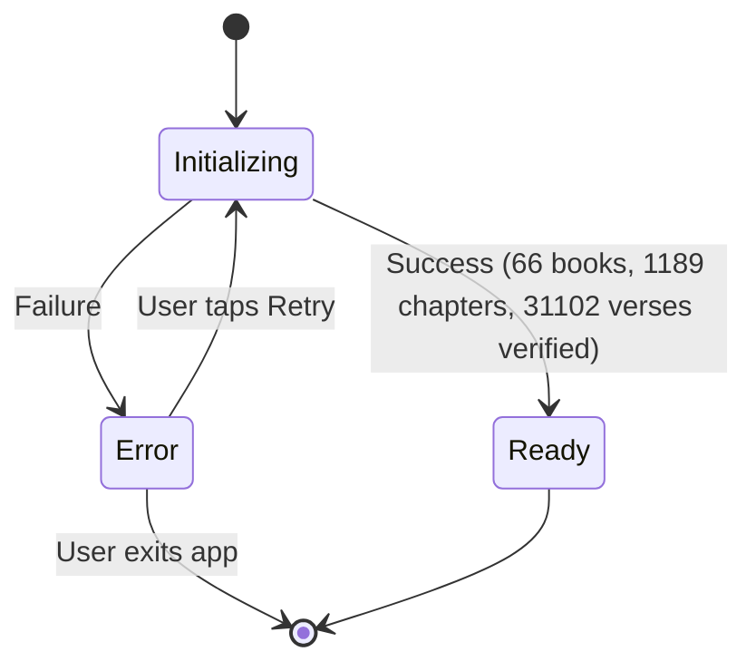

# Design Document: Biblia RVR1960 App

## Overview

The Biblia RVR1960 App is a premium, offline-first Android application built with Flutter for reading the Reina Valera 1960 Bible. The app delivers a fast, elegant reading experience with ultra-fast search, favorites, notes, verse of the day, theming, and social sharing as image.

### Key Design Decisions

| Decision | Choice | Rationale |
|----------|--------|-----------|
| Local Database | Hive (key-value NoSQL) | Pure Dart, no native dependencies, fast reads, lazy box loading |
| Search Strategy | Pre-built inverted index in Hive | O(1) lookup per token, accent-normalized, <200ms across 31K verses |
| State Management | Riverpod (code-gen) | Compile-safe, testable, supports async/stream providers |
| Navigation | GoRouter (TypedGoRoute) | Declarative, type-safe routes, deep linking support |
| Models | freezed + json_serializable | Immutable, copyWith, JSON serialization, union types |
| Image Generation | RepaintBoundary + dart:ui | Native Flutter rendering, no external dependencies, <2s |
| Architecture | Clean Architecture + Feature-based | Separation of concerns, testable layers, scalable |

### Technology Stack

- **Flutter SDK** ≥ 3.22
- **Dart** ≥ 3.4
- **hive** ^2.2.3 / **hive_flutter** ^1.1.0
- **flutter_riverpod** ^2.5 / **riverpod_annotation** ^2.3
- **go_router** ^14.0 / **go_router_builder** ^2.7
- **freezed** ^2.5 / **json_serializable** ^6.8
- **share_plus** ^9.0
- **path_provider** ^2.1
- **google_fonts** ^6.2

## Architecture

### High-Level Architecture



### Dependency Rule

- **Presentation** → depends on **Domain** only
- **Data** → depends on **Domain** only (implements interfaces)
- **Domain** → depends on nothing external (pure Dart)

### Directory Structure

```
lib/
├── main.dart
├── app.dart
├── core/
│   ├── constants/
│   │   ├── bible_constants.dart       # Book names, chapter counts
│   │   └── app_constants.dart         # Timeouts, limits
│   ├── services/
│   │   ├── analytics_service.dart     # Abstract interface
│   │   ├── notification_service.dart  # Abstract interface
│   │   └── remote_config_service.dart # Abstract interface
│   ├── theme/
│   │   ├── app_theme.dart             # Material 3 theme data
│   │   ├── color_schemes.dart         # Light/dark color tokens
│   │   └── typography.dart            # Text styles hierarchy
│   ├── router/
│   │   ├── app_router.dart            # GoRouter configuration
│   │   └── routes.dart                # TypedGoRoute definitions
│   └── utils/
│       ├── text_normalizer.dart       # Accent removal, lowercase
│       └── date_utils.dart            # Verse of day seed logic
├── shared/
│   ├── widgets/
│   │   ├── skeleton_loader.dart
│   │   ├── empty_state.dart
│   │   └── error_state.dart
│   └── extensions/
│       └── string_extensions.dart
├── features/
│   ├── bible/
│   │   ├── data/
│   │   │   ├── datasources/
│   │   │   │   └── bible_local_datasource.dart
│   │   │   ├── models/
│   │   │   │   ├── verse_model.dart
│   │   │   │   ├── chapter_model.dart
│   │   │   │   └── book_model.dart
│   │   │   └── repositories/
│   │   │       └── bible_repository_impl.dart
│   │   ├── domain/
│   │   │   ├── entities/
│   │   │   │   ├── verse.dart
│   │   │   │   ├── chapter.dart
│   │   │   │   └── book.dart
│   │   │   ├── repositories/
│   │   │   │   └── bible_repository.dart
│   │   │   └── usecases/
│   │   │       ├── get_chapter.dart
│   │   │       ├── get_books.dart
│   │   │       └── get_adjacent_chapter.dart
│   │   └── presentation/
│   │       ├── providers/
│   │       │   ├── bible_providers.dart
│   │       │   └── reading_position_provider.dart
│   │       ├── screens/
│   │       │   ├── reader_screen.dart
│   │       │   └── book_selector_screen.dart
│   │       └── widgets/
│   │           ├── verse_tile.dart
│   │           ├── chapter_grid.dart
│   │           └── swipe_navigator.dart
│   ├── search/
│   │   ├── data/
│   │   │   ├── datasources/
│   │   │   │   └── search_local_datasource.dart
│   │   │   ├── models/
│   │   │   │   └── search_index_model.dart
│   │   │   └── repositories/
│   │   │       └── search_repository_impl.dart
│   │   ├── domain/
│   │   │   ├── entities/
│   │   │   │   └── search_result.dart
│   │   │   ├── repositories/
│   │   │   │   └── search_repository.dart
│   │   │   └── usecases/
│   │   │       └── search_verses.dart
│   │   └── presentation/
│   │       ├── providers/
│   │       │   └── search_providers.dart
│   │       ├── screens/
│   │       │   └── search_screen.dart
│   │       └── widgets/
│   │           ├── search_result_tile.dart
│   │           └── search_empty_state.dart
│   ├── favorites/
│   │   ├── data/
│   │   ├── domain/
│   │   └── presentation/
│   ├── notes/
│   │   ├── data/
│   │   ├── domain/
│   │   └── presentation/
│   ├── home/
│   │   ├── data/
│   │   ├── domain/
│   │   └── presentation/
│   ├── settings/
│   │   ├── data/
│   │   ├── domain/
│   │   └── presentation/
│   └── share/
│       ├── data/
│       ├── domain/
│       └── presentation/
└── assets/
    └── bible/
        └── rvr1960.json              # Bundled Bible data
```

## Components and Interfaces

### 1. Bible Data Layer (Bible_Database)

#### Hive Box Architecture



**Box Design Rationale:**

| Box | Key Strategy | Lazy? | Reason |
|-----|-------------|-------|--------|
| `books_box` | Integer bookId (1-66) | No | Small (66 entries), always needed for navigation |
| `chapters_box` | `"{bookId}_{chapterNum}"` | Yes | 1,189 entries; load on demand per chapter |
| `search_index_box` | Normalized token string | Yes | Large index; load tokens on search only |
| `favorites_box` | `"{bookId}_{chapter}_{verse}"` | No | Small user data, needed for indicator display |
| `notes_box` | `"{bookId}_{chapter}_{verse}"` | No | Small user data, needed for indicator display |
| `preferences_box` | Setting key string | No | Tiny, always needed |

#### Lazy Loading Strategy

1. **App startup**: Open `books_box` (non-lazy), `favorites_box`, `notes_box`, `preferences_box`
2. **Chapter navigation**: Open `chapters_box` lazily → fetch by composite key `"{bookId}_{chapterNum}"`
3. **Pre-fetching**: When user views chapter N, pre-fetch chapters N-1 and N+1 into memory
4. **Search**: Open `search_index_box` lazily on first search invocation

#### Data Initialization Flow



#### Bible Local DataSource Interface

```dart
abstract class BibleLocalDataSource {
  Future<void> initialize();
  Future<bool> isInitialized();
  Future<List<BookModel>> getAllBooks();
  Future<BookModel> getBook(int bookId);
  Future<ChapterModel> getChapter(int bookId, int chapterNum);
  Future<List<ChapterModel>> getAdjacentChapters(int bookId, int chapterNum);
  Future<int> getTotalVerseCount();
}
```

### 2. Search Engine (Search_Engine)

#### Inverted Index Architecture

The search index is a pre-built inverted index stored in a dedicated Hive box. Each key is a normalized token (lowercase, accent-stripped), and each value is a list of verse references where that token appears.

**Index Build Process** (runs once during initialization, in an Isolate):

1. For each verse in the Bible:
   - Normalize text: lowercase, strip accents (á→a, é→e, í→i, ó→o, ú→u, ñ→n)
   - Tokenize: split on whitespace and punctuation
   - For each token ≥ 3 characters, add verse reference to that token's posting list
   - Generate suffix tokens for partial matching (e.g., "salvación" → "sal", "salv", "salva", "salvac", "salvaci", "salvacio", "salvacion")

2. Store in `search_index_box`: key = token, value = `List<VerseReference>`

**Search Query Flow:**



**Multi-word Search**: For queries with multiple words, intersect the posting lists of each token and return only verses containing all tokens.

**Performance Budget:**
- Index size: ~5-7 MB (within 15 MB total budget with Bible text)
- Lookup: O(1) per token via Hive key access
- Intersection: O(min(n,m)) for two posting lists
- Target: <200ms for any query

#### Search Repository Interface

```dart
abstract class SearchRepository {
  Future<List<SearchResult>> search(String query);
  Future<void> buildIndex(List<ChapterModel> allChapters);
  Future<bool> isIndexReady();
}
```

### 3. Favorites Manager (Favorites_Manager)

#### Interface

```dart
abstract class FavoritesRepository {
  Future<void> toggleFavorite(VerseReference ref);
  Future<bool> isFavorite(VerseReference ref);
  Future<List<Favorite>> getAllFavorites({int limit = 1000});
  Future<void> removeFavorite(VerseReference ref);
  Stream<List<Favorite>> watchFavorites();
}
```

#### Data Model

```dart
@freezed
class Favorite with _$Favorite {
  const factory Favorite({
    required int bookId,
    required int chapter,
    required int verse,
    required DateTime addedAt,
  }) = _Favorite;
}
```

### 4. Notes Manager (Notes_Manager)

#### Interface

```dart
abstract class NotesRepository {
  Future<void> saveNote(VerseReference ref, String text);
  Future<void> updateNote(VerseReference ref, String text);
  Future<void> deleteNote(VerseReference ref);
  Future<Note?> getNote(VerseReference ref);
  Future<List<Note>> getAllNotes();
  Stream<List<Note>> watchNotes();
}
```

#### Data Model

```dart
@freezed
class Note with _$Note {
  const factory Note({
    required int bookId,
    required int chapter,
    required int verse,
    required String text,
    required DateTime createdAt,
    required DateTime modifiedAt,
  }) = _Note;
}
```

### 5. Image Generator (Image_Generator)

#### Architecture

The Image Generator uses Flutter's `RepaintBoundary` and `dart:ui` to render a styled widget into a PNG image without displaying it on screen.



**Implementation Strategy:**

1. Create a `RenderRepaintBoundary` wrapping a styled verse card widget
2. Use `OffsetLayer.toImage()` to capture at 1080x1080 pixels
3. Encode as PNG using `image.toByteData(format: ImageByteFormat.png)`
4. Write to temporary directory via `path_provider`
5. Share via `share_plus` package

**Background Styles:**
- **Minimalist**: Solid color background (surface color from theme)
- **Gradient**: Linear gradient with primary/tertiary colors
- **Textured**: Subtle paper texture overlay with warm tones

#### Interface

```dart
abstract class ImageGeneratorService {
  Future<String> generateVerseImage({
    required Verse verse,
    required String bookName,
    required ImageStyle style,
    required String typeface,
  });
}

enum ImageStyle { minimalist, gradient, textured }
```

### 6. Theme Engine (Theme_Engine)

#### Material 3 Color Scheme

```dart
// Light theme tokens
static const lightScheme = ColorScheme(
  brightness: Brightness.light,
  primary: Color(0xFF4A6741),        // Forest green
  secondary: Color(0xFF8B6914),      // Gold accent
  tertiary: Color(0xFF3D5A80),       // Deep blue
  surface: Color(0xFFFFFBF5),        // Warm white
  error: Color(0xFFBA1A1A),
  onPrimary: Color(0xFFFFFFFF),
  onSecondary: Color(0xFFFFFFFF),
  onTertiary: Color(0xFFFFFFFF),
  onSurface: Color(0xFF1C1B1F),
  onError: Color(0xFFFFFFFF),
);

// Dark theme tokens
static const darkScheme = ColorScheme(
  brightness: Brightness.dark,
  primary: Color(0xFFA8D5A0),        // Soft green
  secondary: Color(0xFFE8C547),      // Warm gold
  tertiary: Color(0xFF98C1D9),       // Light blue
  surface: Color(0xFF1C1B1F),        // Near black
  error: Color(0xFFFFB4AB),
  onPrimary: Color(0xFF1B3518),
  onSecondary: Color(0xFF3D2E00),
  onTertiary: Color(0xFF003547),
  onSurface: Color(0xFFE6E1E5),
  onError: Color(0xFF690005),
);
```

#### Typography Hierarchy

| Style | Usage | Size Range |
|-------|-------|-----------|
| `headlineLarge` | Book titles | base + 10sp |
| `headlineMedium` | Chapter headers | base + 6sp |
| `bodyLarge` | Verse text (reader) | base (14-28sp) |
| `bodySmall` | Verse numbers | base - 4sp |
| `labelMedium` | Captions, metadata | base - 2sp |

#### Font Options

1. **Serif**: Merriweather (classic reading)
2. **Sans-serif**: Inter (modern, clean)
3. **Additional**: Lora (elegant, literary)

### 7. Navigation (GoRouter)

#### Route Definitions

```dart
@TypedGoRoute<HomeRoute>(path: '/')
class HomeRoute extends GoRouteData { ... }

@TypedGoRoute<BibleRoute>(path: '/bible')
class BibleRoute extends GoRouteData { ... }

@TypedGoRoute<ReaderRoute>(path: '/bible/:bookId/:chapter')
class ReaderRoute extends GoRouteData {
  final int bookId;
  final int chapter;
  ...
}

@TypedGoRoute<SearchRoute>(path: '/search')
class SearchRoute extends GoRouteData { ... }

@TypedGoRoute<FavoritesRoute>(path: '/favorites')
class FavoritesRoute extends GoRouteData { ... }

@TypedGoRoute<NotesRoute>(path: '/notes')
class NotesRoute extends GoRouteData { ... }

@TypedGoRoute<SettingsRoute>(path: '/settings')
class SettingsRoute extends GoRouteData { ... }
```

#### Bottom Navigation Shell

```dart
@TypedStatefulShellRoute<AppShellRoute>(
  branches: [
    TypedStatefulShellBranch(routes: [HomeRoute]),
    TypedStatefulShellBranch(routes: [BibleRoute]),
    TypedStatefulShellBranch(routes: [SearchRoute]),
    TypedStatefulShellBranch(routes: [SettingsRoute]),
  ],
)
class AppShellRoute extends StatefulShellRouteData { ... }
```

### 8. State Management (Riverpod)

#### Provider Architecture



#### Key Provider Patterns

- **FutureProvider.family**: For parameterized async data (chapters, search)
- **StreamProvider**: For reactive data that changes (favorites, notes lists)
- **NotifierProvider**: For mutable state with methods (theme, reading position)
- **Provider**: For computed/derived values (verse of the day)

## Data Models

### Core Entities (Domain Layer - freezed)

```dart
@freezed
class Book with _$Book {
  const factory Book({
    required int id,
    required String name,
    required String abbreviation,
    required Testament testament,
    required int chapterCount,
  }) = _Book;
}

enum Testament { oldTestament, newTestament }

@freezed
class Chapter with _$Chapter {
  const factory Chapter({
    required int bookId,
    required int number,
    required List<Verse> verses,
  }) = _Chapter;
}

@freezed
class Verse with _$Verse {
  const factory Verse({
    required int bookId,
    required int chapter,
    required int number,
    required String text,
  }) = _Verse;
}

@freezed
class VerseReference with _$VerseReference {
  const factory VerseReference({
    required int bookId,
    required int chapter,
    required int verse,
  }) = _VerseReference;
}

@freezed
class SearchResult with _$SearchResult {
  const factory SearchResult({
    required VerseReference reference,
    required String verseText,
    required String bookName,
    required String highlightedSnippet,
    required int matchStart,
    required int matchEnd,
  }) = _SearchResult;
}

@freezed
class ReadingPosition with _$ReadingPosition {
  const factory ReadingPosition({
    required int bookId,
    required int chapter,
    @Default(0.0) double scrollOffset,
  }) = _ReadingPosition;
}

@freezed
class ThemeSettings with _$ThemeSettings {
  const factory ThemeSettings({
    @Default(ThemeMode.system) ThemeMode mode,
    @Default(16) int fontSize,
    @Default(AppTypeface.sansSerif) AppTypeface typeface,
  }) = _ThemeSettings;
}

enum AppTypeface { serif, sansSerif, lora }
```

### Hive Models (Data Layer)

```dart
@HiveType(typeId: 0)
class BookModel extends HiveObject {
  @HiveField(0) late int id;
  @HiveField(1) late String name;
  @HiveField(2) late String abbreviation;
  @HiveField(3) late int testament; // 0=OT, 1=NT
  @HiveField(4) late int chapterCount;
}

@HiveType(typeId: 1)
class ChapterModel extends HiveObject {
  @HiveField(0) late int bookId;
  @HiveField(1) late int number;
  @HiveField(2) late List<VerseModel> verses;
}

@HiveType(typeId: 2)
class VerseModel extends HiveObject {
  @HiveField(0) late int number;
  @HiveField(1) late String text;
}

@HiveType(typeId: 3)
class FavoriteModel extends HiveObject {
  @HiveField(0) late int bookId;
  @HiveField(1) late int chapter;
  @HiveField(2) late int verse;
  @HiveField(3) late int addedAtMillis;
}

@HiveType(typeId: 4)
class NoteModel extends HiveObject {
  @HiveField(0) late int bookId;
  @HiveField(1) late int chapter;
  @HiveField(2) late int verse;
  @HiveField(3) late String text;
  @HiveField(4) late int createdAtMillis;
  @HiveField(5) late int modifiedAtMillis;
}

@HiveType(typeId: 5)
class SearchIndexEntry extends HiveObject {
  @HiveField(0) late List<int> bookIds;
  @HiveField(1) late List<int> chapters;
  @HiveField(2) late List<int> verses;
}
```

### JSON Asset Format (rvr1960.json)

```json
{
  "books": [
    {
      "id": 1,
      "name": "Génesis",
      "abbreviation": "Gn",
      "testament": 0,
      "chapters": [
        {
          "number": 1,
          "verses": [
            { "number": 1, "text": "En el principio creó Dios los cielos y la tierra." },
            ...
          ]
        }
      ]
    }
  ]
}
```


## Correctness Properties

*A property is a characteristic or behavior that should hold true across all valid executions of a system—essentially, a formal statement about what the system should do. Properties serve as the bridge between human-readable specifications and machine-verifiable correctness guarantees.*

### Property 1: Chapter data isolation and completeness

*For any* valid book ID and chapter number in the RVR1960 Bible, loading that chapter should return all verses belonging to that chapter in sequential order (verse 1, 2, 3, ..., N), and no verses from any other chapter should be present in the result.

**Validates: Requirements 1.2, 2.3**

### Property 2: Book chapter count correctness

*For any* book in the RVR1960 Bible, selecting that book should return a chapter list whose length equals the known chapter count for that book (e.g., Genesis = 50, Psalms = 150, Revelation = 22).

**Validates: Requirements 2.2**

### Property 3: Adjacent chapter navigation resolution

*For any* valid reading position (bookId, chapterNum) that is not at the absolute Bible boundaries (Genesis 1 or Revelation 22), navigating to the next chapter should produce the canonically next chapter (either chapterNum+1 in the same book, or chapter 1 of the next book), and navigating to the previous chapter should produce the canonically previous chapter (either chapterNum-1 in the same book, or the last chapter of the previous book).

**Validates: Requirements 2.5, 2.6**

### Property 4: Reading position persistence round-trip

*For any* valid reading position (bookId, chapter, scrollOffset where scrollOffset ≥ 0), saving the position to User_Preferences and then loading it should return an identical reading position.

**Validates: Requirements 2.8**

### Property 5: Search returns matching verses

*For any* normalized query string of 3 or more characters that exists as a substring in at least one verse of the RVR1960 text, the search function should return a non-empty list of results where each result's verse text contains the query (after accent normalization).

**Validates: Requirements 3.1**

### Property 6: Search rejects short queries

*For any* string of length 0, 1, or 2 (including whitespace-only strings), the search function should return a validation rejection and not execute a search against the index.

**Validates: Requirements 3.2**

### Property 7: Search results ordering and limits

*For any* search query that produces results, the returned results should be sorted by canonical book order (bookId ascending, then chapter ascending, then verse ascending), the result list length should be at most 100, and the reported total match count should be greater than or equal to the result list length.

**Validates: Requirements 3.5, 3.6**

### Property 8: Accent normalization equivalence

*For any* Spanish text string containing accented characters (á, é, í, ó, ú, ñ), the text normalization function should produce a string where all accented characters are replaced by their unaccented equivalents, and the normalization function should be idempotent (normalizing an already-normalized string produces the same string).

**Validates: Requirements 3.8**

### Property 9: Partial word matching

*For any* word of length ≥ 4 that appears in the RVR1960 text, searching for any prefix of that word with length ≥ 4 should include at least one result containing the full word.

**Validates: Requirements 3.9**

### Property 10: Favorites toggle round-trip

*For any* valid verse reference, toggling the favorite status should flip the isFavorite state (false→true or true→false), and toggling twice should return to the original state. The favorite should persist across box close/reopen cycles.

**Validates: Requirements 4.1, 4.2, 4.3, 4.7**

### Property 11: Favorites sorted by date

*For any* collection of favorites with distinct timestamps, retrieving all favorites should return them sorted by addedAt in descending order (most recent first).

**Validates: Requirements 4.4**

### Property 12: Notes CRUD round-trip

*For any* valid verse reference and note text (1-2000 characters), creating a note then reading it should return the same text. Updating the note with new text then reading should return the new text. Deleting the note then reading should return null. Notes should persist across box close/reopen cycles.

**Validates: Requirements 5.1, 5.2, 5.3, 5.9**

### Property 13: Notes sorted by modification date

*For any* collection of notes with distinct modification timestamps, retrieving all notes should return them sorted by modifiedAt in descending order (most recent first).

**Validates: Requirements 5.5**

### Property 14: Note text length validation

*For any* string of length 0 (empty) or length > 2000, attempting to save it as a note should be rejected with a validation error. *For any* string of length 1 to 2000 (inclusive), saving should succeed.

**Validates: Requirements 5.7, 5.8**

### Property 15: Verse of the day determinism and uniqueness

*For any* date, the verse of the day algorithm should always produce the same verse reference (deterministic). *For any* two distinct dates within a 365-day window, the algorithm should produce different verse references (no repeats within the cycle).

**Validates: Requirements 6.2**

### Property 16: Verse of the day content completeness

*For any* verse selected as verse of the day, the display model should contain non-empty verse text, a valid book name, a chapter number ≥ 1, and a verse number ≥ 1. The share text should contain the verse text, the full reference (book chapter:verse), and the attribution string "RVR1960".

**Validates: Requirements 6.5, 6.6**

### Property 17: Verse of the day display truncation

*For any* verse text longer than 500 characters, the display-formatted text should be at most 503 characters (500 + "...") and end with an ellipsis indicator. The share-formatted text should contain the complete untruncated verse text regardless of length.

**Validates: Requirements 6.7**

### Property 18: Theme and typography settings persistence round-trip

*For any* valid combination of theme mode (light, dark, system), font size (14, 16, 18, 20, 22, 24, 26, 28), and typeface (serif, sansSerif, lora), saving the settings and then loading them should return identical values.

**Validates: Requirements 7.3, 7.7**

### Property 19: Font size validation

*For any* even integer in the range [14, 28], setting the font size should succeed. *For any* integer outside this range or any odd integer within the range, setting the font size should be rejected.

**Validates: Requirements 7.4**

### Property 20: Image generation produces valid output

*For any* valid verse (non-empty text, valid reference) and any of the 3 background styles, the image generator should produce a non-empty PNG byte array representing an image with dimensions exactly 1080×1080 pixels.

**Validates: Requirements 8.1, 8.2**

### Property 21: Long verse text image fitting

*For any* verse text exceeding 300 characters, the image generation text layout algorithm should calculate a reduced font size such that all text fits within the 1080×1080 image boundaries without truncation (the full text is present in the layout).

**Validates: Requirements 8.8**

### Property 22: Continue reading card correctness

*For any* saved reading position (bookId, chapter, verse), the home screen continue reading card should display the correct book name corresponding to that bookId, the correct chapter number, and the correct verse number.

**Validates: Requirements 9.2**

### Property 23: Pre-fetch strategy correctness

*For any* chapter N in book B (where N is not at Bible boundaries), after navigating to that chapter, the chapter cache should contain exactly chapters (B, N-1), (B, N), and (B, N+1) — or the appropriate cross-book chapters at book boundaries.

**Validates: Requirements 10.4**

## Error Handling

### Error Categories and Strategies

| Category | Trigger | User-Facing Behavior | Recovery |
|----------|---------|---------------------|----------|
| **Database Init Failure** | Corrupted assets, insufficient storage | Full-screen error with reason, blocks navigation | Retry button, clear data option |
| **Chapter Load Failure** | Corrupted Hive box entry | Error state in reader with retry | Attempt re-read, fallback to re-init |
| **Search Failure** | Index not ready, malformed query | Empty state with helpful message | Graceful degradation, suggest retry |
| **Favorite Save Failure** | Storage full, write error | Snackbar error, state unchanged | Preserve previous state, log error |
| **Note Save Failure** | Storage full, validation error | Inline error message on form | Keep user input, show specific error |
| **Image Generation Failure** | Memory pressure, render error | Snackbar error, no share sheet | Suggest retry, offer text-only share |
| **Preference Save Failure** | Storage corruption | Silent fallback to defaults | Use in-memory values, retry on next change |

### Error Handling Patterns

```dart
// Domain layer - Result type pattern using freezed
@freezed
sealed class Result<T> with _$Result<T> {
  const factory Result.success(T data) = Success<T>;
  const factory Result.failure(AppError error) = Failure<T>;
}

@freezed
sealed class AppError with _$AppError {
  const factory AppError.storage(String message) = StorageError;
  const factory AppError.validation(String message) = ValidationError;
  const factory AppError.initialization(String message) = InitializationError;
  const factory AppError.notFound(String message) = NotFoundError;
}
```

### Initialization Error Flow



### Graceful Degradation Rules

1. **Search index not ready**: Show "Preparando búsqueda..." message, disable search input
2. **Verse of day pool missing**: Show placeholder card, remaining home screen renders normally
3. **Favorites/Notes box corrupted**: Attempt recovery, show error only if unrecoverable
4. **Image generation OOM**: Catch exception, show text-only share fallback

## Testing Strategy

### Testing Pyramid

```
         ╱╲
        ╱  ╲         Integration Tests (10%)
       ╱    ╲        - Full initialization flow
      ╱──────╲       - Navigation end-to-end
     ╱        ╲      - Performance benchmarks
    ╱──────────╲
   ╱            ╲    Widget Tests (30%)
  ╱              ╲   - Screen rendering
 ╱────────────────╲  - User interactions
╱                  ╲ - Loading/error states
╱────────────────────╲
╱                      ╲  Unit + Property Tests (60%)
╱                        ╲ - Business logic
╱──────────────────────────╲- Data transformations
                             - Repository operations
```

### Property-Based Testing Configuration

**Library**: `fast_check` (Dart property-based testing library)

**Configuration**:
- Minimum 100 iterations per property test
- Seed-based reproducibility for CI
- Shrinking enabled for minimal failing examples

**Tag Format**: Each property test file includes a comment referencing the design property:
```dart
// Feature: biblia-rvr1960-app, Property 1: Chapter data isolation and completeness
```

### Test Organization

```
test/
├── unit/
│   ├── features/
│   │   ├── bible/
│   │   │   ├── domain/
│   │   │   │   └── usecases/
│   │   │   │       ├── get_chapter_test.dart
│   │   │   │       └── get_adjacent_chapter_test.dart
│   │   │   └── data/
│   │   │       └── repositories/
│   │   │           └── bible_repository_impl_test.dart
│   │   ├── search/
│   │   │   ├── domain/
│   │   │   │   └── usecases/
│   │   │   │       └── search_verses_test.dart
│   │   │   └── data/
│   │   │       └── search_repository_impl_test.dart
│   │   ├── favorites/
│   │   ├── notes/
│   │   ├── home/
│   │   ├── settings/
│   │   └── share/
│   └── core/
│       ├── utils/
│       │   ├── text_normalizer_test.dart
│       │   └── date_utils_test.dart
│       └── theme/
│           └── theme_validation_test.dart
├── property/
│   ├── chapter_isolation_property_test.dart
│   ├── navigation_property_test.dart
│   ├── reading_position_property_test.dart
│   ├── search_property_test.dart
│   ├── accent_normalization_property_test.dart
│   ├── favorites_property_test.dart
│   ├── notes_property_test.dart
│   ├── votd_property_test.dart
│   ├── settings_property_test.dart
│   ├── image_generation_property_test.dart
│   └── font_validation_property_test.dart
├── widget/
│   ├── reader_screen_test.dart
│   ├── search_screen_test.dart
│   ├── home_screen_test.dart
│   ├── favorites_screen_test.dart
│   ├── notes_screen_test.dart
│   └── settings_screen_test.dart
└── integration/
    ├── initialization_test.dart
    ├── navigation_flow_test.dart
    └── performance_test.dart
```

### Unit Tests (Example-Based)

Focus areas:
- Use case logic with mocked repositories
- Data source mapping (Hive model ↔ domain entity)
- Edge cases: Genesis 1 boundary, Revelation 22 boundary, empty favorites, max note length
- Error scenarios: storage failures, corrupted data

### Property Tests

Each correctness property (1-23) maps to a dedicated property test file with:
- Custom generators for Bible data structures (books, chapters, verses, references)
- Minimum 100 iterations per property
- Shrinking for minimal counterexamples
- Seed logging for reproducibility

**Key Generators**:
```dart
// Generator for valid verse references
Arbitrary<VerseReference> arbVerseReference() => ...
// Generator for valid note text (1-2000 chars)
Arbitrary<String> arbNoteText() => ...
// Generator for valid reading positions
Arbitrary<ReadingPosition> arbReadingPosition() => ...
// Generator for Spanish text with accents
Arbitrary<String> arbSpanishText() => ...
// Generator for valid theme settings
Arbitrary<ThemeSettings> arbThemeSettings() => ...
```

### Widget Tests

- Verify correct rendering of screens in various states (loading, data, error, empty)
- Test user interactions (tap verse, swipe chapter, toggle favorite)
- Verify skeleton loaders appear for async content
- Test theme switching applies immediately

### Integration Tests

- Full app initialization from bundled assets
- End-to-end navigation flows
- Performance benchmarks (chapter load <100ms, search <200ms, cold start <3s)
- Offline behavior verification

### CI Pipeline

```yaml
test:
  steps:
    - flutter test test/unit/ --coverage
    - flutter test test/property/ --coverage
    - flutter test test/widget/ --coverage
    - flutter test integration_test/ --device-id=emulator
```
