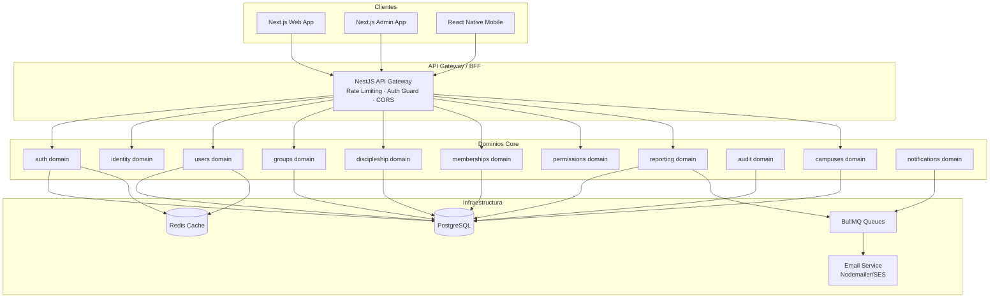

# Design Document — Enterprise Community OS 2026 (Fase 1.1)

## Overview

El ECOS es una plataforma enterprise modular construida sobre un monorepo Turborepo. La arquitectura sigue Domain-Driven Design (DDD) con módulos desacoplados que se comunican mediante eventos asíncronos (BullMQ). El backend es 
ECOS es una plataforma empresarial modular construida sobre una arquitectura **Domain-Driven Design (DDD)** con separación clara entre dominios funcionales. El sistema utiliza un monorepo con aplicaciones independientes (web, admin, api, mobile) y paquetes compartidos, permitiendo escalabilidad horizontal y mantenimiento independiente por dominio.

La arquitectura sigue el patrón **CQRS ligero** (separación de lecturas y escrituras a nivel de servicio), **Event-Driven** para comunicación entre dominios, y **Hexagonal** para aislar la lógica de negocio de la infraestructura.

---

## Arquitectura

### Diagrama de Alto Nivel



### Estructura del Monorepo

```
ecos/
├── apps/
│   ├── web/          # Next.js 15 — Portal de usuarios y líderes
│   ├── admin/        # Next.js 15 — Panel administrativo
│   ├── api/          # NestJS — Backend principal
│   └── mobile/       # React Native — App móvil (Fase 3)
├── packages/
│   ├── ui/           # Componentes shadcn/ui compartidos
│   ├── auth/         # Lógica de autenticación compartida
│   ├── database/     # Prisma schema y migraciones
│   ├── shared/       # Utilidades, constantes, helpers
│   ├── types/        # Tipos TypeScript compartidos
│   └── config/       # Configuraciones (ESLint, TS, Tailwind)
└── docker-compose.yml
```

### Estructura del Backend (NestJS)

```
apps/api/src/
├── domains/
│   ├── auth/
│   │   ├── auth.module.ts
│   │   ├── auth.controller.ts
│   │   ├── auth.service.ts
│   │   ├── strategies/        # JWT, Refresh strategies
│   │   ├── guards/            # JwtAuthGuard, RolesGuard
│   │   └── dto/
│   ├── identity/
│   ├── users/
│   ├── groups/
│   ├── discipleship/
│   ├── memberships/
│   ├── permissions/
│   ├── reporting/
│   ├── audit/
│   ├── campuses/
│   ├── ministries/
│   └── notifications/
├── infrastructure/
│   ├── database/              # PrismaService
│   ├── cache/                 # RedisService
│   ├── queue/                 # BullMQ producers/consumers
│   ├── email/                 # EmailService
│   └── search/                # SearchService (FTS abstraction)
├── common/
│   ├── decorators/
│   ├── filters/               # Global exception filters
│   ├── interceptors/          # Logging, transform
│   ├── pipes/                 # Validation pipes
│   └── events/                # Domain event bus
└── app.module.ts
```

### Estructura del Frontend (Next.js)

```
apps/web/src/
├── app/                       # Next.js App Router
│   ├── (auth)/                # Login, registro, recuperación
│   ├── (dashboard)/           # Layout autenticado
│   │   ├── people/
│   │   ├── groups/
│   │   ├── discipleship/
│   │   ├── reports/
│   │   └── settings/
│   └── api/                   # Route handlers (BFF)
├── features/
│   ├── auth/
│   ├── people/
│   ├── groups/
│   ├── discipleship/
│   ├── memberships/
│   └── reports/
├── components/
│   ├── ui/                    # Re-exports de packages/ui
│   ├── layout/
│   ├── data-table/
│   └── charts/
├── hooks/
├── services/                  # API clients (React Query)
├── schemas/                   # Zod schemas
├── stores/                    # Zustand stores
└── types/
```
