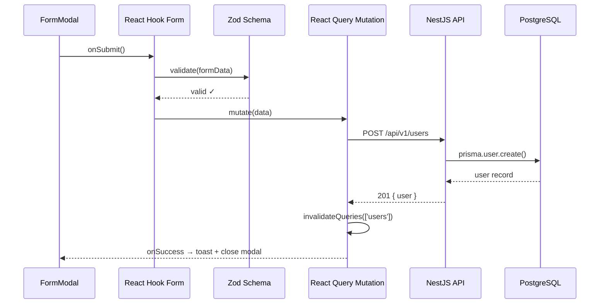
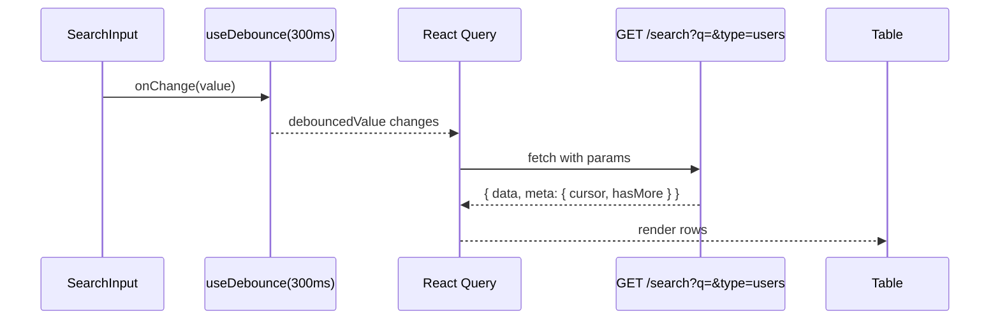
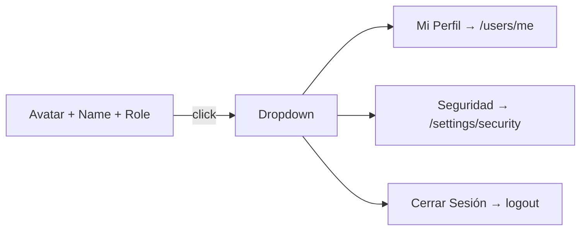

# Design Document — Frontend CRUD, UX & Reporting

## Overview

Este documento describe la arquitectura técnica para implementar los 12 requisitos de operación diaria del frontend. El sistema ya cuenta con un backend NestJS funcional y un frontend Next.js 15 con estructura base (feature folders, React Query, Zustand, TanStack Table). El diseño se enfoca en lo que se debe **construir**: componentes reutilizables, nuevos endpoints, modelo WeeklyReport, y flujos de datos.

---

## 1. Frontend Architecture

### Component Strategy

```mermaid
graph TD
    subgraph "Shared Components"
        FM[FormModal]
        DT[DataTable]
        US[UserSearch]
        PS[PasswordStrength]
        TB[TabsLayout]
        CF[ConfirmDialog]
        BN[BadgeNotification]
    end

    subgraph "Feature Pages"
        P1[/users — tabla + crear]
        P2[/users/:id — perfil tabs]
        P3[/groups — cards + crear]
        P4[/groups/:id — detalle + miembros]
        P5[/discipleship — árbol + crear]
        P6[/discipleship/:id — detalle + check-ins]
        P7[/reports — informes semanales]
        P8[/settings/security — cambio contraseña]
        P9[/activate/:token — onboarding]
    end

    FM --> P1
    FM --> P3
    FM --> P4
    FM --> P5
    DT --> P1
    DT --> P4
    DT --> P7
    US --> P4
    US --> P5
    PS --> P8
    PS --> P9
    TB --> P2
    CF --> P4
    BN --> SideNav
```

### State Management

| Concern | Tool | Scope |
|---------|------|-------|
| Auth tokens + user data | Zustand (persist) | Global |
| Server data (users, groups, reports) | React Query | Per-feature |
| Form state | React Hook Form | Per-form |
| UI state (modals, filters) | React `useState` / URL params | Local |
| Pending reports badge count | React Query (polling 5min) | Sidebar |

### Shared Patterns

- **Optimistic Updates**: React Query `onMutate` → update cache → rollback on error
- **Debounced Search**: `useDebounce(300ms)` + React Query `keepPreviousData`
- **Error Handling**: Global error boundary + per-mutation toast via `sonner`
- **Loading States**: shadcn/ui Skeleton components per section
- **Form Validation**: Zod schemas colocated in `features/*/schemas/`

---

## 2. Backend Changes

### New Endpoints

| Method | Path | Description | Auth |
|--------|------|-------------|------|
| `PATCH` | `/api/v1/auth/password` | Cambiar contraseña | JWT |
| `POST` | `/api/v1/reports/weekly` | Crear informe semanal | JWT + LEADER |
| `GET` | `/api/v1/reports/weekly` | Listar informes (filtros) | JWT |
| `GET` | `/api/v1/reports/weekly/pending` | Grupos sin informe esta semana | JWT + ADMIN |
| `POST` | `/api/v1/invitations` | Enviar invitación | JWT + ADMIN |
| `POST` | `/api/v1/invitations/activate` | Activar cuenta con token | Public |
| `POST` | `/api/v1/invitations/resend/:id` | Reenviar invitación | JWT + ADMIN |
| `GET` | `/api/v1/auth/me` | Datos del usuario actual | JWT |

### New/Modified Services

```
apps/api/src/domains/
├── auth/
│   ├── auth.controller.ts      ← +PATCH /password, +GET /me
│   └── auth.service.ts         ← +changePassword(), +getMe()
├── reporting/
│   ├── weekly-report.controller.ts   ← NEW
│   ├── weekly-report.service.ts      ← NEW
│   └── dto/weekly-report.dto.ts      ← NEW
└── invitations/                       ← NEW module (or extend auth)
    ├── invitations.controller.ts
    ├── invitations.service.ts
    └── dto/invitation.dto.ts
```

### Rate Limiting

El endpoint `PATCH /auth/password` usa el throttler `auth` existente (10 req/min) con override a 5 req/min:

```typescript
@Throttle({ auth: { ttl: 60000, limit: 5 } })
@Patch('password')
async changePassword(@CurrentUser() user, @Body() dto: ChangePasswordDto) {}
```

---

## 3. Data Flow

### Form Submit Flow (Create User example)



### Table Fetch + Search Flow



### Cursor Pagination

```typescript
// Hook pattern
const { data, fetchNextPage, hasNextPage } = useInfiniteQuery({
  queryKey: ['users', { search, status, filters }],
  queryFn: ({ pageParam }) => usersService.list({ cursor: pageParam, limit: 20, ...filters }),
  getNextPageParam: (last) => last.meta.nextCursor,
});
```

### Optimistic Update (Mark Milestone Complete)

```typescript
useMutation({
  mutationFn: (id) => discipleshipService.completeMilestone(id),
  onMutate: async (id) => {
    await queryClient.cancelQueries(['milestones', relationshipId]);
    const prev = queryClient.getQueryData(['milestones', relationshipId]);
    queryClient.setQueryData(['milestones', relationshipId], (old) =>
      old.map(m => m.id === id ? { ...m, completedAt: new Date() } : m)
    );
    return { prev };
  },
  onError: (_, __, ctx) => queryClient.setQueryData(['milestones', relationshipId], ctx.prev),
  onSettled: () => queryClient.invalidateQueries(['milestones', relationshipId]),
});
```

---

## 4. Component Hierarchy

### Reusable Components to Build

```
src/components/
├── data-table/
│   ├── data-table.tsx          # Generic wrapper: TanStack Table + shadcn Table
│   ├── data-table-pagination.tsx  # Cursor-based prev/next
│   ├── data-table-toolbar.tsx  # Search + filters + actions
│   └── data-table-skeleton.tsx # Loading state
├── forms/
│   ├── form-modal.tsx          # Dialog + Form wrapper (open/close, submit, loading)
│   ├── form-field-wrapper.tsx  # Label + error + description
│   ├── password-input.tsx      # Input + eye toggle + strength indicator
│   └── user-search-input.tsx   # Async combobox with debounce (Cmd+K style)
├── feedback/
│   ├── confirm-dialog.tsx      # Destructive action confirmation
│   ├── empty-state.tsx         # Illustration + CTA
│   └── badge-count.tsx         # Notification badge for sidebar
├── layout/
│   ├── page-header.tsx         # Title + description + actions
│   ├── tabs-layout.tsx         # Tabs container with lazy loading
│   └── user-menu.tsx           # Avatar dropdown (profile, security, logout)
└── hierarchy/
    └── tree-view.tsx           # Recursive tree for discipleship visualization
```

### Feature Component Structure (per module)

```
src/features/users/
├── components/
│   ├── users-table.tsx         # Existing → enhance with filters, row click
│   ├── create-user-modal.tsx   # FormModal + user creation form
│   ├── user-profile-tabs.tsx   # TabsLayout with 6 tabs
│   ├── user-general-tab.tsx
│   ├── user-contact-tab.tsx
│   ├── user-ministry-tab.tsx
│   ├── user-groups-tab.tsx
│   ├── user-discipleship-tab.tsx
│   └── user-social-tab.tsx
├── hooks/
│   ├── use-users.ts            # Existing → enhance with cursor pagination
│   ├── use-user.ts             # Single user query
│   └── use-create-user.ts     # Mutation hook
├── schemas/
│   └── user.schema.ts          # Zod: createUserSchema, updateUserSchema
└── services/
    └── users.service.ts        # API client functions
```

---

## 5. New Routes

### App Router Pages

```
src/app/
├── (auth)/
│   ├── login/page.tsx                    # Existing
│   └── activate/[token]/page.tsx         # NEW — Onboarding page
├── (dashboard)/
│   ├── users/
│   │   ├── page.tsx                      # ENHANCE — add search, filters, create modal
│   │   └── [id]/page.tsx                 # NEW — User profile with tabs
│   ├── groups/
│   │   ├── page.tsx                      # ENHANCE — cards view, filters, create modal
│   │   └── [id]/page.tsx                 # NEW — Group detail + members table
│   ├── discipleship/
│   │   ├── page.tsx                      # ENHANCE — hierarchy tree + create relationship
│   │   ├── [id]/page.tsx                 # NEW — Relationship detail + milestones
│   │   └── [id]/report/page.tsx          # NEW — Check-in form
│   ├── reports/
│   │   └── page.tsx                      # NEW — Weekly reports (create + list)
│   ├── audit/
│   │   └── page.tsx                      # Existing
│   ├── analytics/
│   │   └── page.tsx                      # Existing
│   └── settings/
│       └── security/page.tsx             # NEW — Change password
│   └── layout.tsx                        # ENHANCE — user menu in sidebar
```

### Route Protection

- `/activate/[token]` → Public (no auth required)
- `/settings/security` → Authenticated
- `/reports` → LEADER+ (leaders see own, admins see all)
- `/audit`, `/analytics` → ADMIN+ only (hide from sidebar for MEMBER/GUEST)

---

## 6. Database Schema

### New Model: WeeklyReport

```prisma
model WeeklyReport {
  id              String   @id @default(uuid())
  groupId         String   @map("group_id")
  reporterId      String   @map("reporter_id")
  meetingDate     DateTime @map("meeting_date")
  attendanceCount Int      @map("attendance_count")
  newVisitorsCount Int     @map("new_visitors_count") @default(0)
  prayerRequests  String?  @map("prayer_requests")
  notes           String?
  offeringAmount  Decimal? @map("offering_amount") @db.Decimal(10, 2)
  createdAt       DateTime @default(now()) @map("created_at")
  updatedAt       DateTime @updatedAt @map("updated_at")

  group    Group @relation(fields: [groupId], references: [id])
  reporter User  @relation(fields: [reporterId], references: [id])

  @@index([groupId])
  @@index([reporterId])
  @@index([meetingDate])
  @@index([groupId, meetingDate])
  @@map("weekly_reports")
}
```

### Schema Changes Required

```prisma
// Add to User model:
weeklyReports WeeklyReport[] @relation("WeeklyReportReporter")

// Add to Group model:
weeklyReports WeeklyReport[]

// Add to Invitation model (already exists, verify fields):
// - Ensure `expiresAt` defaults to 72h from creation
// - Add relation for activated user (optional)
activatedUserId String? @map("activated_user_id")
```

### Migration Plan

1. Add `WeeklyReport` model
2. Add relations to `User` and `Group`
3. Add `activatedUserId` to `Invitation` (optional)
4. Run `prisma migrate dev --name add-weekly-reports`

---

## 7. Sidebar & Navigation Update

### Updated Navigation Structure

```typescript
const NAV_ITEMS = [
  { href: '/dashboard', label: 'Dashboard', icon: LayoutDashboard },
  { href: '/users', label: 'Usuarios', icon: Users },
  { href: '/groups', label: 'Grupos', icon: Network },
  { href: '/discipleship', label: 'Discipulado', icon: GitBranch },
  { href: '/reports', label: 'Informes', icon: FileText, badge: 'pendingCount' },
  { href: '/analytics', label: 'Analytics', icon: BarChart3, roles: ['ADMIN', 'SUPER_ADMIN'] },
  { href: '/audit', label: 'Auditoría', icon: Shield, roles: ['ADMIN', 'SUPER_ADMIN'] },
];
```

### User Menu (Sidebar Footer)



---

## 8. Auth Store Enhancement

```typescript
// Extend existing auth.store.ts
interface AuthState {
  accessToken: string | null;
  refreshToken: string | null;
  user: CurrentUser | null;        // ← NEW
  isAuthenticated: boolean;
  setTokens: (tokens: TokenPair) => void;
  setUser: (user: CurrentUser) => void;  // ← NEW
  clearTokens: () => void;
  logout: () => Promise<void>;     // ← NEW (calls API + clears)
}

interface CurrentUser {
  id: string;
  email: string;
  firstName: string;
  lastName: string;
  avatarUrl: string | null;
  roles: UserRole[];
  campusId: string | null;
}
```

---

## 9. API Client Pattern

### Base HTTP Client (enhance existing)

```typescript
// src/lib/api-client.ts
class ApiClient {
  private baseUrl = process.env.NEXT_PUBLIC_API_URL;

  async request<T>(path: string, options: RequestInit): Promise<T> {
    const token = useAuthStore.getState().accessToken;
    const res = await fetch(`${this.baseUrl}${path}`, {
      ...options,
      headers: {
        'Content-Type': 'application/json',
        ...(token && { Authorization: `Bearer ${token}` }),
        ...options.headers,
      },
    });

    if (res.status === 401) {
      // Attempt token refresh
      await this.refreshToken();
      return this.request(path, options); // retry once
    }

    if (!res.ok) {
      const error = await res.json().catch(() => ({}));
      throw new ApiError(res.status, error.message, error.field);
    }

    return res.json();
  }
}

export const api = new ApiClient();
```

### Service Pattern (per feature)

```typescript
// src/features/reports/services/weekly-reports.service.ts
export const weeklyReportsService = {
  create: (data: CreateWeeklyReportDto) =>
    api.post<WeeklyReport>('/reports/weekly', data),

  list: (params: WeeklyReportFilters) =>
    api.get<PaginatedResponse<WeeklyReport>>('/reports/weekly', { params }),

  getPending: () =>
    api.get<PendingGroup[]>('/reports/weekly/pending'),
};
```

---

## 10. Key Technical Decisions

| Decision | Choice | Rationale |
|----------|--------|-----------|
| Pagination | Cursor-based | Consistent with existing `cursor-pagination.ts` in backend |
| Form modals | shadcn Dialog + React Hook Form | Consistent with shadcn patterns, accessible |
| Search | Debounce 300ms + existing `/search` endpoint | Backend FTS already implemented |
| Tree visualization | Custom recursive component | Lightweight, no heavy lib needed for discipleship tree |
| Password hashing | Argon2id (backend) | Already used in auth service |
| Invitation tokens | crypto.randomUUID + 72h TTL | Simple, secure, matches existing Invitation model |
| Badge polling | React Query refetchInterval: 5min | Low overhead, no WebSocket needed |
| Bulk actions | Client-side selection + batch API call | Simple UX, backend already supports batch |

---

## 11. File Inventory (New Files to Create)

### Frontend (~35 files)

```
# Shared components
src/components/data-table/data-table.tsx
src/components/data-table/data-table-pagination.tsx
src/components/data-table/data-table-toolbar.tsx
src/components/data-table/data-table-skeleton.tsx
src/components/forms/form-modal.tsx
src/components/forms/password-input.tsx
src/components/forms/user-search-input.tsx
src/components/feedback/confirm-dialog.tsx
src/components/feedback/empty-state.tsx
src/components/feedback/badge-count.tsx
src/components/layout/page-header.tsx
src/components/layout/tabs-layout.tsx
src/components/layout/user-menu.tsx
src/components/hierarchy/tree-view.tsx

# Pages
src/app/(auth)/activate/[token]/page.tsx
src/app/(dashboard)/users/[id]/page.tsx
src/app/(dashboard)/groups/[id]/page.tsx
src/app/(dashboard)/discipleship/[id]/page.tsx
src/app/(dashboard)/discipleship/[id]/report/page.tsx
src/app/(dashboard)/reports/page.tsx
src/app/(dashboard)/settings/security/page.tsx

# Features (hooks, schemas, services, components)
src/features/users/components/create-user-modal.tsx
src/features/users/components/user-profile-tabs.tsx
src/features/users/schemas/user.schema.ts
src/features/groups/components/create-group-modal.tsx
src/features/groups/components/group-members-table.tsx
src/features/groups/components/add-member-modal.tsx
src/features/discipleship/components/create-relationship-modal.tsx
src/features/discipleship/components/discipleship-tree.tsx
src/features/discipleship/components/milestone-form.tsx
src/features/discipleship/components/checkin-form.tsx
src/features/reporting/components/weekly-report-form.tsx
src/features/reporting/components/weekly-reports-table.tsx
src/features/reporting/schemas/weekly-report.schema.ts
src/features/reporting/services/weekly-reports.service.ts
src/features/reporting/hooks/use-weekly-reports.ts
src/features/auth/components/change-password-form.tsx
src/features/auth/components/onboarding-form.tsx

# Lib
src/lib/api-client.ts
```

### Backend (~10 files)

```
src/domains/reporting/weekly-report.controller.ts
src/domains/reporting/weekly-report.service.ts
src/domains/reporting/dto/weekly-report.dto.ts
src/domains/auth/dto/change-password.dto.ts
src/domains/invitations/invitations.controller.ts
src/domains/invitations/invitations.service.ts
src/domains/invitations/invitations.module.ts
src/domains/invitations/dto/invitation.dto.ts
```

### Database

```
packages/database/prisma/schema.prisma  ← modify (add WeeklyReport)
packages/database/prisma/migrations/    ← new migration
```

---

## 12. Implementation Priority

```mermaid
gantt
    title Implementation Order
    dateFormat X
    axisFormat %s

    section Foundation
    API Client refactor           :a1, 0, 1
    Shared components (DataTable, FormModal, etc) :a2, 0, 2

    section Core CRUD
    Req 2 - Crear/Buscar Persona  :b1, 2, 4
    Req 3 - Perfil Modular        :b2, 4, 6
    Req 5 - Crear Grupo           :b3, 2, 4
    Req 7 - Agregar Persona a Grupo :b4, 4, 5

    section Discipleship
    Req 4 - Crear Discipulado     :c1, 4, 6
    Req 6 - Agregar a Discipulado :c2, 6, 7
    Req 9 - Reporte Discipulado   :c3, 7, 8

    section Reports & Auth
    Req 10 - Informe Semanal (DB + API + UI) :d1, 5, 8
    Req 1 - Cambiar Contraseña    :d2, 2, 3
    Req 8 - Onboarding/Invitaciones :d3, 3, 5

    section Navigation
    Req 11 - Perfil/Logout Sidebar :e1, 1, 2
    Req 12 - Navegación Actualizada :e2, 1, 2
```



---

## 13. Security Considerations

- **Password change**: Rate limited (5/min), requires current password verification, Argon2id hashing
- **Invitation tokens**: UUID v4, 72h expiry, single-use (invalidated on activation)
- **Role-based UI**: Sidebar items filtered client-side, endpoints protected server-side with guards
- **CSRF**: Not needed (JWT in Authorization header, not cookies)
- **Input sanitization**: Zod on frontend, class-validator + Prisma parameterized queries on backend
- **Audit trail**: All mutations logged via existing `AuditInterceptor`
