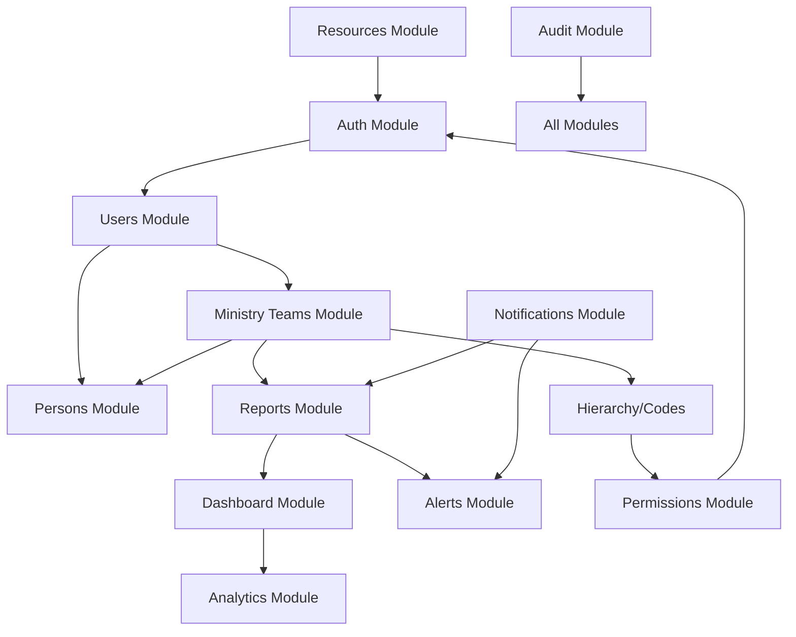

# 1. Validación del PRD — J-PDVE Conexiones

## Resumen del Análisis

El PRD provee una visión clara del producto y sus prioridades. Sin embargo, se identifican áreas que requieren clarificación antes del desarrollo.

---

## Inconsistencias Detectadas

| # | Área | Inconsistencia | Impacto | Recomendación |
|---|------|---------------|---------|---------------|
| 1 | Estructura Organizacional | El PRD muestra `Pastor General → Pastor de Red → Cobertura → Equipo Ministerial → Personas`, pero los códigos ministeriales (E, E4, E4.1...) no definen explícitamente a qué nivel jerárquico pertenecen | Alto | Definir tabla de mapeo: nivel jerárquico ↔ profundidad del código |
| 2 | Roles vs Jerarquía | "Cobertura" aparece como rol Y como nivel jerárquico. Un usuario con rol Cobertura ¿siempre supervisa Ministry Teams o puede supervisar otras Coberturas? | Alto | Separar rol funcional (permisos) de posición jerárquica (estructura) |
| 3 | Pipeline Pastoral vs Roles | El pipeline (Visitor → Leader → Coverage) implica que un Líder puede convertirse en Cobertura, pero los roles de sistema son fijos. ¿El cambio de pipeline cambia los permisos automáticamente? | Medio | Definir si pipeline es informativo o dispara cambios de permisos |
| 4 | Ministry Team ownership | "Cada persona pertenece a un Ministry Team" pero ¿qué pasa con el Pastor General o Pastores de Red que no tienen equipo ministerial asignado? | Medio | Definir que niveles superiores tienen un Ministry Team virtual o están exentos |
| 5 | Report locking | "Reports become locked after Wednesday" pero no se define timezone ni qué pasa con reportes de semanas anteriores | Bajo | Definir timezone (Panamá UTC-5) y política de reportes atrasados |

---

## Ambigüedades

| # | Área | Ambigüedad | Pregunta Clave |
|---|------|-----------|----------------|
| 1 | Ministry Team | ¿Un Ministry Team puede tener más de 2 líderes? El ejemplo muestra "Luis & Oris" | ¿Hay límite de co-líderes? |
| 2 | Ministry Codes | "Codes are assigned manually" — ¿Quién puede asignar? ¿Se pueden reasignar? ¿Qué pasa con el código cuando un team se multiplica? | Definir workflow de asignación |
| 3 | Person Transfer | "Simplifies transfers and multiplication" — ¿Cómo funciona exactamente la multiplicación? ¿El equipo original se divide? | Definir workflow de multiplicación |
| 4 | Multi-church | "Architecture must support this from day one" — ¿Tenant isolation? ¿Shared database? ¿Subdomain per church? | Definir estrategia de multi-tenancy |
| 5 | Geolocation | ¿GPS se captura en cada reporte o se asigna una sola vez al equipo? | Definir cuándo y cómo se captura GPS |
| 6 | Offering Amount | ¿En qué moneda? ¿Se requiere precisión decimal? ¿Auditoría especial para montos? | Definir formato monetario |
| 7 | Evidence Photo | ¿Obligatoria u opcional? ¿Máximo de fotos por reporte? ¿Compresión? | Definir política de evidencia |

---

## Riesgos Identificados

### Riesgos Técnicos

| # | Riesgo | Probabilidad | Impacto | Mitigación |
|---|--------|-------------|---------|------------|
| 1 | Complejidad de jerarquía ministerial con códigos manuales | Alta | Alto | Validación en backend + UI de asignación con preview de estructura |
| 2 | Offline-first para reportes en zonas sin conectividad | Media | Alto | Service Worker + IndexedDB queue (ya diseñado en platform-ux-modernization) |
| 3 | Escalabilidad de multi-church sin definición clara de isolation | Media | Alto | Diseñar con `churchId` desde día 1, pero single-database inicialmente |
| 4 | GPS accuracy en dispositivos móviles de gama baja | Media | Bajo | Permitir entrada manual de coordenadas como fallback |
| 5 | Photo storage costs en AWS S3 | Baja | Medio | Compresión client-side + lifecycle policies en S3 |

### Riesgos de Negocio

| # | Riesgo | Mitigación |
|---|--------|------------|
| 1 | Resistencia al cambio (de papel a digital) | UX extremadamente simple para reportes, Quick Report Mode |
| 2 | Líderes sin smartphone moderno | PWA ligero, soporte para dispositivos de gama baja |
| 3 | Dependencia de conectividad en Panamá rural | Offline queue + sync automático |

---

## Dependencias Críticas

---

## Problemas de Escalabilidad

1. **Ministry Codes como strings jerárquicos** — Queries con `LIKE 'E4.1%'` no escalan con índices B-tree. Solución: Usar `ltree` de PostgreSQL o materializar la jerarquía.
2. **Dashboard aggregations en tiempo real** — Calcular KPIs on-the-fly sobre miles de reportes será lento. Solución: Materialized views + Redis cache.
3. **Audit log growth** — Sin partitioning, la tabla de auditoría crecerá indefinidamente. Solución: Partition by month + archive policy.
4. **Photo storage** — Sin limits, el storage crece sin control. Solución: Max 3 fotos × 5MB = 15MB/reporte, lifecycle policies.

---

## Problemas de Seguridad

1. **Hierarchy-based access control** — Un líder no debe ver datos de equipos que no supervisa. Requiere ABAC (Attribute-Based Access Control) no solo RBAC.
2. **Offering amounts** — Datos financieros requieren encryption at rest y audit trail especial.
3. **Photo URLs** — URLs firmadas con expiración, no públicas.
4. **Ministry codes manuales** — Riesgo de asignación duplicada o inválida sin validación.
5. **Session management** — JWT rotation con refresh tokens, invalidación por cambio de rol.

---

## Problemas de Modelo de Datos

1. **Person ≠ User** — Correcto en el PRD, pero requiere una junction table clara para cuando una Person obtiene acceso al sistema.
2. **Ministry Team como entidad compartida** — Múltiples Users comparten un Team. ¿Comparten un login? No, cada User tiene su propio login pero ve los mismos datos del Team.
3. **Pipeline stages configurables** — Requiere una tabla `pipeline_stages` no hardcodeada, con orden y metadata.
4. **Ministry Code como tree** — Necesita soporte para operaciones: "dame todos los descendientes de E4", "¿quién es el padre de E4.1.2?".
5. **Temporal ownership** — Si una persona se transfiere, ¿se pierde el historial? Necesita `person_team_history`.

---

## Mejoras Recomendadas

| # | Mejora | Justificación | Prioridad |
|---|--------|---------------|-----------|
| 1 | Definir timezone explícito (America/Panama) | Evita ambigüedad en report locking | Alta |
| 2 | Agregar concepto de "Period" (semana ministerial) | Simplifica queries de reportes y dashboards | Alta |
| 3 | Definir workflow de multiplicación de equipos | Core business que no está documentado | Alta |
| 4 | Agregar "Church" como entidad desde día 1 | Preparar multi-church sin refactoring | Media |
| 5 | Definir límites de API (rate limiting por rol) | Seguridad y performance | Media |
| 6 | Agregar concepto de "Season" (temporadas ministeriales) | Permite comparativas año vs año | Baja |
| 7 | Documentar flujo de eliminación/inactivación | ¿Qué pasa cuando un líder deja el ministerio? | Alta |
