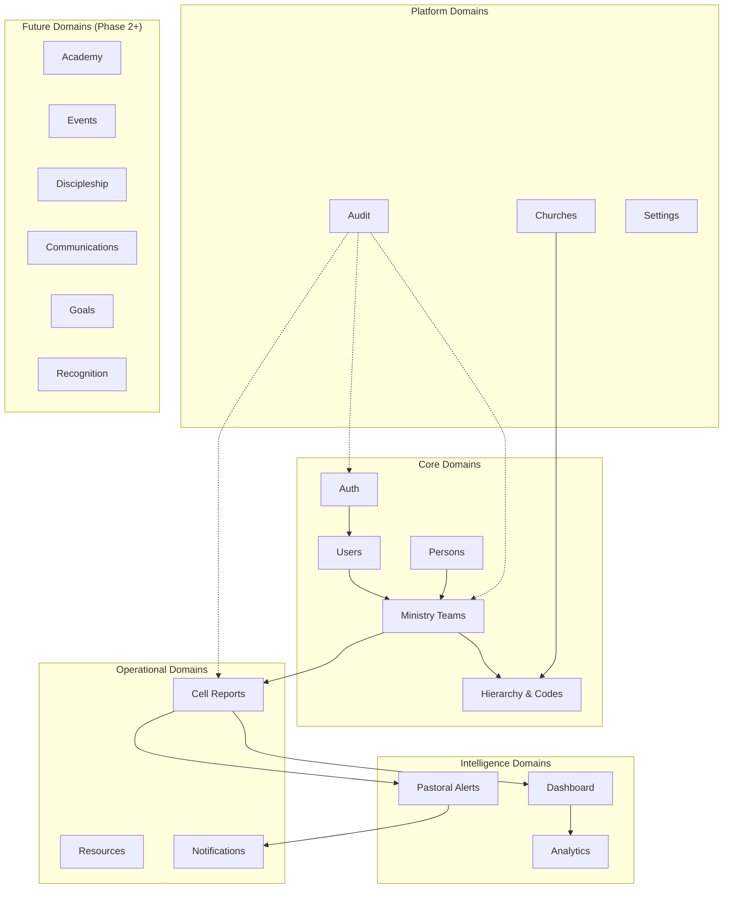

# 2. Dominios de Negocio — J-PDVE Conexiones

---

## Mapa de Dominios

---

## Dominio 1: Auth

### Responsabilidad
Gestión de autenticación, sesiones, tokens y recuperación de contraseña.

### Entidades
| Entidad | Descripción |
|---------|-------------|
| Session | Sesión activa de un usuario (JWT + refresh token) |
| RefreshToken | Token de refresco con expiración y revocación |
| PasswordReset | Solicitud de recuperación con token temporal |

### Casos de Uso
- Login con email + password
- Refresh de token
- Logout (invalidar sesión)
- Solicitar recuperación de contraseña
- Cambiar contraseña con token
- Detectar sesiones sospechosas

### Dependencias
- **Users** — Valida credenciales contra User entity
- **Audit** — Registra intentos de login (exitosos y fallidos)

---

## Dominio 2: Users

### Responsabilidad
Gestión de cuentas de usuario del sistema (credenciales, roles, permisos).

### Entidades
| Entidad | Descripción |
|---------|-------------|
| User | Cuenta de sistema con credenciales y rol |
| UserRole | Rol asignado (PASTOR_GENERAL, PASTOR_RED, COBERTURA, MINISTRY_TEAM, MEMBER) |
| UserPreferences | Preferencias de UI, idioma, notificaciones |

### Casos de Uso
- Crear usuario (asociado a una Person)
- Asignar/cambiar rol
- Desactivar usuario
- Listar usuarios por rol/estado
- Actualizar preferencias

### Dependencias
- **Auth** — Provee credenciales para autenticación
- **Persons** — Un User referencia a una Person (1:1 opcional)
- **Ministry Teams** — Un User pertenece a uno o más Ministry Teams
- **Hierarchy** — El rol determina el scope de visibilidad

---

## Dominio 3: Persons

### Responsabilidad
Registro de todas las personas relacionadas con el ministerio, independientemente de si tienen acceso al sistema.

### Entidades
| Entidad | Descripción |
|---------|-------------|
| Person | Individuo con datos básicos y pipeline stage |
| PipelineStage | Etapa actual en el pipeline pastoral |
| PersonTeamAssignment | Asignación actual de persona a Ministry Team |
| PersonTeamHistory | Historial de asignaciones (transferencias) |
| PersonContact | Datos de contacto (teléfono, email, dirección) |

### Casos de Uso
- Registrar nueva persona (visitante)
- Avanzar persona en pipeline pastoral
- Transferir persona a otro Ministry Team
- Consultar historial de una persona
- Buscar personas por nombre/stage/equipo
- Consolidar persona (marcar como consolidada)

### Dependencias
- **Ministry Teams** — Cada persona pertenece a un team
- **Users** — Una persona puede tener o no una cuenta de usuario
- **Audit** — Cambios de pipeline y transferencias se auditan

---

## Dominio 4: Ministry Teams

### Responsabilidad
Gestión de la unidad organizacional principal: el Equipo Ministerial. Incluye composición, código ministerial, y relaciones jerárquicas.

### Entidades
| Entidad | Descripción |
|---------|-------------|
| MinistryTeam | Equipo con código, líderes y personas asignadas |
| TeamMember | Relación User ↔ MinistryTeam (con rol dentro del team) |
| TeamCode | Código jerárquico asignado manualmente (E4.1.2) |
| TeamLocation | Ubicación GPS del punto de reunión |

### Casos de Uso
- Crear Ministry Team
- Asignar código ministerial
- Agregar/remover líderes del equipo
- Asignar personas al equipo
- Transferir personas entre equipos
- Multiplicar equipo (split)
- Desactivar equipo
- Consultar equipos por red/cobertura

### Dependencias
- **Hierarchy** — El código define posición en el árbol
- **Persons** — Personas asignadas al equipo
- **Users** — Líderes del equipo son Users
- **Reports** — Los reportes se envían por equipo
- **Audit** — Cambios estructurales se auditan

---

## Dominio 5: Hierarchy & Codes

### Responsabilidad
Gestión del árbol jerárquico ministerial y los códigos que definen la estructura organizacional.

### Entidades
| Entidad | Descripción |
|---------|-------------|
| HierarchyNode | Nodo en el árbol (church → network → coverage → team) |
| MinistryCode | Código string jerárquico con path materializado |
| Network | Red ministerial (agrupación de coberturas) |
| Coverage | Cobertura (supervisor de equipos) |

### Casos de Uso
- Crear/modificar nodo jerárquico
- Asignar código a un Ministry Team
- Consultar descendientes de un nodo
- Consultar ancestros de un nodo
- Mover nodo dentro del árbol
- Validar unicidad de código
- Visualizar organigrama completo

### Dependencias
- **Ministry Teams** — Cada team tiene un nodo en la jerarquía
- **Users** — Pastores y coberturas son nodos superiores
- **Permissions** — La jerarquía determina scope de acceso
- **Churches** — El nodo raíz es la iglesia

---

## Dominio 6: Cell Reports

### Responsabilidad
Captura, validación, almacenamiento y consulta de reportes semanales de células/equipos ministeriales.

### Entidades
| Entidad | Descripción |
|---------|-------------|
| CellReport | Reporte semanal con asistencia, ofrenda, tema, notas |
| ReportDraft | Borrador auto-guardado |
| ReportPhoto | Foto de evidencia adjunta |
| ReportPeriod | Semana ministerial (lunes a domingo) |
| ReportComment | Comentario de cobertura/pastor sobre un reporte |

### Casos de Uso
- Crear nuevo reporte
- Guardar borrador automáticamente
- Enviar reporte (validar período)
- Adjuntar foto de evidencia
- Consultar historial de reportes
- Editar reporte (si dentro del período)
- Comentar reporte (cobertura)
- Exportar reportes
- Detectar reportes duplicados

### Dependencias
- **Ministry Teams** — Cada reporte pertenece a un team
- **Hierarchy** — Determina quién puede ver/comentar
- **Dashboard** — Alimenta métricas
- **Alerts** — Detecta ausencia de reportes
- **Audit** — Ediciones y eliminaciones se auditan

### Reglas de Negocio
- Envío normal: Domingo
- Envío tardío: Lunes a Miércoles
- Cerrado: Jueves en adelante
- Editable por: Ministry Team + Cobertura
- Un reporte por equipo por semana

---

## Dominio 7: Resources

### Responsabilidad
Distribución de contenido ministerial (sermones, manuales, material de capacitación).

### Entidades
| Entidad | Descripción |
|---------|-------------|
| Resource | Archivo con metadata (tipo, categoría, fecha) |
| ResourceCategory | Clasificación (sermón, manual, training) |
| ResourceAccess | Quién puede ver qué recurso (por rol/nivel) |

### Casos de Uso
- Subir recurso (PDF, imagen)
- Categorizar recurso
- Asignar visibilidad por rol/nivel
- Listar recursos disponibles para el usuario
- Descargar recurso
- Marcar recurso como favorito
- Notificar nuevo recurso disponible

### Dependencias
- **Auth** — Control de acceso por rol
- **Notifications** — Alerta de nuevo recurso
- **Storage** — S3 para archivos

---

## Dominio 8: Dashboard

### Responsabilidad
Agregación y presentación de métricas operativas del ministerio.

### Entidades
| Entidad | Descripción |
|---------|-------------|
| KpiSnapshot | Snapshot calculado de KPIs (cacheado) |
| DashboardFilter | Filtros activos del usuario (red, período, equipo) |

### Casos de Uso
- Ver dashboard ejecutivo (métricas semanales)
- Ver dashboard avanzado (top 10, trends)
- Filtrar por red/cobertura/período
- Drill-down en cualquier KPI
- Exportar datos del dashboard
- Comparar períodos

### Dependencias
- **Reports** — Fuente primaria de datos
- **Ministry Teams** — Agrupación de métricas
- **Hierarchy** — Scope de visibilidad
- **Analytics** — Cálculos complejos

---

## Dominio 9: Notifications

### Responsabilidad
Sistema de notificaciones in-app para mantener informados a los usuarios.

### Entidades
| Entidad | Descripción |
|---------|-------------|
| Notification | Notificación individual para un usuario |
| NotificationTemplate | Plantilla de notificación por tipo |
| NotificationPreference | Preferencia del usuario (qué quiere recibir) |

### Casos de Uso
- Enviar notificación (sistema genera)
- Listar notificaciones del usuario
- Marcar como leída
- Marcar todas como leídas
- Configurar preferencias de notificación
- Enviar notificación masiva (por rol/nivel)

### Dependencias
- **Reports** — Notifica pendientes/aprobados/comentados
- **Resources** — Notifica nuevo recurso
- **Alerts** — Alerta pastoral genera notificación
- **Users** — Cada notificación tiene un destinatario

---

## Dominio 10: Audit

### Responsabilidad
Registro inmutable de todas las mutaciones críticas del sistema para trazabilidad y compliance.

### Entidades
| Entidad | Descripción |
|---------|-------------|
| AuditLog | Registro de acción con actor, target, before/after values |
| AuditCategory | Clasificación del audit (REPORT, HIERARCHY, USER, OFFERING) |

### Casos de Uso
- Registrar mutación automáticamente (interceptor)
- Consultar historial de una entidad
- Consultar acciones de un usuario
- Filtrar por categoría/fecha/actor
- Exportar audit trail

### Dependencias
- **Todos los dominios** — El audit es transversal
- NO tiene dependencias hacia otros dominios (es consumidor pasivo)

---

## Dominio 11: Pastoral Alerts

### Responsabilidad
Detección automática de anomalías operativas y generación de alertas para liderazgo.

### Entidades
| Entidad | Descripción |
|---------|-------------|
| Alert | Alerta generada con tipo, target, metadata |
| AlertRule | Regla configurable (ej: 2 semanas sin reporte) |
| AlertAcknowledgment | Registro de quién atendió la alerta |

### Casos de Uso
- Detectar equipos sin reportar (2+ semanas)
- Detectar declive de asistencia (3+ semanas consecutivas)
- Detectar personas sin seguimiento post-consolidación
- Generar alerta automática
- Enviar notificación al responsable
- Marcar alerta como atendida
- Ver historial de alertas

### Dependencias
- **Reports** — Fuente de datos para detección
- **Ministry Teams** — Target de alertas
- **Hierarchy** — Determina quién recibe la alerta
- **Notifications** — Canal de entrega

---

## Dominio 12: Churches (Preparación Multi-Church)

### Responsabilidad
Entidad raíz para soportar multi-church desde la arquitectura inicial.

### Entidades
| Entidad | Descripción |
|---------|-------------|
| Church | Iglesia con metadata, configuración, y branding |
| ChurchSettings | Configuración específica (timezone, pipeline stages, report rules) |

### Casos de Uso
- Crear iglesia (solo super admin, futuro)
- Configurar pipeline stages por iglesia
- Configurar reglas de reportes por iglesia
- Configurar branding por iglesia

### Dependencias
- **Hierarchy** — Nodo raíz del árbol
- **Settings** — Configuración global vs por iglesia
- **Todos** — churchId como tenant discriminator

---

## Dominio 13: Settings

### Responsabilidad
Configuración global del sistema y configuración por iglesia.

### Entidades
| Entidad | Descripción |
|---------|-------------|
| SystemSetting | Configuración global (feature flags, limits) |
| PipelineStageConfig | Stages configurables del pipeline pastoral |
| ReportPeriodConfig | Reglas de períodos de reporte |

### Casos de Uso
- Configurar pipeline stages
- Configurar horarios de reporte
- Activar/desactivar features
- Configurar timezone

### Dependencias
- **Churches** — Settings puede ser por iglesia
- **Reports** — Reglas de período
- **Persons** — Pipeline stages

---

## Resumen de Dominios MVP

| # | Dominio | Prioridad | Sprint |
|---|---------|-----------|--------|
| 1 | Auth | Crítica | 1 |
| 2 | Users | Crítica | 1 |
| 3 | Churches | Crítica (estructura) | 1 |
| 4 | Hierarchy & Codes | Crítica | 1 |
| 5 | Ministry Teams | Crítica | 1-2 |
| 6 | Persons | Crítica | 2 |
| 7 | Cell Reports | Crítica | 2-3 |
| 8 | Resources | Alta | 3 |
| 9 | Dashboard | Alta | 3 |
| 10 | Notifications | Media | 3-4 |
| 11 | Audit | Crítica (transversal) | 1 |
| 12 | Pastoral Alerts | Media | 4 |
| 13 | Settings | Media | 1 (parcial) |
