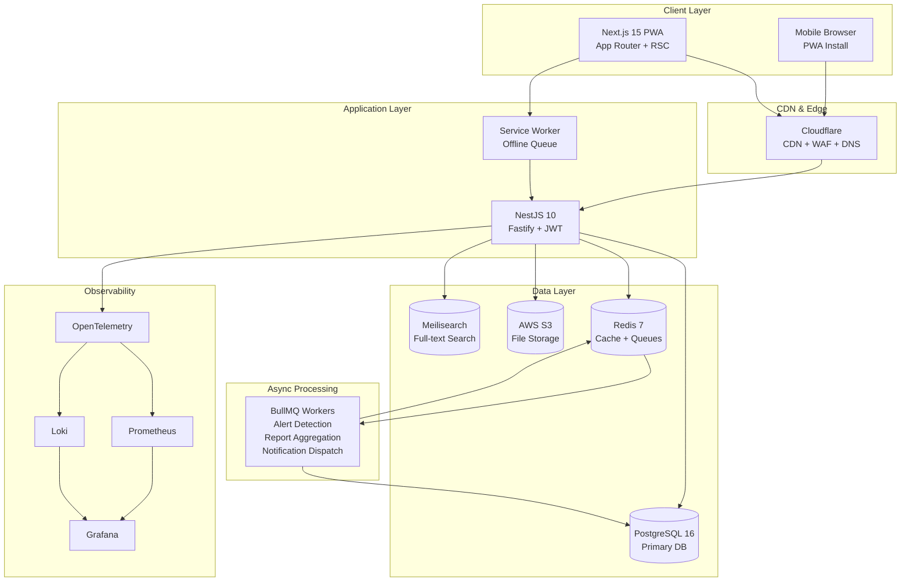
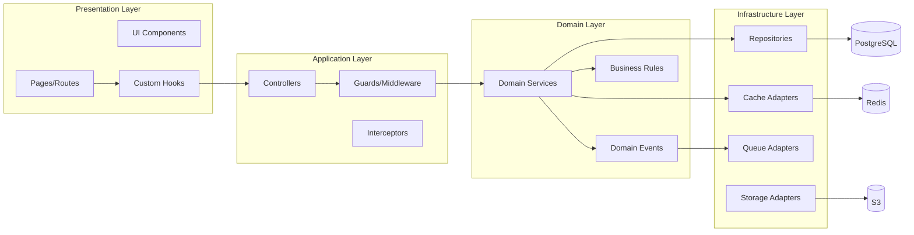
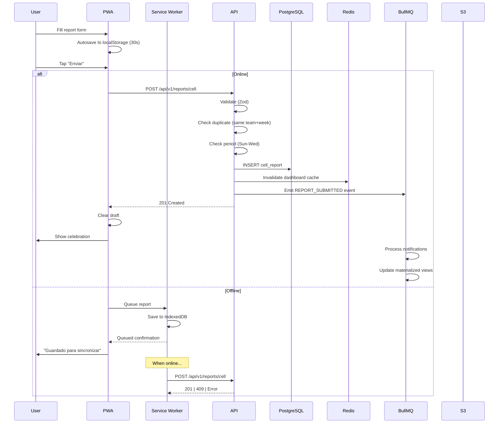
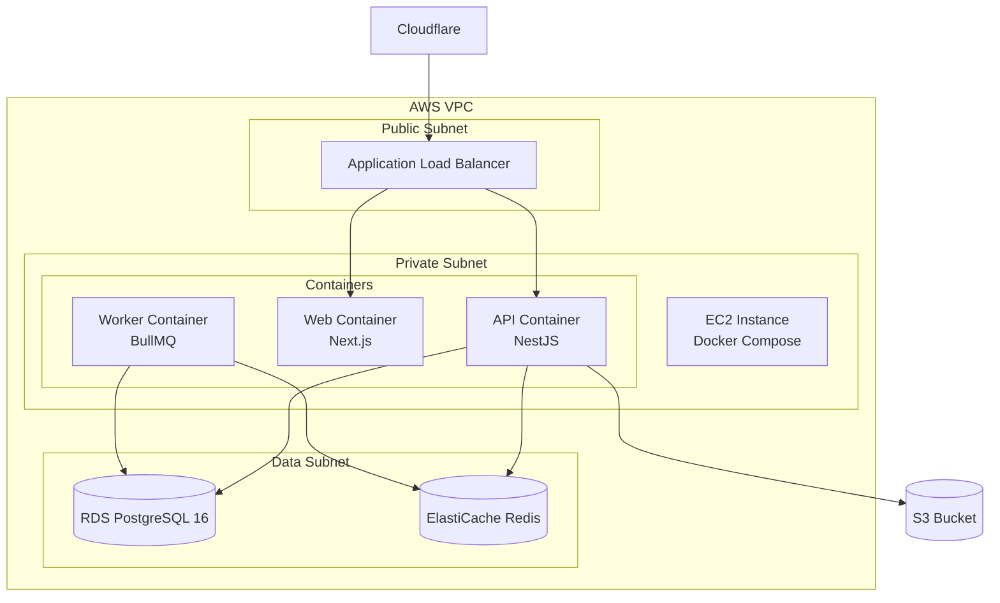

# 3. Arquitectura del Sistema — J-PDVE Conexiones

---

## Diagrama General de Arquitectura

---

## Decisiones Arquitectónicas

### Frontend: Next.js 15 (App Router) como PWA

**¿Por qué?**
- Server Components reducen bundle size y mejoran TTI
- App Router permite layouts compartidos eficientes
- PWA capabilities para offline support (Service Worker)
- Rendering híbrido: SSR para SEO/dashboard, CSR para interactividad
- Ecosystem maduro con shadcn/ui, TanStack, Zustand

**Alternativas descartadas:**
- Remix: Menos ecosystem para UI components
- SPA puro (Vite + React): Sin SSR, peor para SEO y initial load
- React Native: Requiere App Store, más costo de mantenimiento

---

### Backend: NestJS 10 sobre Fastify

**¿Por qué?**
- Modular por diseño — encaja con DDD-lite y dominios separados
- Fastify 2-3x más rápido que Express en throughput
- Decorators + DI simplifican testing y mocking
- Guards/Interceptors para cross-cutting (auth, audit, logging)
- OpenAPI generation automática para documentación

**Alternativas descartadas:**
- Express directo: Sin estructura, no escala en equipo
- Hono/Elysia: Ecosystem inmaduro para enterprise
- tRPC: Acoplamiento fuerte frontend-backend, no ideal para multi-client futuro

---

### Base de Datos: PostgreSQL 16

**¿Por qué?**
- `ltree` extension para jerarquía ministerial (queries eficientes de ancestros/descendientes)
- JSONB para metadata flexible (structured notes, alert metadata)
- Materialized views para dashboard aggregations
- Partitioning para audit logs de alto volumen
- Row-Level Security (futuro multi-tenant)
- Prisma 6 como ORM con type safety

**Alternativas descartadas:**
- MySQL: Sin `ltree`, menor soporte para features avanzadas
- MongoDB: Relaciones complejas (jerarquía, pipeline) encajan mejor en relacional
- Supabase: Vendor lock-in, menos control sobre infraestructura

---

### Cache: Redis 7

**¿Por qué?**
- Cache de dashboard KPIs (TTL 5min)
- Cache de sesiones y rate limiting
- BullMQ queues (alert detection, notifications, aggregation jobs)
- Pub/Sub para real-time notifications (futuro)
- Sorted sets para leaderboards/rankings

**Alternativas descartadas:**
- Memcached: Sin persistence, sin queues
- In-memory cache only: No sobrevive restarts, no compartido entre instancias

---

### Storage: AWS S3

**¿Por qué?**
- Evidence photos de reportes
- PDFs de recursos ministeriales
- Lifecycle policies para archiving automático
- Presigned URLs para acceso seguro sin proxy
- Cost-effective para almacenamiento a largo plazo

**Configuración:**
- Bucket: `jpdve-conexiones-{env}`
- Prefixes: `reports/{teamId}/{year}/`, `resources/{category}/`, `avatars/{userId}/`
- Lifecycle: Move to Glacier después de 1 año para photos

---

### Search: Meilisearch v1.11

**¿Por qué?**
- Búsqueda de personas por nombre (fuzzy, typo-tolerant)
- Búsqueda de recursos por título/contenido
- Filtros facetados (por red, stage, equipo)
- Self-hosted, sin costo por request
- Latencia <50ms para búsquedas

**Alternativas descartadas:**
- Elasticsearch: Overkill para el volumen esperado, alto consumo de RAM
- PostgreSQL full-text: No soporta fuzzy/typos adecuadamente
- Algolia: Costo por búsqueda, vendor lock-in

---

### Queues: BullMQ

**¿Por qué?**
- Alert detection jobs (cron: cada 15 min)
- Dashboard aggregation (cron: cada 5 min)
- Notification dispatch (async, no bloquea request)
- Report photo processing (resize, optimize)
- Retry automático con backoff exponencial

**Jobs principales:**
| Job | Schedule | Purpose |
|-----|----------|---------|
| `detect-missing-reports` | Every 15 min | Alertas por reportes faltantes |
| `refresh-materialized-views` | Every 15 min | Dashboard data freshness |
| `detect-attendance-decline` | Daily 6 AM | Alertas de declive |
| `dispatch-notifications` | On event | Envío async de notificaciones |
| `process-report-photo` | On upload | Resize + optimize |
| `compute-weekly-kpis` | Monday 1 AM | Snapshot semanal |

---

### CDN & Security: Cloudflare

**¿Por qué?**
- WAF protege contra ataques comunes
- CDN para assets estáticos (fonts, images)
- DDoS protection incluido
- DNS management
- Edge caching para API responses estáticos

---

### Observability: Grafana + Prometheus + Loki + OpenTelemetry

**¿Por qué?**
- OpenTelemetry: Tracing distribuido (request → service → DB)
- Prometheus: Métricas de aplicación (response time, error rate, queue depth)
- Loki: Log aggregation con correlación por traceId
- Grafana: Dashboards unificados + alerting

**Métricas clave:**
- API response time (p50, p95, p99)
- DB query latency
- Queue depth + processing time
- Error rate by endpoint
- Active users (DAU/WAU)
- Report submission rate

---

## Arquitectura por Capas

---

## Flujo de Datos: Cell Report Submission

---

## Deployment Architecture (Phase 1)

**Justificación Phase 1 (EC2 + Docker):**
- Costo optimizado para startup (~$50-80/mes)
- Simplicidad operativa (un solo servidor)
- Docker Compose permite migrar fácilmente a ECS después
- RDS managed elimina DBA overhead
- ElastiCache managed para Redis sin ops

**Evolución Phase 2 (ECS Fargate):**
- Auto-scaling por demanda
- Zero-downtime deployments
- Container-per-service isolation
- Cost: pay-per-use vs reserved EC2

---

## Comunicación entre Componentes

| From | To | Protocol | Pattern |
|------|----|----------|---------|
| Frontend → Backend | HTTPS | REST (OpenAPI) |
| Backend → Database | TCP | Prisma Client (connection pool) |
| Backend → Redis | TCP | ioredis (connection pool) |
| Backend → S3 | HTTPS | AWS SDK v3 (presigned URLs) |
| Backend → Meilisearch | HTTP | Meilisearch JS client |
| Backend → BullMQ | Redis | BullMQ producer |
| Worker → Database | TCP | Prisma Client |
| Service Worker → Backend | HTTPS | Fetch API (background sync) |

---

## Estrategia de Escalabilidad

| Concern | Strategy |
|---------|----------|
| Database reads | Read replicas + Redis cache (5min TTL) |
| Database writes | Connection pooling (PgBouncer if needed) |
| API throughput | Horizontal scaling (ECS tasks) |
| File uploads | Direct-to-S3 presigned URLs |
| Search | Meilisearch scales independently |
| Background jobs | Multiple worker instances |
| Real-time | Redis Pub/Sub → SSE (future) |
