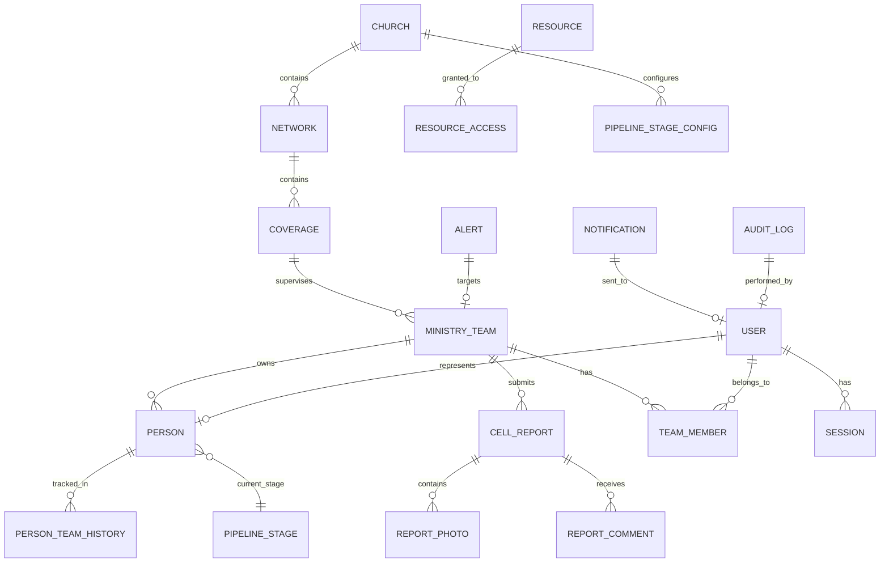
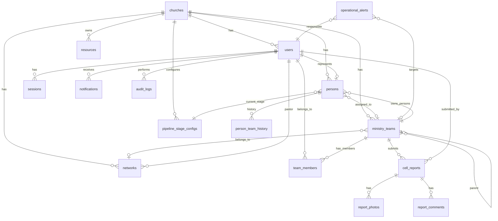

# 4. Modelo de Datos — J-PDVE Conexiones

---

## Modelo Conceptual

---

## Modelo Lógico

### Entidades Core

| Entidad | Descripción | PK | Soft Delete |
|---------|-------------|-----|-------------|
| Church | Iglesia raíz (tenant) | UUID | Sí |
| User | Cuenta de sistema | UUID | Sí |
| Person | Individuo del ministerio | UUID | Sí |
| MinistryTeam | Unidad organizacional | UUID | Sí |
| TeamMember | Junction User↔Team | UUID | No (hard delete) |
| HierarchyNode | Nodo del árbol ministerial | UUID | Sí |

### Entidades Operativas

| Entidad | Descripción | PK | Soft Delete |
|---------|-------------|-----|-------------|
| CellReport | Reporte semanal | UUID | Sí |
| ReportDraft | Borrador auto-guardado | UUID | No |
| ReportPhoto | Foto de evidencia | UUID | No |
| ReportComment | Comentario de liderazgo | UUID | Sí |
| Resource | Material ministerial | UUID | Sí |
| ResourceCategory | Clasificación | UUID | No |

### Entidades de Soporte

| Entidad | Descripción | PK | Soft Delete |
|---------|-------------|-----|-------------|
| Notification | Notificación in-app | UUID | No |
| AuditLog | Registro inmutable | UUID | No (nunca) |
| OperationalAlert | Alerta pastoral | UUID | No |
| Session | Sesión JWT activa | UUID | No |
| PipelineStageConfig | Stages configurables | UUID | No |

---

## Modelo Relacional Detallado

### churches

| Column | Type | Constraints | Description |
|--------|------|-------------|-------------|
| id | UUID | PK, DEFAULT uuid_generate_v4() | Identificador único |
| name | VARCHAR(200) | NOT NULL | Nombre de la iglesia |
| code | VARCHAR(20) | UNIQUE, NOT NULL | Código corto |
| timezone | VARCHAR(50) | NOT NULL, DEFAULT 'America/Panama' | Timezone para report locking |
| logo_url | VARCHAR(500) | NULL | URL del logo |
| is_active | BOOLEAN | DEFAULT true | Estado |
| settings | JSONB | DEFAULT '{}' | Configuración flexible |
| created_at | TIMESTAMPTZ | DEFAULT NOW() | Fecha de creación |
| updated_at | TIMESTAMPTZ | | Auto-update |
| deleted_at | TIMESTAMPTZ | NULL | Soft delete |

**Índices:** `idx_churches_code` UNIQUE

---

### users

| Column | Type | Constraints | Description |
|--------|------|-------------|-------------|
| id | UUID | PK | Identificador único |
| church_id | UUID | FK → churches.id, NOT NULL | Tenant |
| person_id | UUID | FK → persons.id, UNIQUE, NULL | Persona asociada |
| email | VARCHAR(255) | UNIQUE, NOT NULL | Email para login |
| password_hash | VARCHAR(255) | NOT NULL | Hash Argon2 |
| role | ENUM | NOT NULL | Rol del sistema |
| status | ENUM | DEFAULT 'ACTIVE' | Estado de cuenta |
| last_login_at | TIMESTAMPTZ | NULL | Último login |
| created_at | TIMESTAMPTZ | DEFAULT NOW() | |
| updated_at | TIMESTAMPTZ | | |
| deleted_at | TIMESTAMPTZ | NULL | |

**Enums:**
- `UserRole`: SUPER_ADMIN, PASTOR_GENERAL, PASTOR_RED, COBERTURA, MINISTRY_TEAM, MEMBER
- `UserStatus`: ACTIVE, INACTIVE, SUSPENDED, PENDING_VERIFICATION

**Índices:** `idx_users_email` UNIQUE, `idx_users_church_role` (church_id, role), `idx_users_person` (person_id)

---

### persons

| Column | Type | Constraints | Description |
|--------|------|-------------|-------------|
| id | UUID | PK | Identificador único |
| church_id | UUID | FK → churches.id, NOT NULL | Tenant |
| first_name | VARCHAR(100) | NOT NULL | Nombre |
| last_name | VARCHAR(100) | NOT NULL | Apellido |
| email | VARCHAR(255) | NULL | Email (puede no tener) |
| phone | VARCHAR(20) | NULL | Teléfono |
| birth_date | DATE | NULL | Fecha de nacimiento |
| gender | ENUM | NULL | Género |
| address | VARCHAR(500) | NULL | Dirección |
| avatar_url | VARCHAR(500) | NULL | Foto |
| pipeline_stage_id | UUID | FK → pipeline_stage_configs.id | Stage actual |
| pipeline_stage_date | DATE | NULL | Fecha del último cambio de stage |
| current_team_id | UUID | FK → ministry_teams.id, NULL | Team actual |
| notes | TEXT | NULL | Notas pastorales |
| created_at | TIMESTAMPTZ | DEFAULT NOW() | |
| updated_at | TIMESTAMPTZ | | |
| deleted_at | TIMESTAMPTZ | NULL | |

**Enums:**
- `Gender`: MALE, FEMALE

**Índices:** `idx_persons_church` (church_id), `idx_persons_team` (current_team_id), `idx_persons_stage` (pipeline_stage_id), `idx_persons_name` (church_id, first_name, last_name)

---

### ministry_teams

| Column | Type | Constraints | Description |
|--------|------|-------------|-------------|
| id | UUID | PK | Identificador único |
| church_id | UUID | FK → churches.id, NOT NULL | Tenant |
| name | VARCHAR(200) | NOT NULL | Nombre del equipo (ej: "Luis & Oris") |
| ministry_code | VARCHAR(50) | NOT NULL | Código jerárquico (E4.1.2) |
| ministry_code_path | LTREE | NOT NULL | Path materializado para queries |
| parent_team_id | UUID | FK → ministry_teams.id, NULL | Cobertura directa |
| network_id | UUID | FK → networks.id, NULL | Red a la que pertenece |
| meeting_day | ENUM | NULL | Día de reunión |
| meeting_time | TIME | NULL | Hora de reunión |
| latitude | DECIMAL(10,8) | NULL | GPS latitud |
| longitude | DECIMAL(11,8) | NULL | GPS longitud |
| address | VARCHAR(500) | NULL | Dirección de reunión |
| status | ENUM | DEFAULT 'ACTIVE' | Estado |
| created_at | TIMESTAMPTZ | DEFAULT NOW() | |
| updated_at | TIMESTAMPTZ | | |
| deleted_at | TIMESTAMPTZ | NULL | |

**Enums:**
- `TeamStatus`: ACTIVE, INACTIVE, MULTIPLIED
- `DayOfWeek`: MONDAY, TUESDAY, WEDNESDAY, THURSDAY, FRIDAY, SATURDAY, SUNDAY

**Índices:** `idx_teams_church` (church_id), `idx_teams_code` UNIQUE (church_id, ministry_code), `idx_teams_path` GiST (ministry_code_path), `idx_teams_parent` (parent_team_id), `idx_teams_network` (network_id), `idx_teams_location` (latitude, longitude)

---

### team_members

| Column | Type | Constraints | Description |
|--------|------|-------------|-------------|
| id | UUID | PK | |
| team_id | UUID | FK → ministry_teams.id, NOT NULL | |
| user_id | UUID | FK → users.id, NOT NULL | |
| role_in_team | ENUM | NOT NULL | Rol dentro del equipo |
| joined_at | TIMESTAMPTZ | DEFAULT NOW() | |
| left_at | TIMESTAMPTZ | NULL | |

**Enums:**
- `TeamMemberRole`: LEADER, CO_LEADER, MEMBER

**Índices:** `idx_team_members_team` (team_id), `idx_team_members_user` (user_id), UNIQUE (team_id, user_id, left_at IS NULL)

---

### networks

| Column | Type | Constraints | Description |
|--------|------|-------------|-------------|
| id | UUID | PK | |
| church_id | UUID | FK → churches.id, NOT NULL | |
| name | VARCHAR(200) | NOT NULL | Nombre de la red |
| pastor_user_id | UUID | FK → users.id, NULL | Pastor de red |
| color | VARCHAR(7) | NULL | Color identificativo (#hex) |
| status | ENUM | DEFAULT 'ACTIVE' | |
| created_at | TIMESTAMPTZ | DEFAULT NOW() | |
| updated_at | TIMESTAMPTZ | | |
| deleted_at | TIMESTAMPTZ | NULL | |

**Índices:** `idx_networks_church` (church_id), `idx_networks_pastor` (pastor_user_id)

---

### cell_reports

| Column | Type | Constraints | Description |
|--------|------|-------------|-------------|
| id | UUID | PK | |
| church_id | UUID | FK → churches.id, NOT NULL | Tenant |
| team_id | UUID | FK → ministry_teams.id, NOT NULL | Equipo que reporta |
| submitted_by | UUID | FK → users.id, NOT NULL | Quién envió |
| report_date | DATE | NOT NULL | Fecha de la reunión |
| week_start | DATE | NOT NULL | Lunes de la semana (calculado) |
| period_status | ENUM | NOT NULL | NORMAL, LATE, LOCKED |
| address | VARCHAR(500) | NULL | Dirección de reunión |
| start_time | TIME | NULL | Hora inicio |
| end_time | TIME | NULL | Hora fin |
| men_count | SMALLINT | DEFAULT 0, CHECK >= 0 | Hombres |
| women_count | SMALLINT | DEFAULT 0, CHECK >= 0 | Mujeres |
| children_count | SMALLINT | DEFAULT 0, CHECK >= 0 | Niños |
| visitors_count | SMALLINT | DEFAULT 0, CHECK >= 0 | Visitantes |
| consolidated_count | SMALLINT | DEFAULT 0, CHECK >= 0 | Consolidados |
| total_attendance | SMALLINT | GENERATED | Calculado |
| offering_amount | DECIMAL(10,2) | DEFAULT 0 | Ofrenda |
| offering_currency | VARCHAR(3) | DEFAULT 'PAB' | Moneda |
| topic | VARCHAR(300) | NULL | Tema predicado |
| notes | TEXT | NULL | Observaciones generales |
| meeting_type | ENUM | DEFAULT 'PRESENCIAL' | Tipo de reunión |
| spiritual_health | SMALLINT | NULL, CHECK 1-5 | Salud espiritual |
| is_supervised | BOOLEAN | DEFAULT false | ¿Fue supervisada? |
| created_at | TIMESTAMPTZ | DEFAULT NOW() | |
| updated_at | TIMESTAMPTZ | | |
| deleted_at | TIMESTAMPTZ | NULL | |

**Enums:**
- `ReportPeriodStatus`: NORMAL, LATE, LOCKED
- `MeetingType`: PRESENCIAL, VIRTUAL, HIBRIDA

**Índices:** `idx_reports_team_week` UNIQUE (team_id, week_start, deleted_at IS NULL), `idx_reports_church_week` (church_id, week_start), `idx_reports_date` (report_date), `idx_reports_submitted_by` (submitted_by)

**Restricciones:** `total_attendance = men_count + women_count + children_count`

---

### cell_report_drafts

| Column | Type | Constraints | Description |
|--------|------|-------------|-------------|
| id | UUID | PK | |
| user_id | UUID | FK → users.id, NOT NULL | |
| team_id | UUID | FK → ministry_teams.id, NOT NULL | |
| form_data | JSONB | NOT NULL | Estado del formulario |
| current_step | SMALLINT | DEFAULT 0 | Step del wizard |
| created_at | TIMESTAMPTZ | DEFAULT NOW() | |
| updated_at | TIMESTAMPTZ | | |

**Índices:** UNIQUE (user_id, team_id)

---

### report_photos

| Column | Type | Constraints | Description |
|--------|------|-------------|-------------|
| id | UUID | PK | |
| report_id | UUID | FK → cell_reports.id, NOT NULL | |
| url | VARCHAR(500) | NOT NULL | S3 URL |
| filename | VARCHAR(255) | NOT NULL | Nombre original |
| size_bytes | INTEGER | NOT NULL | Tamaño |
| created_at | TIMESTAMPTZ | DEFAULT NOW() | |

**Índices:** `idx_photos_report` (report_id)

---

### report_comments

| Column | Type | Constraints | Description |
|--------|------|-------------|-------------|
| id | UUID | PK | |
| report_id | UUID | FK → cell_reports.id, NOT NULL | |
| author_id | UUID | FK → users.id, NOT NULL | Quién comentó |
| content | TEXT | NOT NULL | Contenido |
| created_at | TIMESTAMPTZ | DEFAULT NOW() | |
| updated_at | TIMESTAMPTZ | | |
| deleted_at | TIMESTAMPTZ | NULL | |

**Índices:** `idx_comments_report` (report_id)

---

### person_team_history

| Column | Type | Constraints | Description |
|--------|------|-------------|-------------|
| id | UUID | PK | |
| person_id | UUID | FK → persons.id, NOT NULL | |
| team_id | UUID | FK → ministry_teams.id, NOT NULL | |
| assigned_at | TIMESTAMPTZ | NOT NULL | Inicio |
| removed_at | TIMESTAMPTZ | NULL | Fin |
| reason | VARCHAR(200) | NULL | Motivo del cambio |
| assigned_by | UUID | FK → users.id | Quién asignó |

**Índices:** `idx_person_history_person` (person_id), `idx_person_history_team` (team_id)

---

### pipeline_stage_configs

| Column | Type | Constraints | Description |
|--------|------|-------------|-------------|
| id | UUID | PK | |
| church_id | UUID | FK → churches.id, NOT NULL | |
| name | VARCHAR(100) | NOT NULL | Nombre del stage |
| code | VARCHAR(50) | NOT NULL | Código interno |
| order_index | SMALLINT | NOT NULL | Orden en pipeline |
| color | VARCHAR(7) | NULL | Color visual |
| description | VARCHAR(500) | NULL | Descripción |
| is_active | BOOLEAN | DEFAULT true | |

**Índices:** UNIQUE (church_id, code), (church_id, order_index)

---

### resources

| Column | Type | Constraints | Description |
|--------|------|-------------|-------------|
| id | UUID | PK | |
| church_id | UUID | FK → churches.id, NOT NULL | |
| title | VARCHAR(300) | NOT NULL | |
| description | TEXT | NULL | |
| category_id | UUID | FK → resource_categories.id | |
| file_url | VARCHAR(500) | NOT NULL | S3 URL |
| file_type | VARCHAR(50) | NOT NULL | MIME type |
| file_size | INTEGER | NOT NULL | Bytes |
| uploaded_by | UUID | FK → users.id, NOT NULL | |
| visibility_min_role | ENUM | DEFAULT 'MEMBER' | Rol mínimo para ver |
| created_at | TIMESTAMPTZ | DEFAULT NOW() | |
| updated_at | TIMESTAMPTZ | | |
| deleted_at | TIMESTAMPTZ | NULL | |

---

### notifications

| Column | Type | Constraints | Description |
|--------|------|-------------|-------------|
| id | UUID | PK | |
| user_id | UUID | FK → users.id, NOT NULL | Destinatario |
| type | VARCHAR(50) | NOT NULL | Tipo de notificación |
| title | VARCHAR(200) | NOT NULL | |
| body | VARCHAR(500) | NULL | |
| metadata | JSONB | NULL | Data adicional |
| read_at | TIMESTAMPTZ | NULL | Marca de lectura |
| created_at | TIMESTAMPTZ | DEFAULT NOW() | |

**Índices:** `idx_notif_user_read` (user_id, read_at), `idx_notif_created` (created_at)

---

### audit_logs

| Column | Type | Constraints | Description |
|--------|------|-------------|-------------|
| id | UUID | PK | |
| church_id | UUID | NOT NULL | Tenant |
| actor_id | UUID | NOT NULL | Quién realizó la acción |
| action | VARCHAR(50) | NOT NULL | CREATE, UPDATE, DELETE |
| entity_type | VARCHAR(100) | NOT NULL | Tabla/entidad afectada |
| entity_id | UUID | NOT NULL | ID de la entidad |
| before_value | JSONB | NULL | Estado anterior |
| after_value | JSONB | NULL | Estado posterior |
| ip_address | INET | NULL | IP del actor |
| user_agent | VARCHAR(500) | NULL | |
| created_at | TIMESTAMPTZ | DEFAULT NOW() | |

**Partitioning:** Por mes (PARTITION BY RANGE created_at)

**Índices:** `idx_audit_entity` (entity_type, entity_id), `idx_audit_actor` (actor_id), `idx_audit_created` (created_at)

---

### operational_alerts

| Column | Type | Constraints | Description |
|--------|------|-------------|-------------|
| id | UUID | PK | |
| church_id | UUID | FK → churches.id, NOT NULL | |
| type | ENUM | NOT NULL | Tipo de alerta |
| target_team_id | UUID | FK → ministry_teams.id, NULL | |
| target_user_id | UUID | FK → users.id, NULL | |
| responsible_user_id | UUID | FK → users.id, NOT NULL | Quién debe atender |
| message | VARCHAR(500) | NOT NULL | |
| metadata | JSONB | NULL | |
| acknowledged | BOOLEAN | DEFAULT false | |
| acknowledged_at | TIMESTAMPTZ | NULL | |
| acknowledged_by | UUID | NULL | |
| created_at | TIMESTAMPTZ | DEFAULT NOW() | |

**Enums:**
- `AlertType`: MISSING_REPORT, DECLINING_ATTENDANCE, ZERO_VISITORS, NO_FOLLOW_UP, STAGNANT_GROWTH

---

## Diagrama ER Completo

---

## Cardinalidades Clave

| Relación | Cardinalidad | Notas |
|----------|-------------|-------|
| Church → Users | 1:N | Multi-tenant |
| User → Person | 1:1 (opcional) | Un user puede no tener person (admin técnico) |
| Person → MinistryTeam | N:1 | Cada persona pertenece a exactamente un team |
| MinistryTeam → TeamMembers | 1:N | Múltiples líderes/miembros |
| User → TeamMembers | 1:N | Un user puede estar en múltiples teams (raro) |
| MinistryTeam → CellReports | 1:N | Un reporte por team por semana |
| MinistryTeam → MinistryTeam (parent) | N:1 | Jerarquía |
| CellReport → ReportPhotos | 1:N (max 3) | Máximo 3 fotos |
| Person → PipelineStageConfig | N:1 | Stage actual |

---

## Restricciones Importantes

1. **Un reporte por team por semana**: UNIQUE (team_id, week_start) WHERE deleted_at IS NULL
2. **Ministry code único por iglesia**: UNIQUE (church_id, ministry_code)
3. **Email único global**: UNIQUE (email) en users
4. **Soft delete**: Todas las entidades principales usan deleted_at, queries filtran por default
5. **Total attendance**: GENERATED ALWAYS AS (men_count + women_count + children_count)
6. **Report period locking**: Enforced en application layer (no DB constraint, depende de timezone)
7. **Photo limit**: Enforced en application layer (max 3 por reporte)
8. **Offering precision**: DECIMAL(10,2) para montos monetarios
