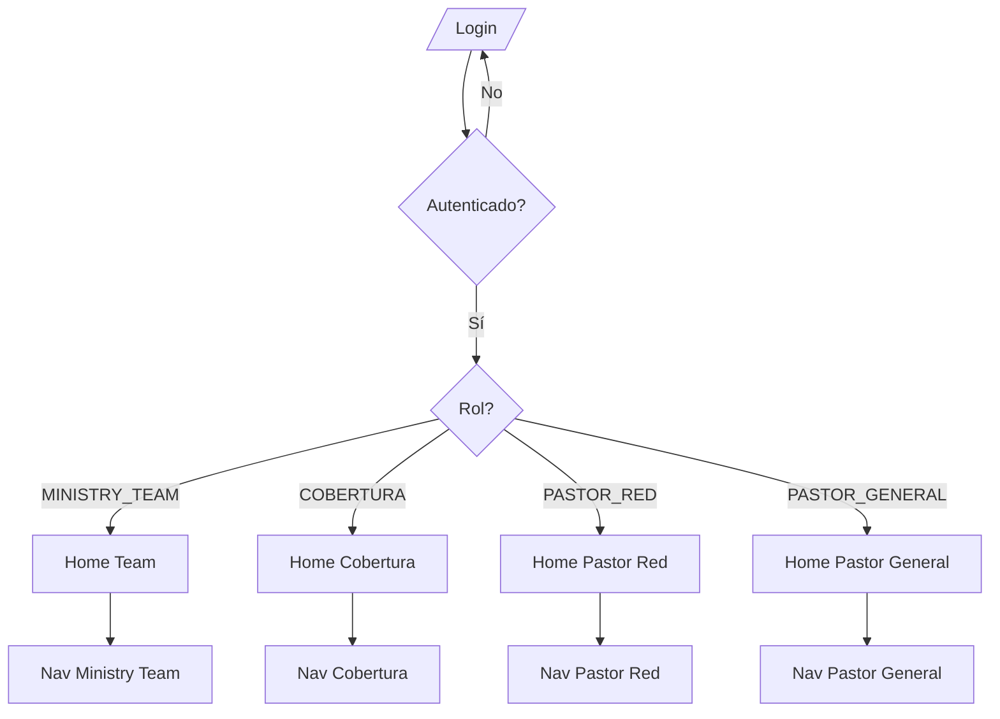
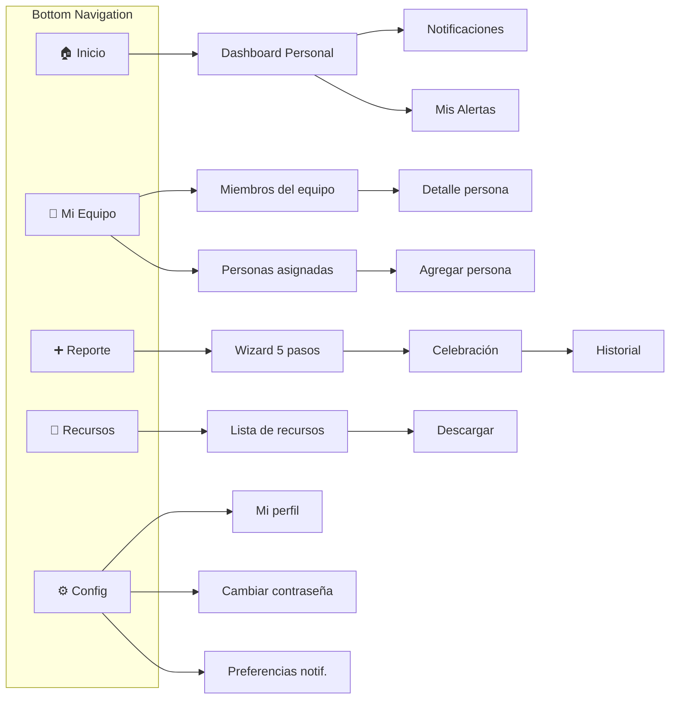
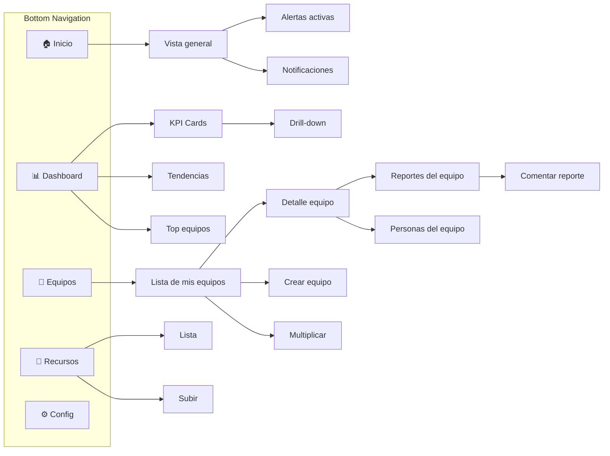
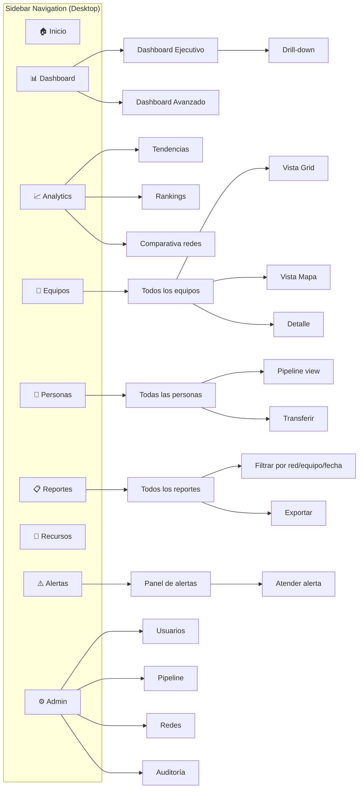

# 8. Mapa de Navegación — J-PDVE Conexiones

---

## Flujo General de Navegación



---

## Estructura de Rutas (App Router)

```mermaid
graph TD
    ROOT["/"] --> LOGIN_R["/login"]
    ROOT --> FORGOT["/forgot-password"]
    ROOT --> RESET["/reset-password/:token"]
    ROOT --> APP["/app (authenticated layout)"]
    
    APP --> DASHBOARD["/app/dashboard"]
    APP --> TEAMS["/app/teams"]
    APP --> PERSONS["/app/persons"]
    APP --> REPORTS["/app/reports"]
    APP --> RESOURCES["/app/resources"]
    APP --> NOTIFICATIONS["/app/notifications"]
    APP --> SETTINGS["/app/settings"]
    APP --> ALERTS["/app/alerts"]
    
    TEAMS --> TEAM_DETAIL["/app/teams/:id"]
    TEAMS --> TEAM_NEW["/app/teams/new"]
    
    PERSONS --> PERSON_DETAIL["/app/persons/:id"]
    PERSONS --> PERSON_NEW["/app/persons/new"]
    
    REPORTS --> REPORT_NEW["/app/reports/new"]
    REPORTS --> REPORT_DETAIL["/app/reports/:id"]
    REPORTS --> REPORT_HISTORY["/app/reports/history"]
    
    RESOURCES --> RESOURCE_DETAIL["/app/resources/:id"]
    RESOURCES --> RESOURCE_UPLOAD["/app/resources/upload"]
    
    SETTINGS --> SETTINGS_PROFILE["/app/settings/profile"]
    SETTINGS --> SETTINGS_SECURITY["/app/settings/security"]
    SETTINGS --> SETTINGS_NOTIF["/app/settings/notifications"]
    SETTINGS --> SETTINGS_ADMIN["/app/settings/admin"]
    
    SETTINGS_ADMIN --> ADMIN_USERS["/app/settings/admin/users"]
    SETTINGS_ADMIN --> ADMIN_PIPELINE["/app/settings/admin/pipeline"]
    SETTINGS_ADMIN --> ADMIN_NETWORKS["/app/settings/admin/networks"]
    SETTINGS_ADMIN --> ADMIN_REPORT_RULES["/app/settings/admin/report-rules"]
```



---

## Flujo: Ministry Team User



---

## Flujo: Cobertura User



---

## Flujo: Pastor Red / Pastor General



---

## Flujo: Reporte de Célula (Completo)

```mermaid
graph TD
    START[User abre Reporte] --> CHECK_DRAFT{¿Hay borrador?}
    
    CHECK_DRAFT -->|Sí, < 7 días| RESTORE[Restaurar borrador<br/>Toast: "Borrador restaurado"]
    CHECK_DRAFT -->|Sí, >= 7 días| DISCARD[Descartar<br/>Toast: "Borrador expirado"]
    CHECK_DRAFT -->|No| FRESH[Formulario vacío]
    
    RESTORE --> STEP1
    DISCARD --> STEP1
    FRESH --> STEP1
    
    STEP1[Step 1: Identificación] --> DUP_CHECK{¿Duplicado?}
    DUP_CHECK -->|Sí| WARN[Warning banner<br/>Submit deshabilitado]
    DUP_CHECK -->|No| VALIDATE1{Validar step 1}
    DUP_CHECK -->|Error red| CONTINUE[Continuar sin check]
    
    WARN --> CHANGE_DATE[Cambiar fecha/equipo]
    CHANGE_DATE --> DUP_CHECK
    
    VALIDATE1 -->|OK| STEP2[Step 2: Asistencia<br/>Stepper Controls]
    VALIDATE1 -->|Error| SHOW_ERRORS1[Mostrar errores inline]
    
    STEP2 --> VALIDATE2{Validar step 2}
    VALIDATE2 -->|OK| STEP3[Step 3: Crecimiento]
    VALIDATE2 -->|Error| SHOW_ERRORS2[Mostrar errores inline]
    
    STEP3 --> VALIDATE3{Validar step 3}
    VALIDATE3 -->|OK| STEP4[Step 4: Reunión]
    VALIDATE3 -->|Error| SHOW_ERRORS3[Mostrar errores inline]
    
    STEP4 --> VALIDATE4{Validar step 4}
    VALIDATE4 -->|OK| STEP5[Step 5: Resumen<br/>Read-only review]
    VALIDATE4 -->|Error| SHOW_ERRORS4[Mostrar errores inline]
    
    STEP5 --> SUBMIT{Enviar}
    
    SUBMIT --> ONLINE{¿Online?}
    ONLINE -->|Sí| API_CALL[POST /reports/cell]
    ONLINE -->|No| QUEUE[Queue offline<br/>IndexedDB]
    
    API_CALL --> SUCCESS{¿Éxito?}
    SUCCESS -->|201| CELEBRATE[🎉 Celebración<br/>+ Trends]
    SUCCESS -->|409| CONFLICT[Conflicto: reporte ya existe]
    SUCCESS -->|500| RETRY[Error: retry habilitado]
    
    QUEUE --> OFFLINE_CONFIRM[✓ Guardado para sync]
    
    CELEBRATE --> NAV_HISTORY[→ Ver Historial]
    CELEBRATE --> NAV_CLOSE[→ Cerrar]
```

---

## Flujo: Autenticación

```mermaid
graph TD
    ENTRY[User accede a la app] --> HAS_TOKEN{¿Tiene token?}
    
    HAS_TOKEN -->|No| LOGIN_PAGE[Página Login]
    HAS_TOKEN -->|Sí| VALID{¿Token válido?}
    
    VALID -->|Sí| APP[Dashboard]
    VALID -->|Expirado| REFRESH{¿Refresh token válido?}
    
    REFRESH -->|Sí| NEW_TOKEN[Obtener nuevo access token]
    REFRESH -->|No| LOGIN_PAGE
    
    NEW_TOKEN --> APP
    
    LOGIN_PAGE --> SUBMIT_LOGIN[Email + Password]
    SUBMIT_LOGIN --> AUTH_CHECK{¿Credenciales OK?}
    
    AUTH_CHECK -->|Sí| STORE_TOKENS[Guardar tokens]
    AUTH_CHECK -->|No| ERROR[Mostrar error]
    AUTH_CHECK -->|Rate Limited| BLOCKED[Bloqueado 15min]
    
    STORE_TOKENS --> REDIRECT[Redirect al dashboard del rol]
    ERROR --> LOGIN_PAGE
    
    LOGIN_PAGE --> FORGOT[¿Olvidé contraseña?]
    FORGOT --> EMAIL_FORM[Ingresar email]
    EMAIL_FORM --> SEND_RESET[Enviar link]
    SEND_RESET --> CONFIRM[Confirmar envío<br/>"Revisa tu email"]
```

---

## Responsive Breakpoints

| Breakpoint | Layout | Navigation |
|-----------|--------|------------|
| < 768px (Mobile) | Single column, Bottom nav | Bottom tab bar (5 items) |
| 768-1024px (Tablet) | Two columns where applicable | Collapsible sidebar |
| > 1024px (Desktop) | Multi-column, full sidebar | Persistent sidebar |

---

## Deep Link Support

| Pattern | Destination | Use Case |
|---------|-------------|----------|
| `/app/reports/:id` | Report detail | Notification "tu reporte fue comentado" |
| `/app/teams/:id` | Team detail | Alert "equipo sin reporte" |
| `/app/persons/:id` | Person detail | Search result |
| `/app/reports/new?teamId=X` | Pre-filled report | Quick report from team card |
| `/app/resources/:id` | Resource download | Notification "nuevo recurso" |
