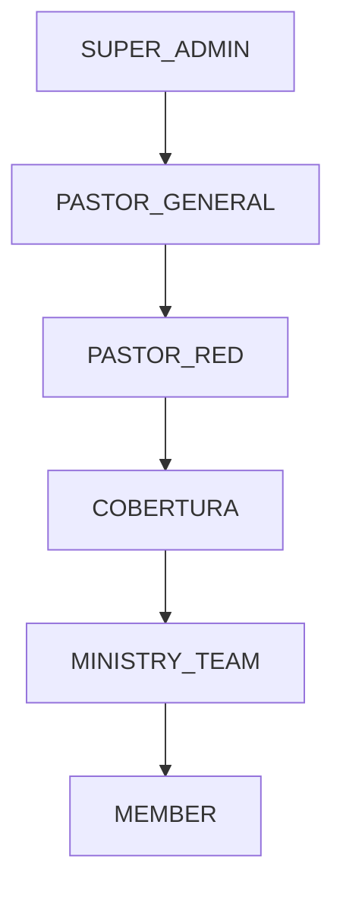
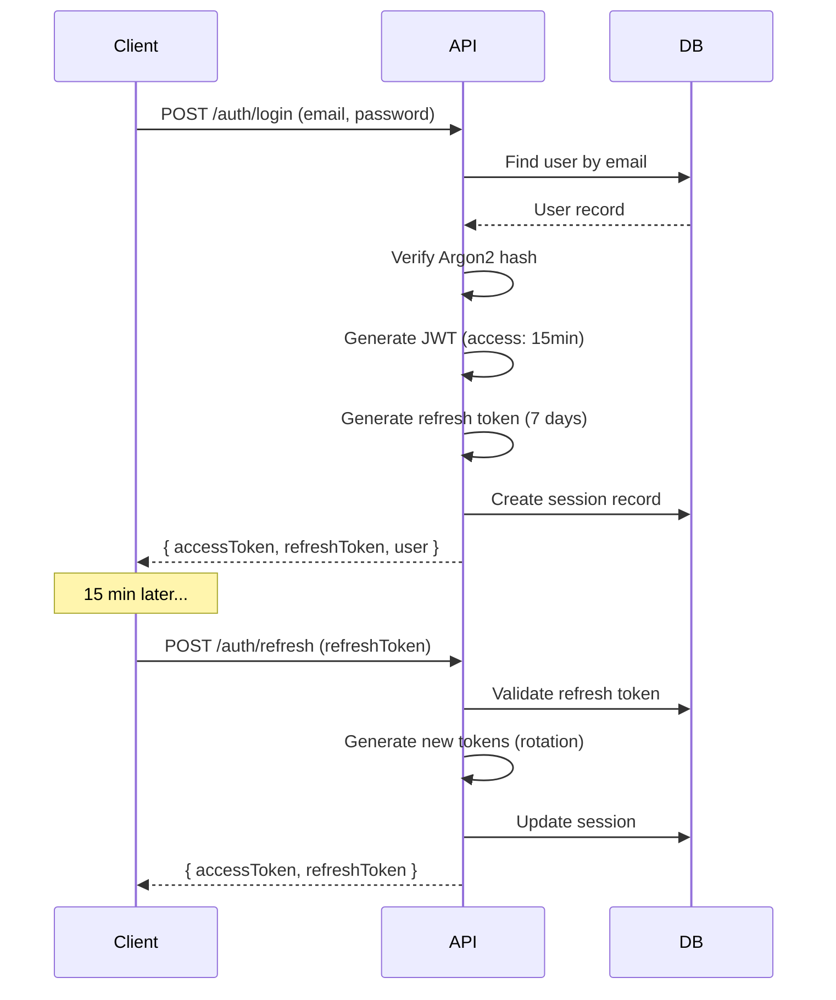
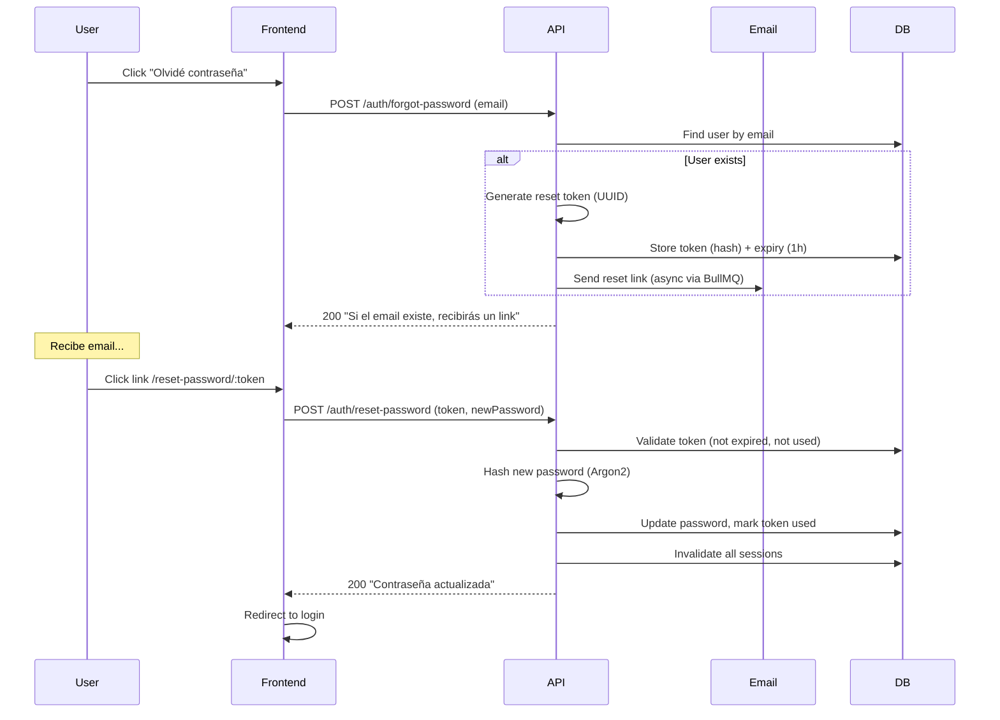

# 9. Seguridad — J-PDVE Conexiones

---

## Modelo de Roles y Permisos

### Roles del Sistema



| Rol | Scope de Visibilidad | Descripción |
|-----|---------------------|-------------|
| SUPER_ADMIN | Todo (multi-church futuro) | Administrador técnico del sistema |
| PASTOR_GENERAL | Toda la iglesia | Líder máximo, ve todos los datos |
| PASTOR_RED | Su red completa | Ve coberturas y teams de su red |
| COBERTURA | Sus teams directos | Ve solo los teams que supervisa |
| MINISTRY_TEAM | Su propio team | Ve solo su equipo y sus personas |
| MEMBER | Solo su perfil | Acceso mínimo (futuro) |

---

### Matriz de Permisos (RBAC)

| Recurso | Acción | SUPER_ADMIN | PASTOR_GENERAL | PASTOR_RED | COBERTURA | MINISTRY_TEAM | MEMBER |
|---------|--------|:-----------:|:--------------:|:----------:|:---------:|:-------------:|:------:|
| Users | CREATE | ✅ | ✅ | ✅ | ❌ | ❌ | ❌ |
| Users | READ | ✅ | ✅ | ✅(red) | ✅(teams) | ✅(team) | ❌ |
| Users | UPDATE | ✅ | ✅ | ❌ | ❌ | ❌ | ❌ |
| Users | DELETE | ✅ | ✅ | ❌ | ❌ | ❌ | ❌ |
| Persons | CREATE | ✅ | ✅ | ✅ | ✅ | ✅ | ❌ |
| Persons | READ | ✅ | ✅ | ✅(red) | ✅(teams) | ✅(team) | ❌ |
| Persons | UPDATE | ✅ | ✅ | ✅(red) | ✅(teams) | ✅(team) | ❌ |
| Persons | TRANSFER | ✅ | ✅ | ✅(red) | ✅(teams) | ❌ | ❌ |
| Teams | CREATE | ✅ | ✅ | ✅ | ✅ | ❌ | ❌ |
| Teams | READ | ✅ | ✅ | ✅(red) | ✅(teams) | ✅(own) | ❌ |
| Teams | UPDATE | ✅ | ✅ | ✅(red) | ✅(teams) | ❌ | ❌ |
| Teams | DELETE | ✅ | ✅ | ❌ | ❌ | ❌ | ❌ |
| Reports | CREATE | ✅ | ✅ | ✅ | ✅ | ✅(own) | ❌ |
| Reports | READ | ✅ | ✅ | ✅(red) | ✅(teams) | ✅(own) | ❌ |
| Reports | UPDATE | ✅ | ✅ | ✅(red) | ✅(teams) | ✅(own*) | ❌ |
| Reports | COMMENT | ✅ | ✅ | ✅(red) | ✅(teams) | ❌ | ❌ |
| Resources | UPLOAD | ✅ | ✅ | ✅ | ❌ | ❌ | ❌ |
| Resources | READ | ✅ | ✅ | ✅ | ✅ | ✅ | ✅ |
| Dashboard | READ | ✅ | ✅ | ✅(red) | ✅(teams) | ✅(own) | ❌ |
| Analytics | READ | ✅ | ✅ | ✅(red) | ❌ | ❌ | ❌ |
| Audit | READ | ✅ | ✅ | ❌ | ❌ | ❌ | ❌ |
| Settings | MANAGE | ✅ | ✅ | ❌ | ❌ | ❌ | ❌ |
| Alerts | READ | ✅ | ✅ | ✅(red) | ✅(teams) | ❌ | ❌ |
| Alerts | ACK | ✅ | ✅ | ✅(red) | ✅(teams) | ❌ | ❌ |

*own* = solo si el período no está cerrado (report locking)

---

### Attribute-Based Access Control (ABAC)

Además de RBAC, la visibilidad se filtra por **jerarquía ministerial**:

```typescript
// Pseudo-código de visibility filter
function getVisibilityFilter(user: User): PrismaWhereClause {
  switch (user.role) {
    case 'PASTOR_GENERAL':
      return { churchId: user.churchId }; // Ve todo en su iglesia
    
    case 'PASTOR_RED':
      return { 
        churchId: user.churchId,
        networkId: user.networkId  // Solo su red
      };
    
    case 'COBERTURA':
      return {
        churchId: user.churchId,
        teamId: { in: getSupervisionTeamIds(user) } // Solo sus teams
      };
    
    case 'MINISTRY_TEAM':
      return {
        churchId: user.churchId,
        teamId: { in: getUserTeamIds(user) } // Solo su team
      };
  }
}
```

**Implementación:**
- Middleware/interceptor que inyecta `churchId` + scope filter en cada query
- Repository layer aplica el filtro automáticamente
- Jamás se expone data fuera del scope del usuario

---

## Autenticación

### JWT Strategy



### Token Configuration

| Token | Lifetime | Storage (Client) | Rotation |
|-------|----------|-----------------|----------|
| Access Token (JWT) | 15 minutos | Memory (no localStorage) | On refresh |
| Refresh Token | 7 días | httpOnly secure cookie | On every use |

### JWT Payload

```typescript
interface JwtPayload {
  sub: string;        // user.id
  email: string;
  role: UserRole;
  churchId: string;
  iat: number;
  exp: number;
}
```

---

## Gestión de Sesiones

### Reglas

1. **Máximo 3 sesiones simultáneas** por usuario
2. **Session tracking**: Se registra IP, User-Agent, último uso
3. **Invalidación**: Logout elimina sesión específica
4. **Force logout**: Admin puede invalidar todas las sesiones de un user
5. **Cambio de password**: Invalida TODAS las sesiones existentes
6. **Cambio de rol**: Invalida TODAS las sesiones (fuerza re-login con nuevo JWT)

### Sesiones Sospechosas

Detectar y alertar:
- Login desde nueva IP/país
- Login desde nuevo dispositivo
- Múltiples refresh en < 5 segundos (posible token theft)

---

## Recuperación de Contraseña



**Seguridad:**
- NUNCA revelar si el email existe o no (mismo response)
- Token single-use (marked as used after first attempt)
- Token expira en 1 hora
- Token almacenado como hash (no plain text)
- Rate limit: max 3 solicitudes por email por hora

---

## Protección de APIs

### Headers de Seguridad

```typescript
// Helmet configuration
{
  contentSecurityPolicy: {
    directives: {
      defaultSrc: ["'self'"],
      scriptSrc: ["'self'"],
      styleSrc: ["'self'", "'unsafe-inline'"], // Para Tailwind
      imgSrc: ["'self'", "data:", "https://*.amazonaws.com"],
      connectSrc: ["'self'", "https://api.jpdve.com"],
    }
  },
  crossOriginEmbedderPolicy: true,
  crossOriginOpenerPolicy: true,
  crossOriginResourcePolicy: { policy: "same-site" },
  dnsPrefetchControl: true,
  frameguard: { action: "deny" },
  hsts: { maxAge: 31536000, includeSubDomains: true },
  noSniff: true,
  referrerPolicy: { policy: "strict-origin-when-cross-origin" },
  xssFilter: true,
}
```

### Rate Limiting

| Endpoint | Limit | Window | Por |
|----------|-------|--------|-----|
| POST /auth/login | 5 | 15 min | IP |
| POST /auth/forgot-password | 3 | 1 hora | IP + email |
| POST /auth/refresh | 10 | 1 min | User |
| POST /reports/cell | 10 | 1 min | User |
| GET /api/* (general) | 100 | 1 min | User |
| POST /resources (upload) | 5 | 1 min | User |

### Input Validation

- **Zod schemas** en TODOS los endpoints (body, query, params)
- **SQL Injection**: Prisma parameterized queries (nunca string interpolation)
- **XSS**: Sanitize HTML inputs, CSP headers
- **CSRF**: SameSite cookies + custom header validation
- **File uploads**: Validar MIME type real (magic bytes), no solo extensión

---

## Auditoría

### Eventos Auditados

| Categoría | Eventos |
|-----------|---------|
| Auth | LOGIN, LOGOUT, PASSWORD_RESET, FAILED_LOGIN |
| Reports | CREATE, UPDATE, DELETE, COMMENT |
| Persons | CREATE, UPDATE, TRANSFER, STAGE_CHANGE |
| Teams | CREATE, UPDATE, DELETE, MULTIPLY, CODE_CHANGE |
| Users | CREATE, UPDATE, ROLE_CHANGE, STATUS_CHANGE |
| Resources | UPLOAD, DELETE |
| Settings | UPDATE (pipeline, report rules, networks) |
| Permissions | GRANT, REVOKE |

### Audit Log Format

```typescript
interface AuditEntry {
  id: string;
  churchId: string;
  actorId: string;       // Quién
  action: AuditAction;   // Qué hizo
  entityType: string;    // Sobre qué tipo
  entityId: string;      // Sobre cuál instancia
  beforeValue: object;   // Estado anterior (para UPDATE/DELETE)
  afterValue: object;    // Estado nuevo (para CREATE/UPDATE)
  ipAddress: string;
  userAgent: string;
  createdAt: Date;       // Cuándo
}
```

### Implementación

```typescript
// Global interceptor que captura mutaciones automáticamente
@Injectable()
class AuditInterceptor implements NestInterceptor {
  intercept(context, next) {
    // Captura before state (para UPDATE/DELETE)
    // Ejecuta handler
    // Captura after state
    // Persiste AuditLog async (no bloquea response)
  }
}
```

### Retención

- **Hot storage** (PostgreSQL): 6 meses
- **Cold storage** (S3 archive): 5 años
- **Partitioning**: Por mes para queries eficientes
- **Compliance**: Audit logs NUNCA se eliminan por soft delete

---

## Encryption

| Dato | Encryption | Método |
|------|-----------|--------|
| Passwords | At rest | Argon2id (memory: 64MB, iterations: 3, parallelism: 4) |
| JWT secrets | At rest | Environment variable (AWS Secrets Manager en prod) |
| Database | At rest | RDS encryption (AES-256) |
| S3 files | At rest | SSE-S3 (AES-256) |
| HTTPS | In transit | TLS 1.3 (Cloudflare) |
| Refresh tokens | At rest | Hashed before storage (SHA-256) |
| Reset tokens | At rest | Hashed before storage (SHA-256) |
| Offering amounts | At rest + app level | DB encryption + audit trail especial |

---

## Protección contra Ataques Comunes

| Ataque | Mitigación |
|--------|-----------|
| Brute force (login) | Rate limiting (5/15min), account lockout temporal |
| Token theft | Short-lived JWT (15min), refresh rotation, httpOnly cookies |
| IDOR (acceso a datos ajenos) | ABAC filter en cada query, nunca confiar en el param ID solo |
| Session fixation | Regenerar token en login, invalidar en password change |
| Privilege escalation | Role check en guards, no solo en frontend |
| Data exfiltration | Scope filtering, no bulk export sin audit |
| Replay attacks | JWT expiry, nonce en refresh |
| Man-in-the-middle | HTTPS only (HSTS), secure cookies |

---

## Checklist de Seguridad Pre-Deployment

- [ ] Todas las rutas protegidas con AuthGuard
- [ ] Todos los endpoints tienen Zod validation
- [ ] Rate limiting configurado
- [ ] CORS restringido a dominios conocidos
- [ ] Helmet headers activos
- [ ] No secrets en código (env vars only)
- [ ] Audit logging activo y verificado
- [ ] ABAC filters aplicados en repositories
- [ ] File upload validation (MIME + size + dimensions)
- [ ] Error messages no exponen stack traces en producción
- [ ] Refresh token rotation implementado
- [ ] Session limit (max 3) enforced
- [ ] SQL injection: no raw queries sin parametrizar
- [ ] XSS: Content-Security-Policy activo
- [ ] CSRF: SameSite cookies configurados
