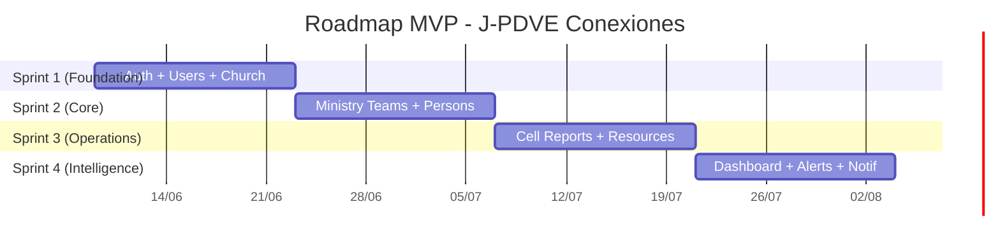
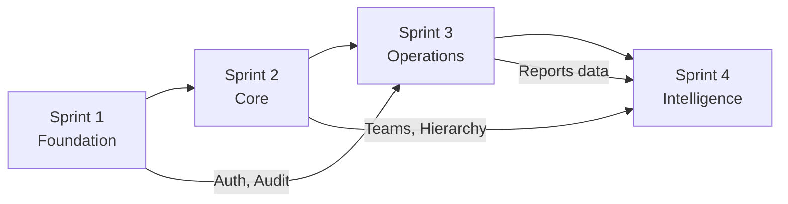

# 10. Roadmap Técnico — J-PDVE Conexiones

---

## Visión General (4 Sprints × 2 semanas)

---

## Sprint 1: Foundation (Semanas 1-2)

### Objetivo
Establecer la base arquitectónica completa: autenticación, gestión de usuarios, entidad Church, y la infraestructura de audit/logging.

### Entregables

#### Backend
| # | Entregable | Dominio | Prioridad |
|---|-----------|---------|-----------|
| 1 | Setup monorepo (pnpm + turbo + config packages) | Infra | Crítica |
| 2 | Docker Compose (PostgreSQL, Redis, Meilisearch, Maildev) | Infra | Crítica |
| 3 | NestJS bootstrap con Fastify + global pipes/filters/interceptors | Infra | Crítica |
| 4 | Prisma schema inicial (Church, User, Session, AuditLog) | DB | Crítica |
| 5 | Migration + seed (iglesia default + super admin) | DB | Crítica |
| 6 | Auth module: login, refresh, logout, forgot/reset password | Auth | Crítica |
| 7 | JWT strategy + AuthGuard + RolesGuard | Auth | Crítica |
| 8 | Users module: CRUD + role management | Users | Crítica |
| 9 | Audit interceptor (global, automático) | Audit | Crítica |
| 10 | Structured logging (correlation IDs) | Infra | Alta |
| 11 | Health check endpoints | Infra | Media |
| 12 | Rate limiting (ThrottlerModule) | Security | Alta |

#### Frontend
| # | Entregable | Área | Prioridad |
|---|-----------|------|-----------|
| 1 | Next.js 15 setup con App Router | Infra | Crítica |
| 2 | TailwindCSS + shadcn/ui setup | UI | Crítica |
| 3 | Design tokens (colores, typography, spacing) | UI | Crítica |
| 4 | Auth pages: Login, Forgot Password, Reset Password | Pages | Crítica |
| 5 | Protected layout (auth check, token refresh) | Auth | Crítica |
| 6 | API client con TanStack Query + interceptors | Data | Crítica |
| 7 | Global components: Layout, Sidebar, BottomNav, Header | UI | Alta |
| 8 | Toast system (Sonner) | UI | Alta |
| 9 | Loading skeletons (base components) | UI | Media |

#### Infrastructure
| # | Entregable | Prioridad |
|---|-----------|-----------|
| 1 | GitHub repo + branch protection | Crítica |
| 2 | CI/CD pipeline (lint + type-check + test) | Alta |
| 3 | Environment variables schema (Zod) | Crítica |
| 4 | .env.example con todas las variables | Crítica |

### Dependencias
- Ninguna externa (sprint fundacional)

### Riesgos
| Riesgo | Probabilidad | Mitigación |
|--------|-------------|------------|
| Configuración del monorepo tome más tiempo | Media | Usar template existente de community-os |
| Prisma schema changes frecuentes | Alta | Diseño aprobado antes de implementar |
| Auth edge cases (token rotation bugs) | Media | Test coverage alto en auth |

### Criterios de Aceptación Sprint 1
- [ ] Login funcional end-to-end
- [ ] Refresh token rotation working
- [ ] CRUD de usuarios (solo PASTOR_GENERAL puede crear)
- [ ] Audit log registrando todas las mutaciones
- [ ] Rate limiting activo
- [ ] CI green (lint + type-check)

---

## Sprint 2: Core (Semanas 3-4)

### Objetivo
Implementar las entidades core del negocio: Ministry Teams, Networks, Hierarchy, y Person management con pipeline pastoral.

### Entregables

#### Backend
| # | Entregable | Dominio | Prioridad |
|---|-----------|---------|-----------|
| 1 | Prisma schema: Network, MinistryTeam, TeamMember, Person, PipelineStageConfig, PersonTeamHistory | DB | Crítica |
| 2 | Networks module: CRUD + assign pastor | Networks | Crítica |
| 3 | Ministry Teams module: CRUD + code assignment + hierarchy | Teams | Crítica |
| 4 | Team Members: assign/remove leaders, co-leaders | Teams | Crítica |
| 5 | Persons module: CRUD + pipeline stage advancement | Persons | Crítica |
| 6 | Person transfer (between teams) + history | Persons | Alta |
| 7 | Hierarchy visibility service (scope filtering) | Permissions | Crítica |
| 8 | ltree extension setup + hierarchy queries | DB | Alta |
| 9 | Meilisearch integration (person search indexing) | Search | Alta |
| 10 | Pipeline stage config: CRUD (admin only) | Settings | Media |
| 11 | Team multiplication workflow | Teams | Media |

#### Frontend
| # | Entregable | Área | Prioridad |
|---|-----------|------|-----------|
| 1 | Teams page: Grid view + List view toggle | Pages | Crítica |
| 2 | Team Card component (name, code, day/time, members) | UI | Crítica |
| 3 | Team detail page (members, persons, info) | Pages | Crítica |
| 4 | Create/Edit team form | Pages | Crítica |
| 5 | Persons page: list + search + filters | Pages | Crítica |
| 6 | Person detail page (profile, pipeline, history) | Pages | Alta |
| 7 | Create person form | Pages | Crítica |
| 8 | Pipeline advancement UI (stage selector + confirmation) | UI | Alta |
| 9 | Person transfer UI (source team → dest team) | UI | Alta |
| 10 | Network selector component | UI | Media |

### Dependencias
- Sprint 1 completado (Auth, Users, Church)
- Prisma schema de Sprint 1 estable

### Riesgos
| Riesgo | Probabilidad | Mitigación |
|--------|-------------|------------|
| Complejidad de hierarchy queries (ltree) | Alta | Prototipar queries en Sprint 1 |
| Scope filtering bugs (ver data ajena) | Media | Tests específicos de visibility |
| Meilisearch sync lag | Baja | Event-driven sync + acceptance of eventual consistency |

### Criterios de Aceptación Sprint 2
- [ ] CRUD de Ministry Teams funcional con códigos únicos
- [ ] Asignación de líderes a teams
- [ ] CRUD de Persons con pipeline stages
- [ ] Transferencia de personas entre teams
- [ ] Búsqueda fuzzy de personas (Meilisearch)
- [ ] Visibility filtering: cada rol solo ve su scope
- [ ] Pipeline stages configurables por admin

---

## Sprint 3: Operations (Semanas 5-6)

### Objetivo
Implementar el flujo operativo principal: Cell Reports (wizard + autosave + offline) y Resources center.

### Entregables

#### Backend
| # | Entregable | Dominio | Prioridad |
|---|-----------|---------|-----------|
| 1 | Prisma schema: CellReport, ReportDraft, ReportPhoto, ReportComment | DB | Crítica |
| 2 | Cell Reports module: create, update, list, detail | Reports | Crítica |
| 3 | Report draft: save/restore/delete server drafts | Reports | Alta |
| 4 | Duplicate check endpoint (team + week) | Reports | Alta |
| 5 | Report period validation (Sunday normal, Mon-Wed late, Thu+ locked) | Reports | Crítica |
| 6 | Photo upload: presigned URL generation + validation | Reports | Alta |
| 7 | Report comments: create, list | Reports | Media |
| 8 | Report trends endpoint (last N weeks by group) | Reports | Alta |
| 9 | Resources module: upload, list, download, categorize | Resources | Alta |
| 10 | Resource categories CRUD | Resources | Media |
| 11 | Presigned URL generation for resources | Resources | Alta |
| 12 | Resource visibility filtering by role | Resources | Alta |

#### Frontend
| # | Entregable | Área | Prioridad |
|---|-----------|------|-----------|
| 1 | Wizard Shell component (generic, reusable) | UI | Crítica |
| 2 | Cell Report Wizard (5 steps) | Pages | Crítica |
| 3 | Stepper Control component (touch-friendly numeric) | UI | Crítica |
| 4 | Autosave engine (localStorage + server sync) | Feature | Alta |
| 5 | Duplicate check integration (warning banner) | Feature | Alta |
| 6 | Post-submission celebration + trends | UI | Alta |
| 7 | Report history page + sparkline | Pages | Alta |
| 8 | Offline sync engine (Service Worker + IndexedDB) | Feature | Alta |
| 9 | Quick Report Mode | Feature | Media |
| 10 | Bottom Sheet component (mobile modals) | UI | Alta |
| 11 | Resources page: list + search + download | Pages | Alta |
| 12 | Resource upload page (pastor only) | Pages | Media |
| 13 | Photo upload component (camera + gallery) | UI | Alta |
| 14 | Swipe navigation for wizard | Feature | Media |

#### Infrastructure
| # | Entregable | Prioridad |
|---|-----------|-----------|
| 1 | S3 bucket setup + CORS | Crítica |
| 2 | Service Worker registration + offline cache strategy | Alta |
| 3 | PWA manifest + install prompt | Alta |

### Dependencias
- Sprint 2 completado (Teams, Persons)
- S3 bucket configured

### Riesgos
| Riesgo | Probabilidad | Mitigación |
|--------|-------------|------------|
| Service Worker complexity (offline sync) | Alta | Implementar MVP simple primero, iteraar |
| Photo upload from mobile (camera API variance) | Media | Fallback to file input |
| Report period timezone edge cases | Media | Usar date-fns-tz, tests con múltiples timezones |
| Autosave race conditions | Media | Debounce + version tracking |

### Criterios de Aceptación Sprint 3
- [ ] Cell Report wizard funcional end-to-end (online)
- [ ] Autosave working (localStorage cada 30s)
- [ ] Duplicate detection warning
- [ ] Report period enforcement (Sunday/Mon-Wed/locked)
- [ ] Photo upload to S3 (max 3, validated)
- [ ] Post-submission celebration + basic trends
- [ ] Offline queue: report queued locally when offline
- [ ] Resources: upload + list + download by role
- [ ] PWA installable en mobile

---

## Sprint 4: Intelligence (Semanas 7-8)

### Objetivo
Implementar dashboards, alertas pastorales, notificaciones y polish general para producción.

### Entregables

#### Backend
| # | Entregable | Dominio | Prioridad |
|---|-----------|---------|-----------|
| 1 | Prisma schema: OperationalAlert, Notification | DB | Crítica |
| 2 | Analytics module: KPI calculations | Analytics | Crítica |
| 3 | Materialized views: weekly_attendance, member stats | DB | Crítica |
| 4 | Redis cache layer for KPIs (5min TTL) | Cache | Alta |
| 5 | BullMQ job: refresh materialized views (every 15min) | Jobs | Alta |
| 6 | BullMQ job: detect missing reports (every 15min) | Jobs | Crítica |
| 7 | BullMQ job: detect attendance decline (daily) | Jobs | Alta |
| 8 | Alerts module: list, acknowledge | Alerts | Alta |
| 9 | Notifications module: create, list, mark read | Notifications | Alta |
| 10 | Dashboard endpoints: executive KPIs, trends, rankings | Dashboard | Crítica |
| 11 | Report export (CSV) | Reports | Media |

#### Frontend
| # | Entregable | Área | Prioridad |
|---|-----------|------|-----------|
| 1 | Dashboard Executive: KPI cards + trend chart | Pages | Crítica |
| 2 | KPI Card component (value, trend, arrow) | UI | Crítica |
| 3 | Sparkline component | UI | Alta |
| 4 | 12-week attendance line chart | UI | Alta |
| 5 | Alerts panel (list + acknowledge) | UI | Alta |
| 6 | Notifications panel (bell + dropdown + list) | UI | Alta |
| 7 | Dashboard Advanced: Top 10 tables | Pages | Alta |
| 8 | Drill-down navigation from KPI → filtered list | Feature | Alta |
| 9 | Network comparison view | Pages | Media |
| 10 | Settings page: profile, password, notifications | Pages | Alta |
| 11 | Admin settings: users, pipeline, networks | Pages | Media |
| 12 | Empty states for all pages | UI | Alta |
| 13 | Error states + retry patterns | UI | Alta |
| 14 | Page transitions (Framer Motion) | UX | Media |
| 15 | Final responsive polish (all breakpoints) | UX | Alta |

#### Infrastructure
| # | Entregable | Prioridad |
|---|-----------|-----------|
| 1 | Production deployment (EC2 + Docker) | Crítica |
| 2 | RDS PostgreSQL setup | Crítica |
| 3 | ElastiCache Redis setup | Crítica |
| 4 | Cloudflare DNS + SSL | Crítica |
| 5 | Monitoring: basic Grafana dashboard | Alta |
| 6 | Backup strategy (RDS automated + S3) | Alta |
| 7 | Error tracking (Sentry or equivalent) | Alta |

### Dependencias
- Sprint 3 completado (Reports, Resources)
- AWS account configured
- Domain name ready

### Riesgos
| Riesgo | Probabilidad | Mitigación |
|--------|-------------|------------|
| Dashboard performance (aggregation queries) | Alta | Materialized views + Redis cache |
| Alert detection false positives | Media | Conservative thresholds + easy acknowledge |
| Production deploy issues | Media | Staging environment first |
| Mobile UX issues en producción | Media | Test con usuarios reales en Sprint 3 |

### Criterios de Aceptación Sprint 4
- [ ] Dashboard ejecutivo funcional con datos reales
- [ ] Alertas generándose automáticamente (missing reports, decline)
- [ ] Notificaciones in-app working
- [ ] Drill-down desde KPIs
- [ ] Top 10 rankings
- [ ] Settings page completa
- [ ] Deployed to production
- [ ] SSL + CDN active
- [ ] Monitoring dashboard operational
- [ ] All empty/error states handled

---

## Post-MVP: Siguiente Iteración

| Feature | Sprint Estimado | Dependencias |
|---------|----------------|-------------|
| Organigrama interactivo (ReactFlow) | Sprint 5 | Teams + Hierarchy |
| Dashboard avanzado (funnel, cohort, heatmap) | Sprint 5-6 | Sprint 4 dashboard |
| Report comments thread | Sprint 5 | Reports |
| Bulk operations (persons, teams) | Sprint 5 | Persons + Teams |
| Academy module (Phase 2) | Sprint 7-8 | Persons + Pipeline |
| Events + QR (Phase 3) | Sprint 9-10 | Persons |
| Multi-church (Phase 4) | Sprint 11+ | All stable |

---

## Resumen de Dependencias entre Sprints

---

## Velocity Assumptions

| Metric | Assumption |
|--------|-----------|
| Team size | 1-2 developers |
| Sprint duration | 2 weeks |
| Story points/sprint | 30-40 |
| Backend:Frontend ratio | 50:50 per sprint |
| Buffer for unknowns | 20% per sprint |
| Testing overhead | Included in estimates |

---

## Definition of Done (por task)

- [ ] Code written + linted + type-safe
- [ ] Unit tests (critical paths)
- [ ] API endpoints documented (OpenAPI)
- [ ] Audit logging verified
- [ ] Permission checks verified
- [ ] Mobile responsive verified
- [ ] Error states handled
- [ ] PR reviewed + merged
