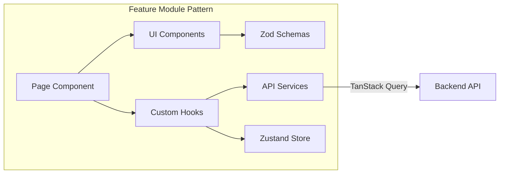
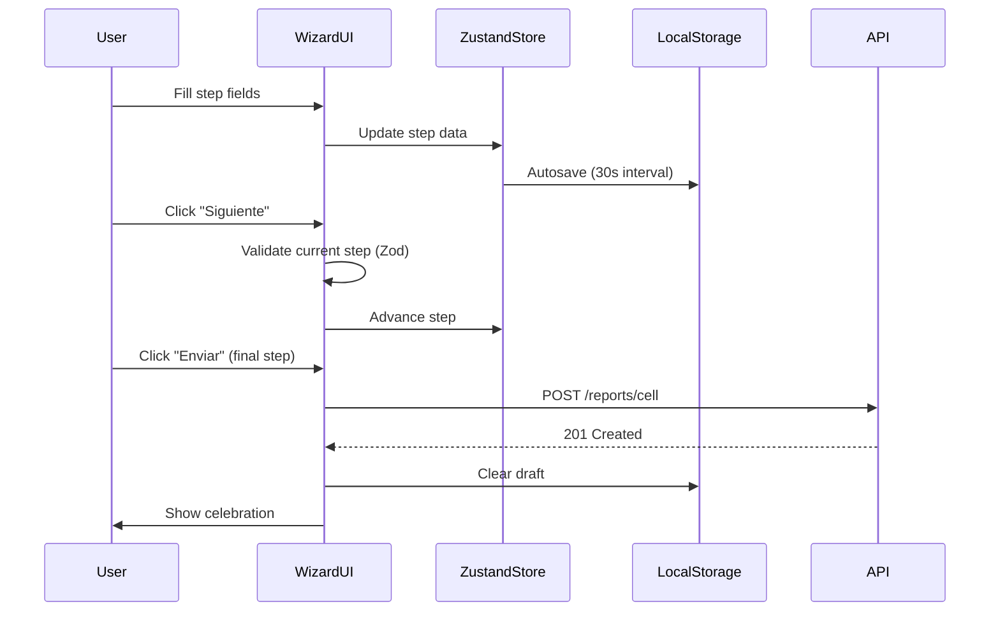
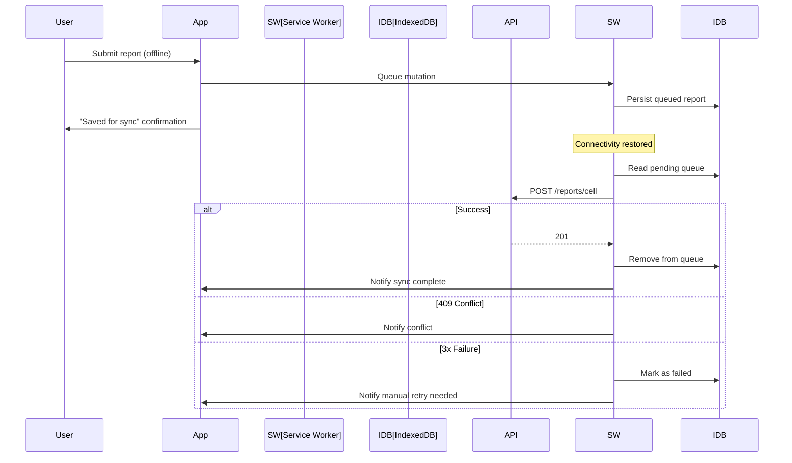
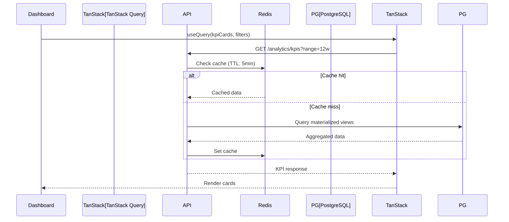
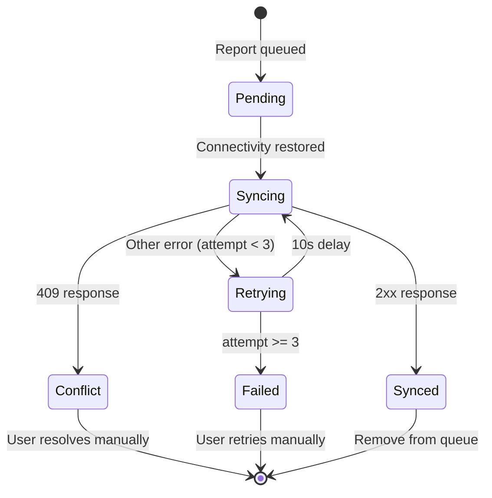

# Design Document: Platform UX Modernization

## Overview

This design transforms J-PDVE Conexiones (Community OS) from a functional but UX-limited platform into a modern, mobile-first, analytics-driven, premium SaaS experience aligned with the PRD vision of Ministerio Palabras de Vida Eterna.

The initiative spans 28 requirements across: cell report modernization, onboarding, group/membership management, hierarchy visualization, reporting dashboards, organizational analytics, mobile UX with offline support, permission management, design system, operational intelligence, map integration, **report submission rules, Ministry Team management, Person/User separation, pastoral pipeline visualization, premium dark branding, offerings tracking, rankings, and notifications**.

**Design Principles:**
- Mobile-first: All components designed for touch interaction first, enhanced for desktop
- Ministry Team as primary unit: All ownership, permissions, and reports are team-based
- Person/User separation: Persons exist independently of user accounts
- Premium dark aesthetic: #050505 background, #1565FF primary, #FFB400 gold accents, Anton/Montserrat typography
- Progressive enhancement: Core functionality works offline, enhanced features require connectivity
- Existing patterns preserved: Backend follows DDD-lite with repository pattern; frontend uses feature-based architecture with TanStack Query + Zustand
- Incremental delivery: Each requirement is independently deployable
- Multi-church ready: Architecture supports future expansion to daughter churches

**Key Technical Decisions:**
1. **Multi-step wizards** use Zustand stores for step state + React Hook Form per step for validation
2. **Offline support** uses Service Worker + IndexedDB queue (not just localStorage)
3. **Analytics** computed via PostgreSQL materialized views + Redis caching for dashboard performance
4. **Graph visualizations** use ReactFlow + dagre (existing) with virtualization for 500+ nodes
5. **Map integration** uses Leaflet (open-source, no API key required) via react-leaflet
6. **Design system** extends existing shadcn/ui with dark-theme variants using brand colors in `@community-os/ui`
7. **Ministry Team model** adds a `ministry_teams` table that bridges users and persons with shared permissions
8. **Report submission window** enforced via middleware that checks day-of-week before accepting/rejecting submissions
9. **Pastoral pipeline** implemented as configurable stage definitions in a `pipeline_stages` table

## Architecture

### System Architecture Diagram

```mermaid
graph TB
    subgraph "Frontend (apps/web)"
        direction TB
        AppRouter[Next.js 15 App Router]
        Features[Feature Modules]
        SharedUI[@community-os/ui]
        StateLayer[Zustand Stores]
        QueryLayer[TanStack Query v5]
        OfflineLayer[Service Worker + IndexedDB]
    end

    subgraph "Backend (apps/api)"
        direction TB
        Controllers[NestJS Controllers]
        Services[Domain Services]
        Repositories[Prisma Repositories]
        Queue[BullMQ Processors]
        Events[EventEmitter2]
    end

    subgraph "Infrastructure"
        DB[(PostgreSQL 16)]
        Cache[(Redis 7)]
        Search[(Meilisearch)]
        Storage[File Storage]
    end

    AppRouter --> Features
    Features --> SharedUI
    Features --> StateLayer
    Features --> QueryLayer
    QueryLayer --> OfflineLayer
    OfflineLayer -->|Online| Controllers
    Controllers --> Services
    Services --> Repositories
    Services --> Events
    Events --> Queue
    Repositories --> DB
    Queue --> Cache
    Services --> Cache
    Services --> Search
    Controllers --> Storage
```

### Frontend Architecture



Each feature module follows the existing pattern:
```
features/{name}/
├── components/     # Feature-specific UI components
├── hooks/          # TanStack Query hooks + custom hooks
├── schemas/        # Zod validation schemas
├── services/       # API client functions
└── stores/         # Zustand stores (when needed)
```

### Data Flow Patterns

**Wizard Flow (Requirements 1, 9):**


**Offline Sync Flow (Requirement 16):**


**Analytics Dashboard Flow (Requirements 14, 15):**


## Components and Interfaces

### Shared UI Components (packages/ui)

| Component | Purpose | Used By |
|-----------|---------|---------|
| `StepperControl` | Touch-friendly numeric input with ±buttons | Cell Report Wizard (Req 4) |
| `WizardShell` | Multi-step wizard container with progress bar | Cell Report (Req 1), Onboarding (Req 9) |
| `BottomSheet` | Mobile modal sliding from bottom | All mobile dialogs (Req 18) |
| `SparklineChart` | Inline mini chart for trends | Group Cards (Req 10), Post-submission (Req 5) |
| `KpiCard` | Dashboard metric card with trend indicator | Dashboards (Req 14) |
| `SkeletonLoader` | Contextual loading placeholders | All data views (Req 18) |
| `CelebrationOverlay` | Confetti/checkmark success animation | Post-submission (Req 5, 18) |
| `GroupCard` | Visual card for group summary | Groups page (Req 10) |
| `MemberCard` | Visual card for member summary | Membership page (Req 13) |
| `StateMachineView` | Interactive state transition diagram | Membership (Req 13) |
| `HeatmapChart` | Day×Hour heatmap visualization | Analytics (Req 15) |
| `FunnelChart` | Stage conversion funnel | Analytics (Req 14, 15) |
| `CohortChart` | Retention cohort matrix | Analytics (Req 15) |
| `AlertPanel` | Operational alerts list | Dashboard (Req 19) |
| `MapView` | Leaflet map with clustering | Groups map (Req 20) |

### Feature Components

#### Cell Report Wizard (`features/reporting/`)

```typescript
// Store: features/reporting/stores/cell-report-wizard.store.ts
interface CellReportWizardState {
  currentStep: number; // 0-4
  steps: ['identificacion', 'asistencia', 'crecimiento', 'reunion', 'resumen'];
  formData: Partial<CellReportFormData>;
  draftId: string | null;
  lastSaved: Date | null;
  isDirty: boolean;
  duplicateWarning: DuplicateWarning | null;
  // Actions
  setStepData: (step: number, data: Partial<CellReportFormData>) => void;
  nextStep: () => void;
  prevStep: () => void;
  goToStep: (step: number) => void;
  clearDraft: () => void;
  restoreDraft: (data: CellReportFormData) => void;
}

// Schema: features/reporting/schemas/cell-report.schema.ts
// Per-step Zod schemas for incremental validation
const identificacionSchema = z.object({
  groupId: z.string().uuid(),
  cellCode: z.string().min(1),
  meetingDate: z.string().datetime(),
  coverageName: z.string().min(1),
  leaderName: z.string().min(1),
  coLeaderName: z.string().optional(),
  contactPhone: z.string().optional(),
});

const asistenciaSchema = z.object({
  menCount: z.number().int().min(0).max(999),
  womenCount: z.number().int().min(0).max(999),
  youthMaleCount: z.number().int().min(0).max(999),
  youthFemaleCount: z.number().int().min(0).max(999),
  childrenCount: z.number().int().min(0).max(999),
  visitorsCount: z.number().int().min(0).max(999),
  convertsCount: z.number().int().min(0).max(999),
  reconciledCount: z.number().int().min(0).max(999),
});
```

#### Autosave Engine (`features/reporting/hooks/use-autosave.ts`)

```typescript
interface AutosaveConfig {
  storageKey: string;        // `draft:${userId}:${groupId}`
  intervalMs: number;        // 30000
  maxAgeDays: number;        // 7
  serverEndpoint?: string;   // Optional server draft sync
}

// Hook returns
interface UseAutosaveReturn {
  lastSaved: Date | null;
  isSaving: boolean;
  hasDraft: boolean;
  draftAge: number | null;   // days
  saveDraft: () => void;
  discardDraft: () => void;
  restoreDraft: () => CellReportFormData | null;
}
```

#### Offline Sync Engine (`features/reporting/services/offline-sync.ts`)

```typescript
interface QueuedReport {
  id: string;
  payload: CreateCellReportDto;
  queuedAt: Date;
  retryCount: number;
  status: 'pending' | 'syncing' | 'failed' | 'conflict';
  lastError?: string;
}

interface OfflineSyncState {
  isOnline: boolean;
  pendingCount: number;
  syncedCount: number;
  failedCount: number;
  queue: QueuedReport[];
}
```

#### Groups Visual Management (`features/groups/`)

```typescript
// Group card view with toggle
interface GroupsPageState {
  viewMode: 'grid' | 'list';
  searchQuery: string;
  mapVisible: boolean;
}

// Map integration
interface GroupMapMarker {
  groupId: string;
  name: string;
  leaderName: string;
  memberCount: number;
  latitude: number;
  longitude: number;
}
```

#### Discipleship Graph (`features/discipleship/`)

```typescript
// ReactFlow node data
interface DiscipleshipNodeData {
  id: string;
  name: string;
  avatarUrl: string | null;
  ministerialRole: MinisterialRole;
  spiritualStage: SpiritualStage;
  discipleCount: number;
  networkId: string;
}

// Filters
interface DiscipleshipGraphFilters {
  search: string;
  network: string | null;
  spiritualStage: SpiritualStage | null;
  ministerialRole: MinisterialRole | null;
}
```

#### Permission Management (`features/settings/`)

```typescript
interface PermissionMatrixCell {
  role: UserRole;
  resource: string;
  action: PermissionAction;
  state: 'granted' | 'denied' | 'inherited';
  isUpdating: boolean;
}

interface PermissionScope {
  id: string;
  name: 'global' | 'network' | 'discipleship' | 'group' | 'leadership';
  resources: string[];
}
```

### API Contracts (New/Extended Endpoints)

#### Cell Report Drafts

```
POST   /api/v1/reports/cell/drafts          # Save draft to server
GET    /api/v1/reports/cell/drafts/:groupId  # Get server draft
DELETE /api/v1/reports/cell/drafts/:groupId  # Discard server draft
```

#### Duplicate Check

```
GET    /api/v1/reports/cell/check-duplicate?groupId=X&weekStart=Y
Response: { exists: boolean, report?: { id, submittedAt, totalAttendance } }
```

#### Cell Report History & Trends

```
GET    /api/v1/reports/cell/trends/:groupId?weeks=12
Response: { weeks: Array<{ weekStart, totalAttendance, visitors, converts }> }

GET    /api/v1/reports/cell/streak/:groupId
Response: { consecutiveWeeks: number }
```

#### Analytics KPIs

```
GET    /api/v1/analytics/kpis?range=12w&networkId=X
Response: {
  totalAttendance: { value, previousValue, change },
  activeGroups: { value, previousValue, change },
  conversionRate: { value, previousValue, change },
  reportingCompliance: { value, previousValue, change }
}

GET    /api/v1/analytics/cohort?startMonth=2024-01&months=12
GET    /api/v1/analytics/funnel?dateRange=30d
GET    /api/v1/analytics/heatmap?weeks=12
GET    /api/v1/analytics/network-comparison?range=12w
GET    /api/v1/analytics/leadership-health?range=12w
GET    /api/v1/analytics/growth-velocity?window=4w|8w|12w
```

#### Alerts

```
GET    /api/v1/analytics/alerts?limit=50
PATCH  /api/v1/analytics/alerts/:id/acknowledge
Response: Array<{ id, type, groupId, leaderId, message, createdAt, acknowledged }>
```

#### Permissions

```
GET    /api/v1/permissions/matrix?scope=global
PATCH  /api/v1/permissions/matrix   # Toggle permission cell
GET    /api/v1/permissions/audit?page=1&limit=20
POST   /api/v1/permissions/temporary-grant
POST   /api/v1/permissions/delegate
```

#### Groups Map

```
GET    /api/v1/groups/map-markers
Response: { markers: GroupMapMarker[], missingCoordinatesCount: number }
```

#### Membership Bulk Operations

```
POST   /api/v1/memberships/bulk-status-change
Body: { memberIds: string[], targetStatus: MembershipStatus }
Response: { succeeded: number, skipped: Array<{ memberId, reason }> }

POST   /api/v1/memberships/bulk-assign-group
Body: { memberIds: string[], groupId: string }

POST   /api/v1/memberships/transfer
Body: { memberIds: string[], sourceGroupId: string, destinationGroupId: string }
```

## Data Models

### Schema Extensions (Prisma)

#### CellReport Model Updates

```prisma
model CellReport {
  // ... existing fields ...

  // New fields (Requirement 7 & 8)
  meetingType      String?   @map("meeting_type")  // 'PRESENCIAL' | 'VIRTUAL' | 'HIBRIDA'
  testimonios      String?   @db.VarChar(2000)
  necesidades      String?   @db.VarChar(2000)
  oracion          String?   @db.VarChar(2000)
  notas            String?   @db.VarChar(2000)
  spiritualHealth  Int?      @map("spiritual_health")  // 1-5
  prayerRequests   String?   @map("prayer_requests") @db.VarChar(500)
  nextEventDate    DateTime? @map("next_event_date")
  structuredNotes  Json?     @map("structured_notes")  // { testimonio, necesidadPastoral, seguimientoVisitante, logistica }
  photos           String[]  @default([])              // URLs array

  @@map("cell_reports")
}
```

#### CellReportDraft Model (New)

```prisma
model CellReportDraft {
  id          String   @id @default(uuid())
  userId      String   @map("user_id")
  groupId     String   @map("group_id")
  formData    Json     @map("form_data")
  currentStep Int      @default(0) @map("current_step")
  createdAt   DateTime @default(now()) @map("created_at")
  updatedAt   DateTime @updatedAt @map("updated_at")

  @@unique([userId, groupId])
  @@index([userId])
  @@map("cell_report_drafts")
}
```

#### Alert Model (New)

```prisma
model OperationalAlert {
  id             String    @id @default(uuid())
  type           String    // 'MISSING_REPORT' | 'DECLINING_ATTENDANCE' | 'ZERO_VISITORS'
  groupId        String?   @map("group_id")
  leaderId       String?   @map("leader_id")
  message        String
  metadata       Json?     // Additional context data
  acknowledged   Boolean   @default(false)
  acknowledgedAt DateTime? @map("acknowledged_at")
  acknowledgedBy String?   @map("acknowledged_by")
  createdAt      DateTime  @default(now()) @map("created_at")

  @@index([type, acknowledged])
  @@index([groupId])
  @@index([leaderId])
  @@index([createdAt])
  @@map("operational_alerts")
}
```

#### PermissionAuditLog Model (New)

```prisma
model PermissionAuditLog {
  id           String   @id @default(uuid())
  actorId      String   @map("actor_id")
  targetUserId String?  @map("target_user_id")
  resource     String
  action       String
  role         String?
  beforeValue  Boolean? @map("before_value")
  afterValue   Boolean? @map("after_value")
  createdAt    DateTime @default(now()) @map("created_at")

  @@index([actorId])
  @@index([targetUserId])
  @@index([createdAt])
  @@map("permission_audit_logs")
}
```

### Materialized Views (PostgreSQL)

```sql
-- Weekly attendance aggregation for dashboard performance
CREATE MATERIALIZED VIEW mv_weekly_attendance AS
SELECT
  date_trunc('week', meeting_date) AS week_start,
  group_id,
  g.network_id,
  SUM(total_attendance) AS total_attendance,
  SUM(visitors_count) AS total_visitors,
  SUM(converts_count) AS total_converts,
  COUNT(*) AS report_count
FROM cell_reports cr
JOIN groups g ON g.id = cr.group_id
WHERE cr.meeting_date >= NOW() - INTERVAL '52 weeks'
GROUP BY date_trunc('week', meeting_date), group_id, g.network_id;

-- Refresh via BullMQ cron job every 15 minutes
CREATE UNIQUE INDEX ON mv_weekly_attendance (week_start, group_id);

-- Member retention cohort
CREATE MATERIALIZED VIEW mv_member_cohort AS
SELECT
  date_trunc('month', u.created_at) AS join_month,
  date_trunc('month', gm.joined_at) AS activity_month,
  COUNT(DISTINCT u.id) AS active_count
FROM users u
JOIN group_members gm ON gm.user_id = u.id AND gm.left_at IS NULL
WHERE u.status = 'ACTIVE' AND u.deleted_at IS NULL
GROUP BY date_trunc('month', u.created_at), date_trunc('month', gm.joined_at);
```

### Redis Cache Keys

| Key Pattern | TTL | Purpose |
|-------------|-----|---------|
| `kpi:{networkId}:{range}` | 5 min | Dashboard KPI cards |
| `trends:{groupId}:{weeks}` | 10 min | Group attendance trends |
| `alerts:{scope}` | 5 min | Operational alerts list |
| `cohort:{startMonth}:{months}` | 30 min | Cohort analysis data |
| `heatmap:{weeks}` | 15 min | Reporting heatmap |
| `funnel:{dateRange}` | 15 min | Stage funnel data |

## Correctness Properties

*A property is a characteristic or behavior that should hold true across all valid executions of a system—essentially, a formal statement about what the system should do. Properties serve as the bridge between human-readable specifications and machine-verifiable correctness guarantees.*

### Property 1: Wizard Step Validation Consistency

*For any* set of form field values and any wizard step schema (cell report or onboarding), the Zod schema validation result SHALL correctly accept all inputs that satisfy the field constraints (required fields present, values within bounds) and reject all inputs that violate any constraint, with the error messages referencing the specific failing fields.

**Validates: Requirements 1.3, 9.2**

### Property 2: Wizard Data Preservation Invariant

*For any* wizard state containing entered form data, navigating forward then backward, or encountering a submission error, SHALL preserve all previously entered field values unchanged across all wizard steps.

**Validates: Requirements 1.5, 1.8, 9.8, 9.10**

### Property 3: Autosave Serialization Round-Trip

*For any* valid cell report form state (including partial data at any wizard step), serializing to JSON for localStorage and deserializing back SHALL produce a form state equivalent to the original.

**Validates: Requirements 2.1**

### Property 4: Draft Age Threshold

*For any* saved draft with a timestamp, the system SHALL restore the draft if and only if the draft age is strictly less than 7 days (168 hours) from the current time; drafts aged 7 or more days SHALL be discarded.

**Validates: Requirements 2.3, 2.4**

### Property 5: Stepper Bounded Counter

*For any* stepper value V in the range [0, 999], incrementing SHALL produce min(V + 1, 999) and decrementing SHALL produce max(V - 1, 0). The value SHALL never exceed 999 or go below 0 regardless of the sequence of operations applied.

**Validates: Requirements 4.2, 4.3, 4.4, 4.8**

### Property 6: Post-Submission Metrics Calculation

*For any* current report with total attendance T_current and previous report with total attendance T_previous, the trend difference SHALL equal T_current - T_previous, the direction indicator SHALL be "up" when positive, "down" when negative, and "unchanged" when zero. The growth rate SHALL equal (visitorsCount + convertsCount) / totalAttendance × 100 for any non-zero totalAttendance.

**Validates: Requirements 5.2, 5.3**

### Property 7: Time Series Gap Detection

*For any* ordered sequence of weekly report dates for a group, the system SHALL correctly identify all calendar weeks (Monday–Sunday) within the range that have no corresponding report, and the count of missing weeks SHALL equal (total weeks in range) minus (weeks with reports).

**Validates: Requirements 6.6, 14.5**

### Property 8: Text Field Validation

*For any* string input to an observation or notes field, the system SHALL treat strings composed entirely of whitespace characters as empty (storing null/empty), SHALL reject strings exceeding the field's maximum length (2000 for observations, 500 for prayer requests, 300 for structured notes), and SHALL accept all non-whitespace strings within the length limit.

**Validates: Requirements 7.3, 7.4, 8.5, 8.7**

### Property 9: File Upload Validation Invariant

*For any* file upload attempt, the system SHALL reject files where size > 5MB OR mime type is not in [image/jpeg, image/png] OR dimensions are below 200×200 pixels, AND rejecting an invalid file SHALL NOT remove any previously uploaded valid files from the upload list.

**Validates: Requirements 8.2, 8.3**

### Property 10: Search and Filter Correctness

*For any* search query string Q and collection of items (groups, members, or graph nodes), the filtered result SHALL contain exactly those items where the searchable fields (name, code, role) contain Q as a case-insensitive substring. When multiple filter criteria are active simultaneously, the result SHALL be the intersection of items matching each individual criterion.

**Validates: Requirements 10.5, 11.4, 11.5, 12.3, 12.4, 13.2**

### Property 11: Membership State Machine Transitions

*For any* member with current status S and target status T, the transition SHALL be allowed if and only if (S, T) is in the set {(PENDING, ACTIVE), (ACTIVE, INACTIVE), (ACTIVE, SUSPENDED), (SUSPENDED, ACTIVE), (INACTIVE, ACTIVE)}. For any bulk operation on N members, the count of succeeded plus skipped SHALL equal N, and skipped members SHALL be exactly those for whom the transition is invalid.

**Validates: Requirements 13.3, 13.5**

### Property 12: KPI Aggregation Correctness

*For any* set of cell reports within a date range, total attendance SHALL equal the sum of all report totalAttendance values, active groups SHALL equal the count of distinct groups with at least one report in the last 4 weeks, and reporting compliance SHALL equal (reports submitted this week / active groups) × 100.

**Validates: Requirements 14.1**

### Property 13: Funnel Conversion Rate Calculation

*For any* set of stage transitions within a date range, the conversion rate from stage A to stage B SHALL equal (count of members who transitioned from A to B) / (count of members in stage A at period start) × 100, and the average time in each stage SHALL equal the arithmetic mean of (transition_out_date - transition_in_date) for all members who completed that stage.

**Validates: Requirements 14.4, 15.2**

### Property 14: Cohort Retention Calculation

*For any* cohort of members who joined in month M, the retention rate for subsequent month M+N SHALL equal (count of cohort members active in at least one group during month M+N) / (total cohort size) × 100.

**Validates: Requirements 15.1**

### Property 15: Growth Velocity and Comparative Metrics

*For any* metric value series over a time window W, the growth velocity SHALL equal ((value at end of W) - (value at start of W)) / (value at start of W) × 100. Period comparisons SHALL correctly compute absolute difference and percentage change between the two periods.

**Validates: Requirements 15.6, 15.8**

### Property 16: Quick Report Pre-Fill Logic

*For any* previous cell report for a group, activating Quick Report Mode SHALL copy all fields EXCEPT meetingDate, menCount, womenCount, youthMaleCount, youthFemaleCount, childrenCount, visitorsCount, convertsCount, reconciledCount, testimonios, necesidades, oracion, and notas (which SHALL remain empty/default). All other fields SHALL match the previous report's values.

**Validates: Requirements 16.3, 16.4**

### Property 17: Offline Queue Lifecycle

*For any* report queued while offline, the queue SHALL persist across application restarts, sync attempts SHALL occur in chronological order when connectivity is restored, and after exactly 3 consecutive non-409 failures the report status SHALL transition to 'failed' and no further automatic retries SHALL occur.

**Validates: Requirements 16.6, 16.7, 16.9**

### Property 18: Permission Delegation Constraint

*For any* delegation attempt where user A grants permission P to user B, the operation SHALL succeed if and only if P is within A's effective permission set AND B is a direct or indirect subordinate of A in the organizational hierarchy. All other delegation attempts SHALL be rejected without modifying any permission state.

**Validates: Requirements 17.8, 17.9**

### Property 19: Operational Alert Rule Detection

*For any* set of groups and their report history, the system SHALL generate alerts for: (a) groups with 2+ consecutive weeks without reports, (b) leaders with 3+ consecutive weeks of declining total attendance, (c) groups with 4+ consecutive weeks of zero visitors. For any KPI value, an anomaly indicator SHALL appear if and only if the absolute deviation from the 4-week moving average exceeds 20%. Churn risk categorization SHALL assign: moderate for 3-4 absent weeks, high for 5-6, critical for 7+.

**Validates: Requirements 19.1, 19.3, 19.4**

### Property 20: Map Marker Filtering

*For any* set of groups, the map SHALL display markers for exactly those groups where both latitude and longitude are non-null. The count of groups without coordinates SHALL equal the total group count minus the marker count.

**Validates: Requirements 20.1, 20.5**

## Error Handling

### Frontend Error Strategy

| Error Type | Handling | User Feedback |
|------------|----------|---------------|
| Network timeout (>10s) | Cancel request, show error state | Skeleton → error with retry button (Req 18.6) |
| API 4xx validation | Display inline field errors | Sonner toast + field highlights |
| API 5xx server error | Preserve form state, enable retry | Error banner with retry action (Req 1.8) |
| API 409 conflict | Show conflict resolution UI | Warning banner with link to existing report (Req 3.2, 16.8) |
| localStorage quota | Warn user, continue without autosave | Warning toast (Req 2.8) |
| Offline submission | Queue to IndexedDB, show pending status | Confirmation with sync indicator (Req 16.6) |
| File upload failure | Preserve valid uploads, show error | Inline error per file (Req 8.3) |
| Graph render failure | Show error state with retry | Error message + retry button (Req 11.8) |
| Permission toggle failure | Revert optimistic update | Error toast with reason (Req 17.3) |

### Backend Error Strategy

| Error Type | HTTP Status | Response Format |
|------------|-------------|-----------------|
| Validation failure | 400 | `{ error: 'VALIDATION_ERROR', details: ZodError[] }` |
| Duplicate report | 409 | `{ error: 'DUPLICATE_REPORT', existingReport: { id, submittedAt } }` |
| Unauthorized | 401 | `{ error: 'UNAUTHORIZED' }` |
| Forbidden (hierarchy) | 403 | `{ error: 'FORBIDDEN', reason: string }` |
| Delegation violation | 403 | `{ error: 'DELEGATION_VIOLATION', constraint: 'PERMISSION_EXCEEDED' | 'NOT_SUBORDINATE' }` |
| Not found | 404 | `{ error: 'NOT_FOUND', resource: string }` |
| Rate limited | 429 | `{ error: 'RATE_LIMITED', retryAfter: number }` |
| Server error | 500 | `{ error: 'INTERNAL_ERROR', traceId: string }` |

### Offline Error Recovery



## Testing Strategy

### Testing Approach

This feature uses a **dual testing approach**:

1. **Property-based tests** (fast-check): Verify universal correctness properties across randomized inputs
2. **Unit tests** (Vitest): Verify specific examples, edge cases, and integration points
3. **Component tests** (Testing Library): Verify UI rendering and interaction behavior
4. **E2E tests** (Playwright): Verify critical user flows end-to-end

### Property-Based Testing Configuration

- **Library**: fast-check (TypeScript)
- **Runner**: Vitest
- **Minimum iterations**: 100 per property
- **Tag format**: `Feature: platform-ux-modernization, Property {N}: {title}`

Properties to implement as PBT:
- Property 1: Wizard Step Validation (generate random form data, verify Zod schema behavior)
- Property 2: Wizard Data Preservation (generate form states, simulate navigation)
- Property 3: Autosave Round-Trip (generate partial form states, serialize/deserialize)
- Property 4: Draft Age Threshold (generate timestamps, verify age comparison)
- Property 5: Stepper Bounded Counter (generate sequences of inc/dec operations)
- Property 6: Post-Submission Metrics (generate attendance pairs, verify calculations)
- Property 7: Time Series Gap Detection (generate report date sequences, verify gap identification)
- Property 8: Text Field Validation (generate strings of various lengths/content)
- Property 9: File Upload Validation (generate file metadata, verify accept/reject)
- Property 10: Search and Filter (generate item collections + queries, verify filtering)
- Property 11: Membership State Machine (generate status + target pairs, verify transitions)
- Property 12: KPI Aggregation (generate report sets, verify sums/counts)
- Property 13: Funnel Conversion (generate stage transitions, verify rates)
- Property 14: Cohort Retention (generate member activity data, verify retention)
- Property 15: Growth Velocity (generate metric series, verify rate calculations)
- Property 16: Quick Report Pre-Fill (generate previous reports, verify field copying)
- Property 17: Offline Queue Lifecycle (generate queue operations, verify state transitions)
- Property 18: Permission Delegation (generate permission sets + hierarchy, verify constraint)
- Property 19: Alert Rule Detection (generate report histories, verify alert generation)
- Property 20: Map Marker Filtering (generate groups with/without coordinates, verify filtering)

### Unit Test Focus Areas

- Specific edge cases: empty form submission, boundary values (0, 999), date boundaries
- API service functions: request/response mapping, error handling
- Zustand store actions: state transitions, computed values
- Formatting functions: date/time localization, number formatting

### Component Test Focus Areas

- Wizard step rendering and navigation
- Stepper control interaction (tap, long-press simulation)
- Bottom sheet behavior on mobile viewports
- Skeleton loading states
- Error state rendering with retry buttons
- Celebration animation trigger/dismiss

### E2E Test Focus Areas (Playwright)

- Complete cell report submission flow (happy path)
- Offline submission → online sync flow
- Dashboard drill-down navigation
- Permission matrix toggle with server confirmation
- Onboarding wizard complete flow

### Test File Organization

```
apps/web/src/
├── features/reporting/__tests__/
│   ├── cell-report-wizard.property.test.ts    # Properties 1-3
│   ├── autosave-engine.property.test.ts       # Properties 3-4
│   ├── stepper-control.property.test.ts       # Property 5
│   ├── post-submission.property.test.ts       # Property 6
│   ├── offline-sync.property.test.ts          # Property 17
│   └── quick-report.property.test.ts          # Property 16
├── features/groups/__tests__/
│   ├── group-search.property.test.ts          # Property 10
│   └── map-markers.property.test.ts           # Property 20
├── features/discipleship/__tests__/
│   └── graph-filter.property.test.ts          # Property 10
└── ...

apps/api/src/domains/
├── reporting/__tests__/
│   ├── gap-detection.property.test.ts         # Property 7
│   ├── kpi-aggregation.property.test.ts       # Property 12
│   └── alert-rules.property.test.ts           # Property 19
├── analytics/__tests__/
│   ├── funnel-conversion.property.test.ts     # Property 13
│   ├── cohort-retention.property.test.ts      # Property 14
│   └── growth-velocity.property.test.ts       # Property 15
├── memberships/__tests__/
│   └── state-machine.property.test.ts         # Property 11
└── permissions/__tests__/
    └── delegation.property.test.ts            # Property 18
```


## PRD-Aligned Extensions (Requirements 21-28)

### New Data Models

#### Ministry Team Model

```prisma
model MinistryTeam {
  id              String   @id @default(uuid())
  name            String   // e.g., "Luis & Oris"
  ministerialCode String   @unique @map("ministerial_code") // e.g., "E5", "E4.1.1"
  networkId       String   @map("network_id")
  coverageId      String   @map("coverage_id")  // supervising cobertura
  createdAt       DateTime @default(now()) @map("created_at")
  updatedAt       DateTime @updatedAt @map("updated_at")
  deletedAt       DateTime? @map("deleted_at")

  // Relations
  members         MinistryTeamMember[]
  persons         Person[]
  cellReports     CellReport[]
  network         Network  @relation(fields: [networkId], references: [id])

  @@index([networkId])
  @@index([coverageId])
  @@index([ministerialCode])
  @@map("ministry_teams")
}

model MinistryTeamMember {
  id             String   @id @default(uuid())
  teamId         String   @map("team_id")
  userId         String   @map("user_id")
  role           String   @default("MEMBER") // LEADER, CO_LEADER, MEMBER
  joinedAt       DateTime @default(now()) @map("joined_at")

  team           MinistryTeam @relation(fields: [teamId], references: [id])
  user           User         @relation(fields: [userId], references: [id])

  @@unique([teamId, userId])
  @@map("ministry_team_members")
}
```

#### Person Model (Separate from User)

```prisma
model Person {
  id              String    @id @default(uuid())
  fullName        String    @map("full_name")
  phone           String?
  email           String?
  userId          String?   @unique @map("user_id")  // null = no login
  ministryTeamId  String    @map("ministry_team_id")
  pipelineStageId String    @map("pipeline_stage_id")
  joinedAt        DateTime  @default(now()) @map("joined_at")
  createdAt       DateTime  @default(now()) @map("created_at")
  updatedAt       DateTime  @updatedAt @map("updated_at")
  deletedAt       DateTime? @map("deleted_at")

  // Relations
  user            User?         @relation(fields: [userId], references: [id])
  ministryTeam    MinistryTeam  @relation(fields: [ministryTeamId], references: [id])
  pipelineStage   PipelineStage @relation(fields: [pipelineStageId], references: [id])
  transitions     PipelineTransition[]

  @@index([ministryTeamId])
  @@index([pipelineStageId])
  @@map("persons")
}
```

#### Pastoral Pipeline Models

```prisma
model PipelineStage {
  id          String   @id @default(uuid())
  name        String   // "Visitante", "Consolidado", etc.
  order       Int      // Sequential order in the pipeline
  maxDays     Int?     @map("max_days")  // Configurable threshold (e.g., 90 days)
  color       String?  // Hex color for visualization
  isActive    Boolean  @default(true) @map("is_active")
  createdAt   DateTime @default(now()) @map("created_at")

  persons     Person[]
  transitionsFrom PipelineTransition[] @relation("from_stage")
  transitionsTo   PipelineTransition[] @relation("to_stage")

  @@unique([order])
  @@map("pipeline_stages")
}

model PipelineTransition {
  id          String   @id @default(uuid())
  personId    String   @map("person_id")
  fromStageId String   @map("from_stage_id")
  toStageId   String   @map("to_stage_id")
  promotedBy  String   @map("promoted_by")  // userId of actor
  promotedAt  DateTime @default(now()) @map("promoted_at")
  notes       String?

  person      Person        @relation(fields: [personId], references: [id])
  fromStage   PipelineStage @relation("from_stage", fields: [fromStageId], references: [id])
  toStage     PipelineStage @relation("to_stage", fields: [toStageId], references: [id])

  @@index([personId])
  @@index([fromStageId, toStageId])
  @@map("pipeline_transitions")
}
```

#### Report Submission Window

```prisma
// Extends CellReport model
model CellReport {
  // ... existing fields ...
  submissionStatus  String  @default("NORMAL") @map("submission_status") // NORMAL, LATE, UNLOCKED
  unlockedBy        String? @map("unlocked_by")
  unlockedAt        DateTime? @map("unlocked_at")
  unlockedReason    String? @map("unlocked_reason")
}
```

#### Notification Model

```prisma
model Notification {
  id          String    @id @default(uuid())
  userId      String    @map("user_id")
  category    String    // REPORT, RESOURCE, ALERT, SYSTEM
  title       String
  message     String
  actionUrl   String?   @map("action_url")
  isRead      Boolean   @default(false) @map("is_read")
  createdAt   DateTime  @default(now()) @map("created_at")
  expiresAt   DateTime  @map("expires_at")  // 30 days from creation

  @@index([userId, isRead])
  @@index([createdAt])
  @@map("notifications")
}
```

### New API Endpoints

#### Ministry Teams

```
GET    /api/v1/ministry-teams                    # List with filters
POST   /api/v1/ministry-teams                    # Create team
GET    /api/v1/ministry-teams/:id                # Team details with persons
PATCH  /api/v1/ministry-teams/:id                # Update team
POST   /api/v1/ministry-teams/:id/multiply       # Team multiplication
GET    /api/v1/ministry-teams/:id/persons        # List assigned persons
POST   /api/v1/ministry-teams/:id/persons        # Assign person to team
```

#### Persons

```
GET    /api/v1/persons                           # List all persons (with/without accounts)
POST   /api/v1/persons                           # Create person (no account)
PATCH  /api/v1/persons/:id                       # Update person
POST   /api/v1/persons/:id/create-account        # Create user account for person
POST   /api/v1/persons/:id/transfer              # Transfer to another team
GET    /api/v1/persons/:id/pipeline-history      # Pipeline stage transitions
POST   /api/v1/persons/:id/promote               # Advance pipeline stage
```

#### Pipeline

```
GET    /api/v1/pipeline/stages                   # Get all configurable stages
PUT    /api/v1/pipeline/stages                   # Update stage configuration
GET    /api/v1/pipeline/dashboard?networkId=&coverageId=  # Funnel data
GET    /api/v1/pipeline/bottlenecks              # Stages exceeding threshold
```

#### Report Submission Window

```
GET    /api/v1/reports/cell/submission-window     # Current window status
POST   /api/v1/reports/cell/:id/unlock           # Cobertura+ unlocks a report
```

#### Notifications

```
GET    /api/v1/notifications?category=&unread=    # List user notifications
PATCH  /api/v1/notifications/:id/read             # Mark as read
POST   /api/v1/notifications/mark-all-read        # Mark all as read
DELETE /api/v1/notifications/clear                 # Clear dismissed
```

#### Rankings

```
GET    /api/v1/analytics/rankings/teams?metric=attendance&period=12w&limit=10
GET    /api/v1/analytics/rankings/coverages?metric=attendance&period=12w&limit=10
GET    /api/v1/analytics/rankings/networks?metric=attendance&period=12w&limit=10
```

#### Offerings

```
GET    /api/v1/analytics/offerings?range=12w&networkId=
Response: { weeklyTotal, trend[], networkComparison[], topTeams[] }
```

### New Frontend Feature Modules

```
features/
├── ministry-teams/
│   ├── components/
│   │   ├── TeamCard.tsx             # Visual card with code, members, status
│   │   ├── TeamGrid.tsx             # Grid/list view
│   │   ├── TeamWizard.tsx           # Create team wizard
│   │   ├── TeamMultiply.tsx         # Multiplication wizard
│   │   └── CodeHierarchyTree.tsx    # Ministerial code tree view
│   ├── hooks/
│   ├── schemas/
│   └── stores/
├── persons/
│   ├── components/
│   │   ├── PersonCard.tsx           # Card with pipeline stage indicator
│   │   ├── PersonGrid.tsx           # Paginated grid
│   │   ├── PersonCreate.tsx         # Create without account
│   │   ├── CreateAccountDialog.tsx  # Link person to user
│   │   └── TransferDialog.tsx       # Transfer between teams
│   ├── hooks/
│   └── schemas/
├── pipeline/
│   ├── components/
│   │   ├── PipelineFunnel.tsx       # Full pipeline visualization
│   │   ├── StageDrillDown.tsx       # Persons in a stage
│   │   ├── StageConfig.tsx          # Admin stage configuration
│   │   └── PromotionDialog.tsx      # Promote person
│   ├── hooks/
│   └── stores/
├── notifications/
│   ├── components/
│   │   ├── NotificationBell.tsx     # Header bell with count
│   │   ├── NotificationPanel.tsx    # Dropdown panel
│   │   └── NotificationItem.tsx     # Individual notification
│   └── hooks/
└── theme/
    ├── dark-theme.css               # CSS variables for dark mode
    ├── light-theme.css              # CSS variables for light mode
    ├── fonts.ts                     # Anton + Montserrat config
    └── ThemeProvider.tsx            # Theme toggle context
```

### Dark Theme Design System

```css
/* Dark theme CSS variables (default) */
:root[data-theme="dark"] {
  --background: #050505;
  --foreground: #F5F7FA;
  --primary: #1565FF;
  --primary-foreground: #F5F7FA;
  --accent: #FFB400;
  --accent-foreground: #050505;
  --card: #0A0A0A;
  --card-foreground: #F5F7FA;
  --border: #1A1A1A;
  --muted: #1A1A2E;
  --muted-foreground: #A0A0B0;
  --destructive: #FF4444;
  --success: #FFB400;
  --chart-1: #1565FF;
  --chart-2: #FFB400;
  --chart-3: #4A90D9;
  --chart-4: #7B61FF;
  --chart-5: #00D1B2;
}

/* Typography */
--font-heading: 'Anton', sans-serif;
--font-body: 'Montserrat', sans-serif;
```

### Report Submission Window Logic

```typescript
// Middleware/guard for submission window enforcement
interface SubmissionWindowStatus {
  status: 'OPEN' | 'LATE' | 'CLOSED';
  windowEnd: Date;         // When current window closes
  nextWindowStart: Date;   // When next window opens
  remainingHours: number;
}

function getSubmissionWindowStatus(now: Date): SubmissionWindowStatus {
  const dayOfWeek = now.getDay(); // 0=Sunday, 1=Monday, ..., 6=Saturday
  
  if (dayOfWeek === 0) return { status: 'OPEN', ... };
  if (dayOfWeek >= 1 && dayOfWeek <= 3) return { status: 'LATE', ... };
  return { status: 'CLOSED', ... };  // Thursday-Saturday
}
```

### Additional Correctness Properties

#### Property 21: Report Submission Window

*For any* date/time value, the submission window status SHALL be 'OPEN' on Sundays, 'LATE' on Monday-Wednesday, and 'CLOSED' on Thursday-Saturday. A report submission SHALL be accepted if and only if the status is 'OPEN' or 'LATE', or the report has been explicitly unlocked by a Cobertura+ user.

**Validates: Requirements 21.1, 21.2, 21.3, 21.5**

#### Property 22: Ministry Team Shared Ownership

*For any* Ministry Team with N members, all N members SHALL have identical effective permissions for: submitting reports for the team, viewing resources, and managing persons assigned to the team. A report submitted by any team member SHALL be visible and editable by all other team members.

**Validates: Requirements 22.3, 1.10**

#### Property 23: Person-User Independence

*For any* person record, the person SHALL exist in the system regardless of whether a linked user account exists. Creating a user account for a person SHALL NOT modify any person fields. Deleting a user account SHALL NOT delete the person record.

**Validates: Requirements 23.1, 23.3**

#### Property 24: Pipeline Stage Ordering

*For any* pipeline configuration, stages SHALL maintain a strict total order defined by the `order` field. A person SHALL only be promoted to a stage with a higher order value. The conversion rate between stages A and B (where B.order = A.order + 1) SHALL equal (transitions from A to B in period) / (persons in stage A at period start) × 100.

**Validates: Requirements 24.1, 24.2, 24.7**

#### Property 25: Notification Lifecycle

*For any* notification, it SHALL be visible for exactly 30 days from creation. After 30 days, it SHALL be automatically excluded from query results. The unread count SHALL equal the count of notifications where isRead = false AND createdAt > (now - 30 days).

**Validates: Requirements 28.1, 28.7**
