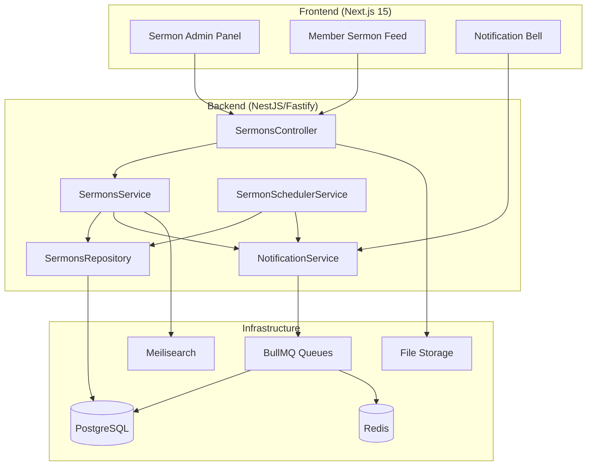
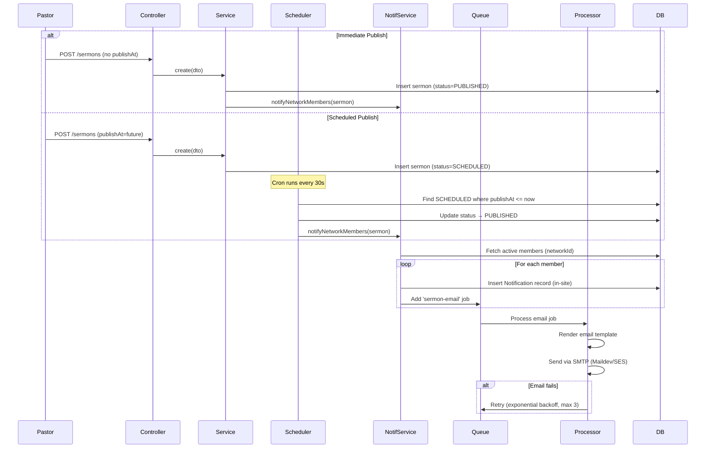

# Design Document: Network Sermons

## Overview

The Network Sermons feature allows network pastors (PASTOR_RED) to publish sermons containing multimedia content to all members within their network. The system handles scheduled publishing via BullMQ, distributes in-site and email notifications asynchronously, tracks member engagement (views), and provides an administrative panel for sermon management.

### Key Design Decisions

| Decision | Choice | Rationale |
|----------|--------|-----------|
| File Storage | Local disk + served via Fastify static | Simplest for MVP; can migrate to S3/MinIO later without schema changes |
| Scheduled Publishing | BullMQ repeatable job (cron) | Already in infrastructure; avoids adding new dependencies |
| Notification Dispatch | BullMQ notifications queue (fan-out) | Existing pattern; handles retries and backoff natively |
| In-Site Notifications | Dedicated `Notification` table + SSE endpoint | Real-time delivery without WebSocket complexity |
| View Tracking | `SermonView` table with unique constraint | Simple, queryable, supports analytics |
| Sermon Status | Enum (DRAFT, SCHEDULED, PUBLISHED) | Clear state machine for publishing lifecycle |
| Pagination | Cursor-based (existing pattern) | Consistent with platform conventions |
| Search | Meilisearch index for sermons | Already deployed; provides full-text search on title/description |

### Technology Stack (additions to existing)

- **File Upload**: `@fastify/multipart` (already available via Fastify)
- **File Storage**: Local `uploads/` directory (configurable path via env)
- **Email Templates**: Handlebars (lightweight, no new dependency needed)
- **Scheduled Jobs**: BullMQ repeatable cron job (every 30 seconds)
- **Real-time Notifications**: Server-Sent Events (SSE) via Fastify

## Architecture

### High-Level Flow



### Domain Module Structure

```
domains/sermons/
├── sermons.module.ts
├── sermons.controller.ts          # REST endpoints + file upload
├── sermons.service.ts             # Business logic + event emission
├── sermons.repository.ts          # Prisma data access
├── sermon-scheduler.service.ts    # BullMQ cron for scheduled publishing
├── sermon-notification.service.ts # Fan-out notification logic
├── dto/
│   ├── create-sermon.dto.ts       # Zod schema for creation
│   ├── update-sermon.dto.ts       # Zod schema for updates
│   └── sermon-query.dto.ts        # Zod schema for list/filter params
├── processors/
│   └── sermon-notification.processor.ts  # BullMQ job processor
└── guards/
    └── network-pastor.guard.ts    # Validates NetworkLeader + PASTOR role
```

### Frontend Structure

```
features/sermons/
├── components/
│   ├── sermon-form.tsx            # Create/edit form with file upload
│   ├── sermon-card.tsx            # Card for sermon list
│   ├── sermon-table.tsx           # Admin table with TanStack Table
│   ├── sermon-detail.tsx          # Full sermon view
│   ├── sermon-analytics.tsx       # View tracking breakdown
│   └── sermon-scheduler.tsx       # Date/time picker for scheduling
├── hooks/
│   ├── use-sermons.ts             # TanStack Query hooks
│   ├── use-sermon-mutations.ts    # Create/update/delete mutations
│   └── use-sermon-views.ts        # View analytics queries
├── stores/
│   └── sermon-filters.store.ts    # Zustand store for filter state
├── pages/
│   ├── sermons-admin.tsx          # Admin dashboard page
│   └── sermons-feed.tsx           # Member feed page
└── types/
    └── sermon.types.ts            # Frontend type definitions
```

## Components and Interfaces

### 1. SermonsController (REST API)

```typescript
// Endpoints
POST   /api/v1/sermons              # Create sermon (multipart/form-data)
GET    /api/v1/sermons              # List sermons (member feed, paginated)
GET    /api/v1/sermons/:id          # Get sermon detail + record view
PATCH  /api/v1/sermons/:id          # Update sermon
DELETE /api/v1/sermons/:id          # Soft delete sermon
GET    /api/v1/sermons/:id/views    # Get view analytics (pastor only)
GET    /api/v1/sermons/admin/stats  # Admin dashboard stats
POST   /api/v1/sermons/:id/files    # Upload additional files
DELETE /api/v1/sermons/:id/files/:fileId  # Remove a file attachment
```

**Authorization Rules:**
- `POST`, `PATCH`, `DELETE`, `/admin/stats`, `/views`: Requires NetworkLeader with PASTOR role for the sermon's network
- `GET /sermons`, `GET /sermons/:id`: Requires authenticated user with matching `networkId` OR SUPER_ADMIN/ADMIN role

### 2. SermonsService (Business Logic)

```typescript
interface SermonsService {
  create(dto: CreateSermonDto, userId: string, files?: UploadedFile[]): Promise<Sermon>;
  update(id: string, dto: UpdateSermonDto, userId: string): Promise<Sermon>;
  softDelete(id: string, userId: string): Promise<void>;
  findById(id: string, userId: string): Promise<SermonDetail>;
  findByNetwork(networkId: string, query: SermonQueryDto): Promise<PaginatedResult<Sermon>>;
  getAdminStats(networkId: string): Promise<SermonAdminStats>;
  getViewAnalytics(sermonId: string): Promise<SermonViewAnalytics>;
  recordView(sermonId: string, userId: string): Promise<void>;
  publishScheduledSermons(): Promise<number>; // Called by cron
}
```

### 3. SermonsRepository (Data Access)

```typescript
interface SermonsRepository {
  create(data: CreateSermonData): Promise<Sermon>;
  update(id: string, data: UpdateSermonData): Promise<Sermon>;
  softDelete(id: string): Promise<void>;
  findById(id: string): Promise<Sermon | null>;
  findByNetwork(networkId: string, options: PaginationOptions & FilterOptions): Promise<PaginatedResult<Sermon>>;
  findScheduledReady(): Promise<Sermon[]>; // publishAt <= now AND status = SCHEDULED
  updateStatus(id: string, status: SermonStatus): Promise<void>;
  createView(sermonId: string, userId: string): Promise<void>;
  getViewsBySermon(sermonId: string): Promise<SermonView[]>;
  getUnviewedCount(networkId: string, userId: string): Promise<number>;
  getAdminStats(networkId: string): Promise<RawAdminStats>;
}
```

### 4. SermonSchedulerService (Cron Job)

```typescript
// Runs every 30 seconds via BullMQ repeatable job
// 1. Queries sermons with status=SCHEDULED and publishAt <= now
// 2. Transitions each to PUBLISHED
// 3. Triggers notification fan-out for each
```

### 5. SermonNotificationService (Fan-out)

```typescript
interface SermonNotificationService {
  notifyNetworkMembers(sermon: Sermon): Promise<void>;
  // 1. Fetches all active users with networkId = sermon.networkId
  // 2. Creates in-site Notification record for each
  // 3. Enqueues email job per member to notifications queue
}
```

### 6. NetworkPastorGuard (Authorization)

```typescript
// Custom guard that validates:
// 1. User has a NetworkLeader record for the target network
// 2. The NetworkLeader.role is 'PASTOR'
// 3. Falls through to allow SUPER_ADMIN/ADMIN for read operations
```

## Data Models

### New Prisma Models

```prisma
enum SermonStatus {
  DRAFT
  SCHEDULED
  PUBLISHED

  @@map("sermon_status")
}

model Sermon {
  id            String       @id @default(uuid())
  networkId     String       @map("network_id")
  createdById   String       @map("created_by_id")
  title         String       @db.VarChar(200)
  description   String?      @db.Text
  sermonDate    DateTime     @map("sermon_date")
  coverImageUrl String?      @map("cover_image_url")
  videoUrl      String?      @map("video_url")
  externalLink  String?      @map("external_link")
  status        SermonStatus @default(DRAFT)
  publishAt     DateTime?    @map("publish_at")
  publishedAt   DateTime?    @map("published_at")
  createdAt     DateTime     @default(now()) @map("created_at")
  updatedAt     DateTime     @updatedAt @map("updated_at")
  deletedAt     DateTime?    @map("deleted_at")

  network    Network        @relation(fields: [networkId], references: [id])
  createdBy  User           @relation("SermonCreator", fields: [createdById], references: [id])
  files      SermonFile[]
  views      SermonView[]
  notifications Notification[] @relation("SermonNotifications")

  @@index([networkId, status])
  @@index([status, publishAt])
  @@index([networkId, sermonDate])
  @@map("sermons")
}

model SermonFile {
  id         String   @id @default(uuid())
  sermonId   String   @map("sermon_id")
  fileName   String   @map("file_name")
  fileUrl    String   @map("file_url")
  fileSize   Int      @map("file_size")       // bytes
  mimeType   String   @map("mime_type")
  createdAt  DateTime @default(now()) @map("created_at")

  sermon Sermon @relation(fields: [sermonId], references: [id], onDelete: Cascade)

  @@index([sermonId])
  @@map("sermon_files")
}

model SermonView {
  id        String   @id @default(uuid())
  sermonId  String   @map("sermon_id")
  userId    String   @map("user_id")
  viewedAt  DateTime @default(now()) @map("viewed_at")

  sermon Sermon @relation(fields: [sermonId], references: [id], onDelete: Cascade)
  user   User   @relation("SermonViews", fields: [userId], references: [id])

  @@unique([sermonId, userId])
  @@index([sermonId])
  @@index([userId])
  @@map("sermon_views")
}

model Notification {
  id         String   @id @default(uuid())
  userId     String   @map("user_id")
  type       String                          // 'sermon_published', 'generic', etc.
  title      String
  body       String?
  link       String?                         // Deep link to sermon
  isRead     Boolean  @default(false) @map("is_read")
  sermonId   String?  @map("sermon_id")
  createdAt  DateTime @default(now()) @map("created_at")

  user   User    @relation("UserNotifications", fields: [userId], references: [id])
  sermon Sermon? @relation("SermonNotifications", fields: [sermonId], references: [id])

  @@index([userId, isRead])
  @@index([userId, createdAt])
  @@map("notifications")
}
```

### Required Schema Additions to User Model

```prisma
// Add to User model:
sermonViews     SermonView[]     @relation("SermonViews")
sermonsCreated  Sermon[]         @relation("SermonCreator")
notifications   Notification[]   @relation("UserNotifications")
```

### Required Schema Addition to Network Model

```prisma
// Add to Network model:
sermons Sermon[]
```

### Zod DTOs

```typescript
// create-sermon.dto.ts
export const createSermonSchema = z.object({
  title: z.string().min(1).max(200),
  description: z.string().max(5000).optional(),
  sermonDate: z.string().datetime(),
  videoUrl: z.string().url().optional(),
  externalLink: z.string().url().optional(),
  publishAt: z.string().datetime().optional(), // If provided + future → SCHEDULED
});

// update-sermon.dto.ts
export const updateSermonSchema = createSermonSchema.partial();

// sermon-query.dto.ts
export const sermonQuerySchema = z.object({
  cursor: z.string().uuid().optional(),
  limit: z.coerce.number().int().min(1).max(50).default(20),
  search: z.string().max(100).optional(),
  dateFrom: z.string().datetime().optional(),
  dateTo: z.string().datetime().optional(),
  status: z.nativeEnum(SermonStatus).optional(), // Admin only
});
```

## Notification Flow

### Publishing Flow (Immediate or Scheduled)



### Email Template Content

- **Subject**: `Nueva predicación: {sermon.title}`
- **Body**: Sermon title, description excerpt (150 chars), sermon date, direct link
- **CTA Button**: "Ver Predicación"

## File Upload Strategy

### Upload Flow

1. Pastor submits form with files via `multipart/form-data`
2. Controller uses `@fastify/multipart` to parse the stream
3. Files are validated (type, size) before writing to disk
4. Files stored at: `uploads/sermons/{sermonId}/{uuid}-{originalName}`
5. File metadata (URL, size, MIME type) stored in `SermonFile` table
6. Cover image stored separately: `uploads/sermons/{sermonId}/cover-{uuid}.{ext}`

### Constraints

| Type | Allowed Formats | Max Size | Max Count |
|------|----------------|----------|-----------|
| Cover Image | JPEG, PNG, WebP | 5 MB | 1 |
| Attachments | PDF, DOCX, TXT | 20 MB each | 10 |

### Serving Files

Files served via a static route: `GET /api/v1/uploads/sermons/:sermonId/:filename`
Protected by auth middleware — only network members or admins can access.

## UI/UX Design

### Admin Panel (Pastor View)

**Dashboard** (`/sermons/admin`):
- Stats cards: Total Published, Total Views, Pending Scheduled, Avg. Views per Sermon
- Quick action: "Nueva Predicación" button
- Recent sermons table (TanStack Table) with columns: Title, Date, Status badge, Views, Actions

**Create/Edit Form** (`/sermons/admin/new`, `/sermons/admin/:id/edit`):
- Title input (required)
- Rich description textarea
- Date picker for sermon date
- Cover image upload with preview
- Video URL input with embed preview
- External link input
- File attachments dropzone (drag & drop)
- Schedule toggle: "Publicar ahora" vs "Programar publicación" with datetime picker
- Save as Draft / Publish button

**Analytics View** (`/sermons/admin/:id/analytics`):
- Pie chart: Viewed vs Not Viewed
- Member list with view status (green check / gray dash)
- Export to CSV option

### Member Feed (`/sermons`)

- Card-based layout (responsive grid)
- Each card shows: cover image, title, date, description excerpt, unread badge
- Click opens full sermon detail with video embed, description, file downloads
- Filter bar: date range, search
- Infinite scroll (cursor pagination)

### Navigation Integration

Add to `NAV_SECTIONS` in side-nav:
```typescript
// Under 'ORGANIZACIÓN' section
{ href: '/sermons', label: 'Predicaciones', icon: BookOpen }
// Under 'ORGANIZACIÓN' section (for pastors)
{ href: '/sermons/admin', label: 'Gestión Predicaciones', icon: Mic2, roles: ['LEADER', 'ADMIN', 'SUPER_ADMIN'] }
```

### Notification Bell

- Badge count shows unread notifications (including sermon notifications)
- Dropdown shows recent notifications with sermon title and "Nuevo" badge
- Click navigates to sermon detail

## Scalability and Security Considerations

### Scalability

| Concern | Mitigation |
|---------|-----------|
| Large networks (1000+ members) | Fan-out via BullMQ with rate limiting; batch DB inserts for notifications |
| File storage growth | Configurable storage path; future migration to S3/MinIO via adapter pattern |
| Email throughput | BullMQ concurrency control (5 concurrent); rate limit per SMTP provider |
| Sermon search at scale | Meilisearch handles full-text efficiently; index only title + description |
| View tracking writes | Upsert with unique constraint avoids duplicates without read-before-write |

### Security

| Concern | Mitigation |
|---------|-----------|
| Unauthorized sermon access | Network-scoped queries; guard validates networkId match |
| File upload attacks | MIME type validation + file extension check; max size enforced at stream level |
| Path traversal | UUID-based file naming; no user-controlled path segments |
| Email injection | Template-based rendering; no raw user input in headers |
| IDOR on sermon views | Validate sermon belongs to user's network before recording view |
| Rate limiting | Throttle file uploads (5/min per user); throttle sermon creation (10/hour) |

### Risks

1. **Email deliverability**: Maildev is dev-only; production needs SES/SendGrid with proper SPF/DKIM
2. **File storage limits**: Local disk has finite space; monitoring + alerts needed
3. **Notification storm**: Publishing to a 5000-member network creates 5000 email jobs simultaneously; mitigate with BullMQ rate limiter
4. **Stale scheduled jobs**: If the API server is down, scheduled sermons won't publish until restart; BullMQ persistence in Redis handles this

## Correctness Properties

### Property 1: Sermon creation authorization

*For any* user attempting to create a sermon, the operation succeeds only if the user has a NetworkLeader record with role 'PASTOR' for the target network. All other users receive a 403 response regardless of their UserRole.

**Validates: Requirements 1.4, 9.1**

### Property 2: Sermon status state machine

*For any* sermon, the status transitions follow exactly: DRAFT → PUBLISHED (immediate), DRAFT → SCHEDULED → PUBLISHED (scheduled). No other transitions are valid. A PUBLISHED sermon cannot return to DRAFT or SCHEDULED.

**Validates: Requirements 3.1, 3.2, 3.5**

### Property 3: Scheduled publishing timeliness

*For any* sermon with status SCHEDULED and a `publishAt` timestamp, the sermon transitions to PUBLISHED within 60 seconds of the `publishAt` time (given the scheduler runs every 30 seconds).

**Validates: Requirement 3.3**

### Property 4: Notification fan-out completeness

*For any* sermon that transitions to PUBLISHED, every active user (status=ACTIVE) with `networkId` matching the sermon's network receives exactly one in-site notification. No inactive users or users from other networks receive notifications.

**Validates: Requirements 4.1, 9.4**

### Property 5: View receipt uniqueness

*For any* combination of (sermonId, userId), at most one SermonView record exists. Recording a view for an already-viewed sermon updates the timestamp but does not create a duplicate.

**Validates: Requirement 6.2**

### Property 6: Network isolation for sermon access

*For any* authenticated user with role MEMBER or LEADER, the sermon list endpoint returns only sermons belonging to the user's network. Users with SUPER_ADMIN or ADMIN role can access sermons across all networks.

**Validates: Requirements 5.2, 9.2, 9.3**

### Property 7: Soft delete exclusion

*For any* sermon with a non-null `deletedAt` timestamp, the sermon is excluded from all list queries, feed responses, and notification triggers. Only admin audit views can access soft-deleted sermons.

**Validates: Requirement 2.2**

### Property 8: File upload constraint enforcement

*For any* file upload attempt, the system rejects files that exceed size limits (5 MB for images, 20 MB for attachments) or have unsupported MIME types. The total attachment count per sermon never exceeds 10.

**Validates: Requirements 8.1, 8.2, 8.3, 8.4**

### Property 9: Audit trail completeness

*For any* sermon create, update, or delete operation, an audit event is emitted containing the sermon ID, network ID, user ID, and (for updates) the previous values. No mutation occurs without a corresponding audit record.

**Validates: Requirements 1.5, 2.1, 2.4**

### Property 10: Unread count accuracy

*For any* network member, the unread sermon count equals the number of PUBLISHED sermons in their network that have no corresponding SermonView record for that user.

**Validates: Requirement 10.2**
